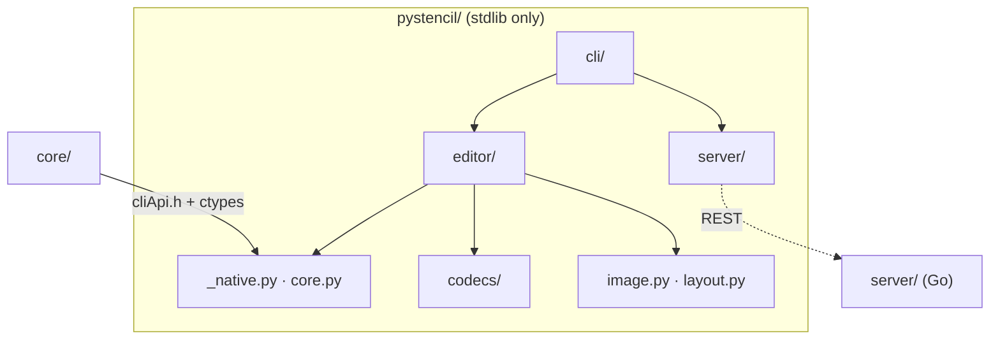
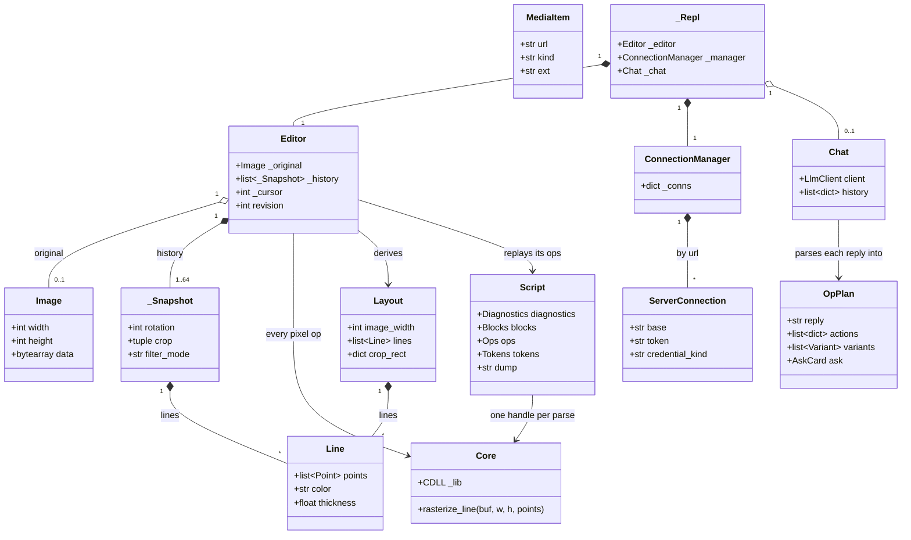

# pystencil architecture

The system-wide design — the parity contract, canonical data, the layer model, the pattern vocabulary — is in the root [`ARCHITECTURE.md`](../ARCHITECTURE.md). The console grammar and stderr output it twins are `cli/CONTRACT.md`; the LLM behaviour is `contracts/llm/`.



A real core consumer, not a thin adapter: every crop, rotate, fill, rasterise, colour parse,
page metric and filter goes through the C++ core over `core/cliApi.h`. Python owns only what
the core leaves out — codecs, HTTP, JSON, the edit/history model, the server protocol.

## Layers

`_native.py` + `core.py` → `image.py`, `codecs/`, `layout.py`, `scriptpaths.py` →
`editor/` → `llm/` (+ `plan/`), `script.py`, `server/`, `sitesource/` → `cli/`. `_net.py` is the single
fetch guard every network path goes through. The other `_`-prefixed helpers sit with `_native` at the bottom. Enforced by
`tests/test_layer_boundary.py`, an AST import-direction lint over the package; its two
`editor → llm` crossings (`assistant.py`, `project.py`) are an explicit allowance in that test.

## Where things go

| Path | Holds | Rule |
|---|---|---|
| `build.py` | compiles `core/` + `cliApi.cpp` into the shared lib | its source list mirrors `STENCIL_CORE_SOURCES`; rebuilds when any source **or header** is newer than the artifact |
| `pystencil/_native.py`, `core.py`, `_raster/` (`ops.py`, `parallel.py`), `_ffi/` (`bindings.py`, `marshal.py`, `coerce.py`, `types.py`, `formula.py`) | locate → (lazily) build → load; `class Core` (scalar half) + the pixel-buffer half; the `argtypes`/`restype` table; the C-view marshalling and buffer guards; the `FormulaContext` a coordinate formula reads its named values from | every ABI function gets an explicit `argtypes`/`restype` row; bytes move as flat RGBA8 buffers and C strings |
| `pystencil/_net.py`, `_raster/parallel.py` | the one fetch guard (scheme, SSRF, redirects, size cap); the one bounded fan-out | fan-out results land in submission order so output matches a serial run |
| `pystencil/_script.py`, `_scripttypes.py`, `scriptpaths.py`, `script.py` | the `.stc` handle over `stencil_cli_script*`; the handle-free value types it reads out (twin of `core/script/types.hpp`); which file a script is read from, what a `@source` names and where a `@save` writes; the whole-file block loop | the core lowers, the adapter opens — directory listing, the one-segment glob, the `-stencil` rule, the two `..` refusals and the png/bmp `save_format` fallback live outside `core/`, each spelled once |
| `pystencil/_severity.py`, `_ffi/types.py` | the `error: ` / `note: ` prefixes (twin of `cli/src/app/logo.zig`); the 3.9 `NoneType` spelling | |
| `pystencil/_data/`, `_opschema/` | the embedded copies of `browser/js/config/llm/`; the registry-driven op-plan schema engine | copies are byte-pinned by `tests/test_canonical_drift.py` |
| `pystencil/image.py`, `layout.py`, `codecs/` | the RGBA8 buffer, the camelCase layout dataclasses (tolerant coercion), pure-Python PNG/BMP | JPEG decoding belongs to the CLI |
| `pystencil/editor/` | the chainable `Editor` over history, derive, project, layout_io, edits, script, assistant and source collaborators | the view is derived on demand (`rotate → crop → filter → rasterise`), memoised on a `revision`; history capped at 64 (`LIMITS.historyMax`), never evicting the pristine state |
| `pystencil/llm/` (+ `plan/`) | config · client · chat, and under `plan/` the parse, registry, validation and execution halves | plans validate against `_opschema` before execution; execution calls `Editor` methods, never pixels |
| `pystencil/server/` | `ServerConnection` + `ConnectionManager` (urllib REST) | mirrors `server/internal/protocol`; REST only, changes are polled |
| `pystencil/sitesource/` | scraping: format · scan · filter · download · net | prints the shared stderr grammar (`cli/CONTRACT.md` §3) |
| `pystencil/cli/` | `python -m pystencil`: the one-shot pipeline, the three script modes (`script.py`, `scriptplan.py`), the console I/O surface, `commands/` | each command is the twin of a `cli/src/console/handlers/` file |
| `tests/` | one suite per subject; `nativecase.py` (the `require_core` gate), `test_build.py`, `test_canonical_drift.py`, `goldens/`, `bench_*.py` | hermetic — no server, no network; `STENCIL_SKIP_NATIVE=1` skips native cases as a band |

## Entities



| Entity | What it is | Owned by / lifetime | Relates to |
|---|---|---|---|
| `Core` (`core.py` + `_raster/ops.py`) | The typed ctypes wrapper over the `stencil_cli_*` ABI: scalar calls (colour, page, formula, duration) plus the RGBA8 kernels | One process singleton from `get_core()`, or injected into an `Editor`; holds the cached `CDLL` | Called by `Editor` and `Image.blank`; never holds pixels |
| `Image` (`image.py`) | A flat RGBA8 `bytearray` with its dimensions, the buffer shape the core reads and writes | Value type; the `Editor` keeps one pristine original and derives views | Encoded/decoded by `codecs/`; uploaded by `ServerConnection` |
| `Layout` / `Line` / `Point` (`layout.py`) | The structured drawing payload: dimensions, lines, optional filter, crop, rotation, page and formula fields | Value dataclasses built by `Editor.layout()` or parsed from JSON | Cross-surface twin; the browser's `buildLayoutPayload` (`browser/js/core/layout.js`) is canonical |
| `_Snapshot` (`editor/_snapshot.py`) | One editing state: rotation, crop rect in rotated-original space, filter mode + colour, drawn lines | Immutable-by-copy entries on the `Editor` history stack | Mirror of the CLI's `EditState` (`cli/src/console/session`) |
| `Editor` (`editor/editor.py`) | The chainable facade: original image, snapshot history, cursor, project metadata, page format, chat document | One per console session or library caller; `clear()` resets it in place | Port of `window.stencil` and the CLI `Session`; drives `Core`; target of `execute_op_plan` |
| `OpPlan` / `Variant` / `AskCard` (`llm/types.py`) | A validated model reply: the chat text, whitelisted top-level actions, variant branches, an optional §11 question card, the paths its saves wrote | Produced by `parse_op_plan`, consumed once by `execute_op_plan` | Validated and applied through `OP_REGISTRY` (`OpSpec` per op); `browser/js/config/llm/opRegistry.json` is canonical |
| `Chat` (`llm/chat.py`) | A client-side conversation whose bounded history (`MAX_HISTORY` 32) is replayed on every call | Created when `/chat on` is set; dropped when the working image is replaced; its `LlmClient` carries the `LlmConfig` from `STENCIL_LLM_*` | Serialises to the §12.1 chat document that rides the `.stencil` file and the server `chat` file |
| `ServerConnection` (`server/connection.py`) | One connected server: base URL, session token, credential kind, status, the REST surface | Created by `ConnectionManager.connect`; `close()` flips status | Speaks `server/internal/protocol`; `ProjectRecord` arrives as a dict, the Go server's definition is canonical |
| `ConnectionManager` (`server/manager.py`) | The session's set of connections keyed by normalised URL, with reconnect and parallel project polling | One per `_Repl` | Port of the browser `ConnectionManager`, REST only |
| `MediaItem` (`sitesource/format.py`) | One scanned media candidate: URL, kind, measured size, format token, alt text | Produced by `scan_html`, filtered and downloaded by `scan_page` | Twin of the extension's `image/scan.js` record |
| `Script` (`_script.py`, types in `_scripttypes.py`) | One parsed `.stc` program: its diagnostics, `@source` blocks and lowered ops, plus the colouring tokens, the canonical dump and the `resolve` of length tokens that read through the live handle | A core handle created by `parse_script`; a context manager, destroyed on `close()`. What a runner needs is read out eagerly and outlives the handle; the three handle-backed reads refuse once it is closed | Read by `Editor.apply_script_ops`, the `script.py` block loop and `cli/scriptplan.py`; the corpus in `browser/js/config/script/fixtures/` is canonical |
| `_Repl` (`cli/repl.py`) | The interactive console state and its command table, composed from the `commands/` mixins and `_PlanHooks` | One per `--console` run, over stdin and stderr | Mediates `Editor`, `ConnectionManager`, `Chat`, `LlmConfig`, `Console` |

## Patterns

| Pattern | Where | Notes |
|---|---|---|
| Facade over core | `Core` (`core.py`, `RasterOps`) and `Editor` (`editor/editor.py`) | `Core` is the narrow ABI surface; `Editor` is the port of `window.stencil`, so console commands, the library API and LLM plans all mutate through the same methods |
| Mediator | `_Repl` (`cli/repl.py`) | Owns `_editor`, `_manager`, `_chat`, `_llm`, `_console`; the command mixins reach each other only through it, and `_image_replaced` is the one chokepoint for image-scoped state |
| Command | `_HistoryApi._push` over the `_Snapshot` stack (`editor/history.py`) | Every mutator pushes a copied snapshot; `undo`/`redo`/`reset` move the cursor and the view re-derives, so apply and revert share one code path |
| Strategy | `LlmClient._build_request` / `_extract_reply` (`llm/client.py`); `codecs.decode` (`codecs/__init__.py`) | Provider wire shape selected by `config.provider`; codec selected by `sniff` magic bytes |
| Observer | `_poll_loop` + `diff_projects` (`server/diff.py`) | REST only, so observation is a poll: `watch_projects(on_change)` fires `created`/`updated`/`deleted` events from list diffs |
| Repository | `_ProjectApi` + `_FileApi` (`server/projects.py`, `server/files.py`); `_ProjectApi.save_project`/`open_project` (`editor/project.py`) | Server projects and the `.stencil` file behind method calls; the version-guarded write and the 409 conflict never leak past `ServerError` |
| Chain of Responsibility | `_net._fetch` (`_net.py`) | `_is_http` → `_assert_fetchable` → `_NoRedirect` opener → `MAX_FETCH_BYTES` cap; each link refuses on its own |
| Adapter | `bind` + `_marshal` (`_ffi/bindings.py`, `_ffi/marshal.py`); `LlmClient` (`llm/client.py`) | ctypes signatures and buffer views turn Python values into the C ABI's pointers and C strings; the client turns internal messages into each provider's JSON |
| Table-driven registry | `OP_REGISTRY` of `OpSpec` (`llm/plan/registry.py`); `_Repl._TABLE`/`_HELP` from `@command` (`cli/registry.py`); `HANDLERS` (`editor/script.py`) and `ACTIONS` (`cli/scriptplan.py`) keyed by `Op.kind` | Validation, execution and the prompt bullets dispatch on one table; the verb table and `/help` come from one declaration; a lowered script op reaches its editor call or its plan action by lookup, never a kind chain |
| Mixin composition | `Editor`, `ServerConnection`, `_Repl` | Each facade is a bare class plus `_*Api` / `_*Commands` mixins that share its state and nothing else |
| Fixture walker / Golden pin | `tests/test_fixture_*.py` over `fixturebase.py`; `tests/test_text_goldens.py` over `tests/goldens/` | The canonical `browser/js/config/llm/fixtures/` corpus is walked verbatim; console and argparse text is byte-pinned |

## Design

- **Boot.** `Core.load()` → `_native.load_library()` → `find_or_build()`: `$STENCIL_CORE_LIB`
  wins, otherwise `build.py` is imported by path (never via `sys.path`). `is_stale` compares
  the artifact's mtime against every input in `build_inputs()` (the `STENCIL_CORE_SOURCES`
  list plus `cliApi.cpp`, the headers and `.inc` bodies in `INCLUDE_DIRS`, and the script
  itself); `build()` runs one `c++ -std=c++17 -O2 -fPIC -shared` over all units from `core/`.
  The `CDLL` is cached in `_CDLL`, `bind(lib)` sets every `argtypes`/`restype` once, and
  `get_core()` hands out the process singleton.
- **An image op.** `Editor.result()` derives the view from the snapshot under the cursor in
  the CLI's `rebuild()` order: `rotate_image_rgba` → `crop_image_rgba` → `apply_filter` /
  `apply_contour` → `rasterize_line` per `Line`. Every buffer is Python-allocated: sources go
  in through `_bytes_arg`, in-place targets through `_buf_view` (`from_buffer`), and
  `_check_dims`/`_check_pixels` reject a short buffer before the call. The core never
  allocates across the ABI. The result is memoised on `(revision, with_lines)`.
- **An edit.** A mutator copies the current `_Snapshot`, changes one field and calls
  `_push`: truncate the redo tail, append, advance the cursor, evict index 1 while the stack
  exceeds 64 (index 0, the pristine state, survives), bump `revision`. Crops compose into
  rotated-original space and ride along through a rotation, as `session.applyCrop` /
  `applyRotate` do in the CLI.
- **A console turn.** `_Repl.run` reads a line, `_parse_command` splits verb and argument,
  `_TABLE` (built from the `@command` declarations) picks the mixin method, which returns
  values and speaks only through `Console.say`/`err`/`note`/`report_wrote` on stderr.
  `ValueError`, `RuntimeError`, `OSError` and `ServerError` become one `error:` line; `/exit`
  returns `True` to end the loop.
- **An LLM turn.** `/prompt` → `_prompt_round`: the current view (PNG, memoised on
  `revision`), its edge map and the `/upload` set ride as attachments under the
  `CONSOLE_SYSTEM_PROMPT` plus console context. With `/chat on` the turn goes through
  `Chat.send` (bounded history replay), otherwise a one-shot `LlmClient.chat`. `parse_op_plan`
  runs the `_opschema` checks and each `OpSpec` normalizer into an `OpPlan`, `blocked_open_url`
  fails the plan when the model names a URL the user never wrote, and `execute_op_plan` applies
  actions through the `OP_REGISTRY` appliers with `_FrameMap` re-mapping, branching variants
  from the flattened pixels on a bounded pool. Console ops run through `_PlanHooks`;
  `clearChat` is confirmed at the end of the turn; an `AskCard` waits for the next `/prompt`.
- **A script run.** `parse_script(text)` hands the source to the core, which lexes, expands
  templates, resolves `@undo`/`@redo` statically and lowers everything to one flat op stream;
  its diagnostics, blocks and ops are read out eagerly while the tokens, the dump and
  `resolve` read through the handle on demand. Any error means nothing executes.
  `Editor.script` replays the whole stream against the working image — `HANDLERS[op.kind]`
  picks one ordinary mutator (`crop_rect` / `apply_filter` / `draw` / `undo` / `redo` /
  `save`), with length tokens resolved at each op against the size as it stands, because an
  earlier crop already moved it; a `@source` block is reported and its ops still apply, the
  console semantics. `run_script` is the batch door and `run_program` its already-parsed
  half, so a caller that reported the diagnostics itself parses once: per block,
  `scriptpaths.expand_source` turns the spec into concrete inputs (a file, an http(s) URL, a
  sorted directory listing, a one-segment glob), each gets a fresh `Editor`, and
  `resolve_target` over `save_format` gives every `@save` its `<stem>-stencil.<ext>`
  destination beside the source — the written codec follows that target path, so the plan
  names the file the run writes. `cli/scriptplan.py` lowers the same program to the op-plan
  vocabulary instead of running it, resolving shapes against a header-only size probe.
- **A server session.** `ConnectionManager.connect(spec)` builds a `ServerConnection` and
  runs `connect()`: no token mints one via `POST /auth/token`, a token is probed with
  `GET /projects`, and one that cannot list but can mint becomes `credential_kind = "admin"`;
  `_request` re-mints once on 401/403. `/fetch name` lists projects, downloads
  `get_file(id, "original")` into the `Editor` and records `_remote`. The edit channel is
  `save_remote_project`: a version-guarded `PUT /projects/{id}` (409 → `ServerError("conflict")`)
  then `put_file("result")`; single-field writes retry the read-then-PUT up to
  `_FIELD_WRITE_RETRIES`. Peers' changes arrive by polling through `diff_projects`; no `/ws`.
- **A fetch.** `_net._fetch(url, strict)`: refuse a non-http(s) scheme, then
  `_assert_fetchable` classifies an IP literal or resolves the host and refuses when any
  address is private, link-local, CGNAT, reserved or multicast (`_is_blocked_ip`); loopback
  is refused only under `strict`. The request goes through `_OPENER`, whose `_NoRedirect`
  raises on any 30x, and the body is read to `MAX_FETCH_BYTES + 1` and refused over the cap.
  A URL the user named (`Editor.load(url)`, the `scan_page` page) runs `strict=False`;
  every harvested sub-resource runs strict, and batches go through `_fetch_all` on
  `MAX_FETCH_WORKERS`. REST and LLM calls reach only user-configured endpoints and share
  `server/http.py`'s `_http_open`, with its own redirect refusal and the `_LLM_TIMEOUT`.

The `.stencil` document `save_project` writes (the browser's `project/file.js` is canonical;
optional keys are omitted when empty):

```
{ "format": "stencil-project", "version": 1, "name",
  "color"?, "keywords"?, "source"?, "resource"?, "chat"?,
  "image": { "dataUrl": "data:<mime>;base64,…", "ext", "w", "h" },
  "layout": Layout.to_dict() }
```

## Rules

1. **Stdlib only, ctypes only.** No PyPI package, no C extension module. `from __future__
   import annotations` in every module so `(X | NoneType)` hints work on 3.9 — below the
   module docstring, which stays the first statement or `__doc__` comes back empty.
2. **Three source lists.** `build.py`'s list is the third copy of `core/CMakeLists.txt`'s
   and `cli/build.zig`'s; `tests/test_build.py` pins it.
3. **Nothing pushed into `core/`.** No Qt, codec or DOM concern ever crosses the ABI.
4. **The console is the CLI's twin.** Same command names, same grammar, same path semantics
   (`/layout`, `/blank`, `/format`), same `error:` / `note:` prefixes; the deviations from it
   are the ones named in the contract.
5. **Contract deviations are named, not silent.** The `frame` op raises
   `LlmExecutionError` (no video decoding); attachments are not downscaled (no resampling).
   The same missing decoder makes a script's `@frame` a `ScriptError`, and a `@source`
   directory or glob picks up only what `codecs` decodes, so a `.jpg` in the folder is
   skipped where the CLI would take it.
6. **Every content fetch** goes through `_net.py`; the REST and LLM clients, which reach
   only user-configured endpoints, share `server/http.py`'s `_http_open`.

## Tests

`unittest` only, hermetic: no server, no network. Native-backed cases pass through the one
`require_core` gate so they skip as a band. Benchmarks are opt-in and assert only ratios —
the PNG Up filter's SWAR row adds, the `revision` memo, validation linear in lines × points
— never microseconds.

The suites are ports of their browser and CLI twins by subject (`test_editor*`,
`test_llm_*`, `test_script*`, `test_server_*`, `test_sitesource_*`, `test_cli_*`).
`test_fixture_script.py` replays `browser/js/config/script/fixtures/cases.txt` — dump,
diagnostics and the load-bearing `err-*` naming — exactly as the C++ and browser walkers do.
The other `test_fixture_*.py`
walkers run the canonical `browser/js/config/llm/fixtures/` corpus through `fixturebase.py`,
with `tests/helpers/fixture_overrides.json` naming this surface's deviations. `test_canonical_drift.py`
byte-pins the `_data/` copies, `test_build.py` the source list and the script ABI's ctypes
signature rows, `test_layer_boundary.py` the import direction and the module docstring's
place, and `tests/goldens/` the console `/help` and argparse text. The network is
stubbed at the `_open` seam (`_StubClient`, `_StubConn`, `_MockLlmClient`), the editor at
`_StubEditor`, and `ServedSiteCase` serves a local site over `http.server` — the scraper's
pages plus the 30x hop and the over-cap body that `_net`'s guard has to refuse.
Concurrency suites check that parallel variants and fetches land in submission order, and
that a racing first `get_core()` builds the library once.
