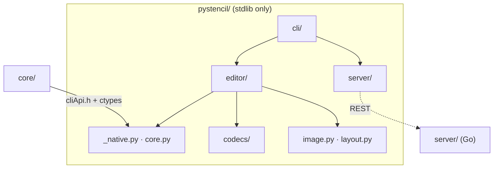

# pystencil architecture

The system-wide design — the parity contract, canonical data, the layer model, the pattern vocabulary — is in the root [`ARCHITECTURE.md`](../ARCHITECTURE.md).

A real core consumer, not a thin adapter: every crop, rotate, fill, rasterise, colour parse,
page metric and filter goes through the C++ core over `core/cliApi.h`. Python owns only what
the core leaves out — codecs, HTTP, JSON, the edit/history model, the server protocol.

## Layers

`_native.py` + `core.py` → `image.py`, `codecs/`, `layout.py` → `editor/` → `llm/`,
`server/`, `sitesource/` → `cli/`. `_net.py` is the single fetch guard every network path
goes through.

## Where things go

| Path | Holds | Rule |
|---|---|---|
| `build.py` | compiles `core/` + `cliApi.cpp` into the shared lib | its source list mirrors `STENCIL_CORE_SOURCES`; rebuilds when any source **or header** is newer than the artifact |
| `pystencil/_native.py`, `core.py`, `_rasterops.py`, `_bindings.py`, `_marshal.py` | locate → (lazily) build → load; `class Core` (scalar half) + the pixel-buffer half; the `argtypes`/`restype` table; the C-view marshalling and buffer guards | every ABI function gets an explicit `argtypes`/`restype` row; bytes move as flat RGBA8 buffers and C strings |
| `pystencil/_net.py`, `_parallel.py` | the one fetch guard (scheme, SSRF, redirects, size cap); the one bounded fan-out | fan-out results land in submission order so output matches a serial run |
| `pystencil/_severity.py`, `_types.py` | the `error: ` / `note: ` prefixes (twin of `cli/src/logo.zig`); the 3.9 `NoneType` spelling | |
| `pystencil/_data/`, `_opschema/` | the embedded copies of `browser/js/config/llm/`; the registry-driven op-plan schema engine | copies are byte-pinned by `tests/test_canonical_drift.py` |
| `pystencil/image.py`, `layout.py`, `codecs/` | the RGBA8 buffer, the camelCase layout dataclasses (tolerant coercion), pure-Python PNG/BMP | JPEG decoding belongs to the CLI |
| `pystencil/editor/` | the chainable `Editor` over history, derive, project, layout_io, edits, assistant and source collaborators | the view is derived on demand (`rotate → crop → filter → rasterise`), memoised on a `revision`; history capped at 64 (`LIMITS.historyMax`), never evicting the pristine state |
| `pystencil/llm/` | config · plan · registry · execute · client · chat | plans validate against `_opschema` before execution; execution calls `Editor` methods, never pixels |
| `pystencil/server/` | `ServerConnection` + `ConnectionManager` (urllib REST) | mirrors `server/internal/protocol`; REST only, changes are polled |
| `pystencil/sitesource/` | scraping: format · scan · filter · download · net | prints the shared stderr grammar (`cli/CONTRACT.md` §3) |
| `pystencil/cli/` | `python -m pystencil`: the one-shot pipeline, the console I/O surface, `commands/` | each command is the twin of a `cli/src/console/handlers/` file |
| `tests/` | one suite per subject; `nativecase.py` (the `require_core` gate), `test_build.py`, `test_canonical_drift.py`, `goldens/`, `bench_*.py` | hermetic — no server, no network; `STENCIL_SKIP_NATIVE=1` skips native cases as a band |

## Rules

1. **Stdlib only, ctypes only.** No PyPI package, no C extension module. `from __future__
   import annotations` in every module so `(X | NoneType)` hints work on 3.9.
2. **Three source lists.** `build.py`'s list is the third copy of `core/CMakeLists.txt`'s
   and `cli/build.zig`'s; `tests/test_build.py` pins it.
3. **Nothing pushed into `core/`.** No Qt, codec or DOM concern ever crosses the ABI.
4. **The console is the CLI's twin.** Same command names, same grammar, same path semantics
   (`/layout`, `/blank`, `/format`), same `error:` / `note:` prefixes; the deviations from it
   are the ones named in the contract.
5. **Contract deviations are named, not silent.** The `frame` op raises
   `LlmExecutionError` (no video decoding); attachments are not downscaled (no resampling).
6. **Every network path** goes through `_net.py`.

## Tests

`unittest` only, hermetic: no server, no network. Native-backed cases pass through the one
`require_core` gate so they skip as a band. Benchmarks are opt-in and assert only ratios —
the PNG Up filter's SWAR row adds, the `revision` memo, validation linear in lines × points
— never microseconds.
