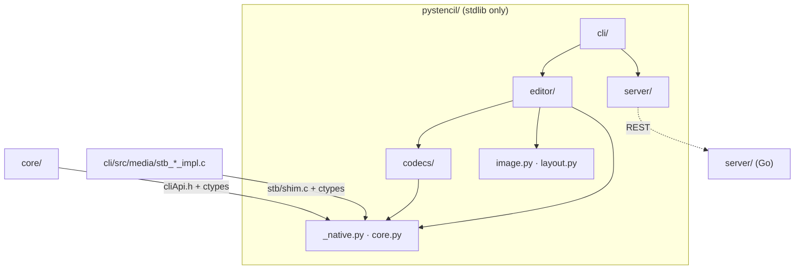

# pystencil architecture

The system-wide design — the parity contract, canonical data, the layer model, the pattern vocabulary — is in the root [`ARCHITECTURE.md`](../ARCHITECTURE.md). The console grammar and stderr output it follows are `cli/CONTRACT.md`; the LLM behaviour is `contracts/llm/`.

```mermaid
graph TD
    CORE["core/"]
    STB["cli/src/media/stb_*_impl.c"]
    subgraph PY["pystencil/ (stdlib only)"]
      NATIVE["_native.py · core.py"]
      CODECS["codecs/"]
      IMG["image.py · layout.py"]
      ED["editor/"]
      SRVC["server/"]
      CLIM["cli/"]
    end
    SRV["server/ (Go)"]

    CORE -->|"cliApi.h + ctypes"| NATIVE
    STB -->|"stb/shim.c + ctypes"| NATIVE
    CODECS --> NATIVE
    ED --> NATIVE & IMG & CODECS
    CLIM --> ED & SRVC
    SRVC -.->|"REST"| SRV
```

A real core consumer, not a thin adapter: every crop, rotate, fill, rasterise, colour parse,
page metric, filter and op-plan validation goes through the C++ core over `core/cliApi.h`.
Python owns only what the core leaves out — codecs, HTTP, JSON, the edit/history model, the
server protocol.

## Layers

`_native.py` + `core.py` → `image.py`, `codecs/`, `layout.py`, `scriptpaths.py` → `editor/` →
`llm/` (+ `plan/`), `script.py`, `server/`, `sitesource/` → `cli/`. `_net.py`, the one fetch
guard, and the other `_`-prefixed helpers sit with `_native` at the bottom.
`tests/test_layer_boundary.py` lints the import direction over the AST and allows the two
`editor → llm` crossings (`assistant.py`, `project.py`) by name.

## Where things go

| Path | Holds | Rule |
|---|---|---|
| `build.py`, `build_compile.py`, `build_stb.py`, `build_data.py` | the shared-lib build of `core/`, the CLI's stb units and `stb/shim.c`; the `pystencil/_data/` sync | its source list is the third copy of `STENCIL_CORE_SOURCES` |
| `stb/` | the `stencil_py_*` shim, `pin.json`, the gitignored cache | `stb/cache/` holds only bytes that hash to `pin.json` |
| `pystencil/_native.py`, `core.py`, `_raster/`, `_ffi/`, `_severity.py` | locate → build → load; `class Core`; the ctypes tables and buffer guards; the `error: ` / `note: ` prefixes | every function pystencil calls gets an explicit `argtypes`/`restype` row — the row-band kernels and the helpers of features this surface lacks stay unbound, since nothing here calls them; only these modules and `_ffi/` import `ctypes`; bytes cross as flat RGBA8 buffers and C strings |
| `pystencil/_net.py`, `_raster/parallel.py` | the one fetch guard and the redirect-refusing opener; the one bounded fan-out | fan-out results land in submission order |
| `pystencil/_script.py`, `_scripttypes.py`, `scriptpaths.py`, `script.py` | the `.stc` handle and its value types; what a `@source` names and where a `@save` writes | the core lowers, the adapter opens — path expansion and save naming live outside `core/`, each spelled once |
| `pystencil/_data/` | the generated copies of `common/config/llm/` and `net/blockedRanges.json` | byte-pinned by `tests/test_canonical_drift.py` |
| `pystencil/image.py`, `layout.py`, `codecs/` | the RGBA8 buffer, the layout dataclasses, stb decode (`stblib.py`), the pure-Python fallbacks, the PNG and BMP encoders | a decoder refuses a side past `MAX_SIDE`; only `_ffi/stb.py` touches `ctypes` for stb |
| `pystencil/editor/` | the chainable `Editor`, one class over per-feature mixins | the view is derived on demand, memoised on `revision`; history never evicts the pristine state |
| `pystencil/llm/` (+ `plan/`) | config · wire · client · chat; under `plan/` the core-result mapping, the registry and execution | core validates every plan; execution calls `Editor` methods, never pixels; a provider's shapes are one `wire.py` row |
| `pystencil/server/` | `ServerConnection` + `ConnectionManager` (urllib REST) | speaks `server/internal/protocol`; REST only, changes are polled |
| `pystencil/sitesource/` | scraping: format · scan · filter · download · net | prints the shared stderr grammar (`cli/CONTRACT.md` §3) |
| `pystencil/cli/` | `python -m pystencil`: one-shot, script run and plan, the console, `commands/` | the console follows `cli/CONTRACT.md` |
| `tests/` | one suite per subject, mirrored by folder; the opt-in `bench/` | hermetic — no server, no network |

## Entities

```mermaid
classDiagram
    class Core {
      +CDLL _lib
    }
    class Snapshot["_Snapshot"] {
      +int rotation
      +tuple crop
      +str filter_mode
    }
    class Editor {
      +int revision
    }
    class OpPlan {
      +str reply
      +list~dict~ actions
      +list~Variant~ variants
      +AskCard ask
    }
    class LlmConfig {
      +str api_key
      +session_key()
    }
    class MediaItem
    class Repl["_Repl"]
    Editor "1" o-- "0..1" Image : original
    Editor "1" *-- "1..*" Snapshot : history
    Editor --> Core : every pixel op
    Editor --> Layout : derives
    Snapshot "1" *-- "*" Line : lines
    Layout "1" *-- "*" Line : lines
    Script --> Core : one handle per parse
    Editor --> Script : replays its ops
    Chat --> OpPlan : parses each reply into
    ConnectionManager "1" *-- "*" ServerConnection : by url
    Repl "1" *-- "1" Editor
    Repl "1" *-- "1" ConnectionManager
    Repl "1" o-- "0..1" Chat
    Repl "1" *-- "1" LlmConfig : /llm
    Chat --> LlmConfig : through its client
```

| Entity | What it is | Owned by / lifetime | Relates to |
|---|---|---|---|
| `Core` (`core.py` + `_raster/ops.py`) | The typed ctypes wrapper over the `stencil_cli_*` ABI | A `get_core()` singleton or injected; holds the `CDLL` and one op-plan schema handle, released by `close()` | Called by `Editor`, `Image.blank` and `parse_op_plan`; never holds pixels |
| `Image` (`image.py`) | A flat RGBA8 `bytearray` with its dimensions | Value type; the `Editor` keeps one pristine original | Coded by `codecs/`; uploaded by `ServerConnection` |
| `Layout` / `Line` / `Point` (`layout.py`) | The drawing payload: dimensions, lines, filter, crop, rotation, page, formulas | Values from `Editor.layout()` or JSON | The layout JSON every surface reads |
| `_Snapshot` (`editor/_snapshot.py`) | One editing state: rotation, crop in rotated-original space, filter, drawn lines | Copied, never mutated, on the `Editor` history stack | Pushed by every `Editor` mutator |
| `Editor` (`editor/editor.py`) | The chainable facade: original image, history, cursor, project metadata, page format, chat | One per console session or library caller | Target of `execute_op_plan` and script replay |
| `OpPlan` / `Variant` / `AskCard` (`llm/types.py`) | A validated model reply: text, actions, variants, an optional question card | Made by `parse_op_plan` from core's result, consumed once by `execute_op_plan` | Typed through `OP_REGISTRY`; `common/config/llm/opRegistry.json` is canonical |
| `Chat` (`llm/chat.py`) | A client-side conversation whose bounded history is replayed on every call | Created by `/chat on`; dropped when the working image is replaced | Serialises to the §12.1 chat document |
| `ServerConnection` (`server/connection.py`) | One connected server: base URL, token, credential kind, status, the REST surface | Created by `ConnectionManager.connect` | Speaks `server/internal/protocol` |
| `ConnectionManager` (`server/manager.py`) | The session's connections by normalised URL, with reconnect and parallel polling | One per `_Repl` | Owns every `ServerConnection` |
| `MediaItem` (`sitesource/format.py`) | One scanned media candidate: URL, kind, size, format, alt text | Made by `scan_html`, filtered and downloaded by `scan_page` | Printed in the shared stderr grammar |
| `Script` (`_script.py`) | One parsed `.stc` program: diagnostics, `@source` blocks, lowered ops | A core handle from `parse_script`, a context manager; its results are read out eagerly | Replayed by `Editor` and `cli/scriptplan.py`; `common/fixtures/script/` is canonical |
| `LlmConfig` (`llm/config.py`) | The §5 provider shape and the key's TTL clock | One per `_Repl`, seeded from `STENCIL_LLM_*`, changed by `/llm` | Read by `LlmClient` on every request; the only holder of the key |
| `_Repl` (`cli/repl.py`) | The console state and command table, composed from the `commands/` mixins | One per `--console` run, over stdin and stderr | Mediates `Editor`, `ConnectionManager`, `Chat`, `LlmConfig`, `Console` |

## Patterns

| Pattern | Where | Notes |
|---|---|---|
| Facade over core | `Core`, `Editor` | `Core` is the narrow ABI surface; `Editor` is the one mutation surface for console, library and plans |
| Mediator | `_Repl` | The command mixins reach each other only through it; `_image_replaced` is the one chokepoint for image-scoped state |
| Command | `_HistoryApi._push` (`editor/history.py`) | Every mutator pushes a copied snapshot; `undo`/`redo`/`reset` move the cursor |
| Strategy | `WIRES` (`llm/wire.py`); `codecs.decode`; `pick_strategy` (`codecs/pngfilter.py`) | Wire shape by `providers.json`'s `wire`; codec by magic bytes; PNG unfilter by a cost model |
| Observer | `diff_projects` (`server/diff.py`) | REST only, so `watch_projects` polls and fires events from list diffs |
| Repository | `server/projects.py`, `server/files.py`; `editor/project.py` | Server projects and the `.stencil` file behind method calls; the version guard never leaks past `ServerError` |
| Chain of Responsibility | `_net._fetch` | scheme → address → redirect → byte cap; each link refuses on its own |
| Adapter | `_ffi/bindings.py` + `_ffi/marshal.py`; `LlmClient` | ctypes signatures map Python values to C pointers; the client maps messages to each provider's JSON |
| Table-driven registry | `OP_REGISTRY`; `_TABLE`/`_HELP` from `@command`; `HANDLERS` and `ACTIONS` keyed by `Op.kind` | Dispatch on core's resolution of the registry; verbs and `/help` come from one declaration |
| Mixin composition | `Editor`, `ServerConnection`, `_Repl` | Each is a bare class plus `_*Api` / `_*Commands` mixins that share its state and nothing else |
| Fixture walker / Golden pin | `tests/fixtures/` over `fixturebase.py`; `tests/goldens/` | Canonical corpora walked verbatim; console text and the typed op-plan result byte-pinned |

## Design

- **Boot.** `Core.load()` → `find_or_build()`: `$STENCIL_CORE_LIB` wins, else `build.py`,
  imported by path, rebuilds when the artifact is older than any input. `build()` locks,
  compiles, links into a temp file and `os.replace`s it in, so no loader maps a half-written
  library; without the stb headers PNG and BMP decode through the fallbacks. Importing the
  package refreshes `pystencil/_data/` from `common/config` through `build_data.sync`.
- **An image op.** `Editor.result()` derives the view from the snapshot under the cursor —
  rotate → crop → filter or contour → `rasterize_line` per `Line` — memoised on `revision`.
  Buffers are Python-allocated; the core never allocates across the ABI.
- **An edit.** A mutator copies the current `_Snapshot`, changes one field and `_push`es it:
  truncate the redo tail, append, evict past `LIMITS.historyMax` keeping index 0, bump
  `revision`. Crops compose into rotated-original space; `Layout.from_dict` holds lines to
  core's layout caps.
- **A console turn.** `_Repl.run` reads a line and `_TABLE` picks the mixin method, which
  returns values and speaks only through `Console` on stderr; a raised error becomes one
  `error:` line.
- **An LLM turn.** `/prompt` sends the view and attachments, through `Chat.send` under
  `/chat on`, else one-shot. `parse_op_plan` hands the reply to `stencil_cli_opplanParse`
  against the generated `opRegistry.json`; core extracts, caps, validates and normalizes, and
  each `OpSpec` types the actions into an `OpPlan`. `blocked_open_url` fails a plan naming a URL
  the user never wrote. `execute_op_plan` applies actions through `OP_REGISTRY`, variants
  branching on a bounded pool.
- **A direct Claude turn.** With `provider = "anthropic"` the `WIRES` row reads
  `LlmConfig.session_key()`, which expires after `sessionKey.ttlMinutes`. No key, or plain http
  off loopback, raises `llmDisabled` before any request. The key rides as `x-api-key`,
  unredirected; upstream text is shown only sanitized, dropped whole if it echoes the key.
- **A script run.** The core lexes, expands templates, resolves `@undo`/`@redo` and lowers to
  one flat op stream; any error means nothing executes. `Editor.script` replays it by
  `HANDLERS[op.kind]`. `run_script` expands each `@source` through `scriptpaths` into fresh
  `Editor`s, and each `@save` writes `<stem>-stencil.<ext>` beside the source.
- **A script plan.** `cli/scriptplan.py` lowers the same program to op plans, laid out by
  `plansequence.py`; what a plan cannot carry is refused with the CLI's codes, so the envelope
  equals the CLI's for the same script and input.
- **A server session.** `ConnectionManager.connect` builds a `ServerConnection`, minting or
  probing a token; `_request` re-mints once on 401/403. `save_remote_project` is a
  version-guarded `PUT /projects/{id}` (409 → `ServerError("conflict")`) then the result file.
- **A fetch.** `_net._fetch(url, strict)` refuses a non-http(s) scheme, then any address in the
  table's `fetch` policy or not global; loopback only when not `strict`. Any 30x raises and a
  body past `MAX_FETCH_BYTES` is refused. A user-named URL runs `strict=False`, every harvested
  sub-resource strict. REST and LLM calls share `server/http.py`'s `_http_open` with the same
  redirect refusal and byte cap.
- **A codec.** PNG, JPEG and BMP decode through the CLI's `cli/src/media/stb_read_impl.c`,
  compiled unchanged so its narrowing is stated once. Each refuses an oversized header before
  stb allocates; the shim zeroes planes and caps inflation per thread. Without stb,
  `pngdecode` and `bmpdecode` read the common subsets to the same pixels.
- **The stb headers.** `build_stb.ensure` takes each header from the first source hashing to
  its pin — `stb/cache/`, the CLI's zig package copy, then the pinned upstream commit via
  `_net._fetch`; a mismatching file is never kept.
- **A project file.** `save_project` writes the `.stencil` document, omitting an empty optional
  key.

## Concurrency

A library, not a runtime: pystencil starts no thread of its own outside a call. Every call
runs on its caller's thread, and ctypes releases the GIL for each call into the core, so
pixel kernels and I/O overlap. The core serializes its op-plan and script handle tables
itself; the `Core` kernels are re-entrant over caller-owned buffers. `Editor` and `_Repl` are
single-owner: one thread drives each, and no state of theirs is locked. The one fan-out,
`map_parallel` in `_raster/parallel.py`, runs self-contained jobs on a bounded
`ThreadPoolExecutor` and returns results in submission order, re-raising a job's exception at
its position. Across processes, two writers share the checkout: the native build and the
`pystencil/_data/` sync, each under its own `flock` and each landing by `os.replace`. Locks nest in one
order only: `codecs/stblib._LOCK` → `_native._LOCK`.

Errors that cross the library API are `ValueError` (bad input, a guard refusal, a malformed
project; `ScriptError` is one), `TypeError` (an unsupported input kind), `RuntimeError` (no
image loaded, a failed build or load, a registry the core refused), `FileNotFoundError` (a
missing `$STENCIL_CORE_LIB` or an unbuilt library with building off), `CodecError`,
`ServerError`, the `LlmError` family and the transport's `OSError` / `urllib.error.URLError`.

| Owner | Runs on | Shares | Guard | On overflow or teardown |
|---|---|---|---|---|
| `_native.load_library` / `get_core` | first caller's thread | `_CDLL`, `core._CORE` | double-checked under the one `_native._LOCK` (`RLock`) | racing first callers build and load once |
| `build.build` | any process | `_native/<lib>` | `flock` on `<lib>.lock`, staleness re-checked inside; temp file + `os.replace` | a failed or timed-out compile leaves the old library and no temp file |
| `build_data.sync` | any importing process | the `pystencil/_data/` copies | unlocked equality check, then `flock` on a lock file beside the copies; temp file + `os.replace` | equal bytes are never rewritten; a reader sees old or new bytes, never a torn file |
| `Core` op-plan schema handle | caller | the handle | created under `_native._LOCK`; the core locks its handle table | `close()` / `__del__` destroy it once; the `get_core()` instance keeps its handle for the process; a teardown failure is swallowed |
| `Script` | any thread | its core handle, the resolve buffer | one `threading.Lock` per `Script` over every handle read and the destroy; the core locks its table | `close()` is idempotent from any thread; a read after it raises `ScriptError` |
| `map_parallel` | `ThreadPoolExecutor`, `min(bound, jobs)` workers | nothing — each job its own | none needed | a batch of one runs inline; the first failing job's exception surfaces at its position |
| `execute_op_plan` variants | `map_parallel`, `MAX_VARIANT_WORKERS` | the injected `Core` | each branch owns a fresh `Editor`, built in plan order on the caller's thread | outputs in variant order |
| `_net._fetch_all` (scan, measure, download, server polls) | `map_parallel`, `MAX_FETCH_WORKERS` | nothing | each fetch runs `_net._fetch`'s guard on its own | a failing item is skipped by its job |
| `ConnectionManager.remote_projects` | `_fetch_all`, one job per connection | each `ServerConnection` | a connection's listing error yields `[]` | an unreachable server is skipped |
| `ServerConnection._request` re-mint | any thread on that connection | `token`, `credential_kind` | the per-connection `_mint_lock`; a request whose token already changed retries without minting | one mint per stale token; a failed mint re-raises the original 401/403 |
| `codecs/stblib.loaded` | first decoding thread | `_LIB`, `_MISSING` | `stblib._LOCK`, then `_native._LOCK` inside it | a missing library is remembered with its reason |
| stb decode | any thread | stb's process-global failure reason | the shim's per-thread block cap; the reason itself is unguarded | two failing decodes at once may report each other's reason |
| `_net._assert_fetchable` | caller | DNS | resolves and judges every address, then the fetch resolves again | a rebinding between the two lookups is the residual TOCTOU the Zig CLI shares |

## Rules

1. **Stdlib only, ctypes only.** No PyPI package, no C extension module. `from __future__
   import annotations` in every module, below the module docstring.
2. **Three source lists.** `build.py`'s list is the third copy of `core/CMakeLists.txt`'s and
   `cli/build.zig`'s; `tests/test_build.py` pins it.
3. **Nothing pushed into `core/`.** No Qt, codec or DOM concern ever crosses the ABI.
4. **The console follows `cli/CONTRACT.md`** — command names, grammar, path semantics, the
   `error:` / `note:` prefixes — save the deviations the contract names.
5. **Contract deviations are named, not silent.** With no video decoding, the `frame` op and
   `@frame` raise; with no resampling, attachments are not downscaled; a `@source` directory or
   glob takes only what `codecs` decodes.
6. **Every content fetch** goes through `_net.py`; the REST and LLM clients, which reach only
   user-configured endpoints, share `server/http.py`'s `_http_open`.
7. **stb is pinned, never committed.** A header compiles only after it hashes to
   `stb/pin.json`, whose commit is `cli/build.zig.zon`'s; the decoder's narrowing lives in the
   CLI's `stb_read_impl.c` alone.
8. **A key lives in `LlmConfig` alone.** Nothing writes, logs or prints it; the compiler, the one
   child process, runs under `build_compile.child_env()` without `STENCIL_LLM_*` or the server
   tokens; a direct `anthropic` request is never built without a live session key.

## Tests

`unittest` only, hermetic: no server, no network — only the first native build fetches the stb
headers. Native cases skip as a band through `require_core`, stb cases through `require_stb`.
Opt-in benchmarks assert only ratios.

The fixture walkers run the canonical corpora verbatim through `fixturebase.py`, with
`tests/helpers/fixture_overrides.json` naming this surface's deviations, and the
`--script-plan` envelope is held equal to the built CLI's. Pinned: the generated asset copies
against `common/`, the source list and ctypes rows, the registry against core's resolution, the
import direction, the typed op-plan result and the console text. The network is stubbed at the
`_open` and `_http_open` seams; loopback servers prove a redirect never carries a credential and
an over-cap body is refused, and `tests/helpers/anthropicmock.py` serves direct turns. Codec
suites hold stb and the fallbacks to the same pixels and against bombs and oversized headers;
concurrency suites prove submission order, one build under a racing `get_core()`, the
`pystencil/_data/` sync against racing writer processes, scripts parsed and closed from a pool, a double
close destroying once, one re-mint for racing stale requests and a `Core` releasing its schema.
