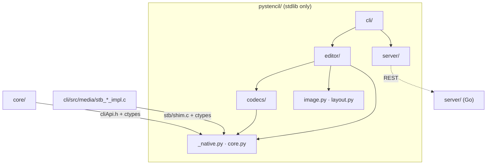
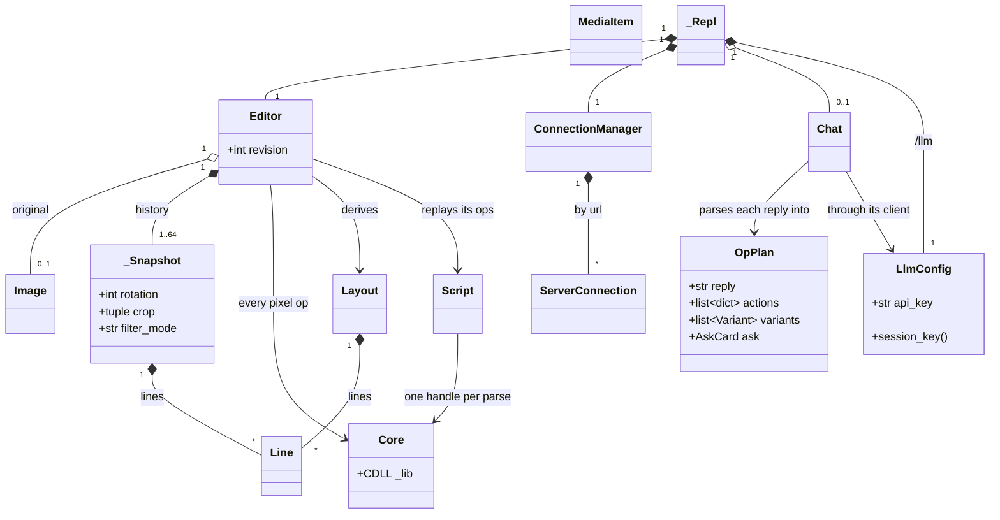

# pystencil architecture

The system-wide design — the parity contract, canonical data, the layer model, the pattern vocabulary — is in the root [`ARCHITECTURE.md`](../ARCHITECTURE.md). The console grammar and stderr output it twins are `cli/CONTRACT.md`; the LLM behaviour is `contracts/llm/`.

```mermaid
graph TD
    CORE["core/"]
    STB["cli/src/media/stb_*_impl.c"]
    subgraph PY["pystencil/ (stdlib only)"]
      NATIVE["_native.py · core.py"]
      CODECS["codecs/"]
      IMG["image.py · layout.py"]
      ED["editor/"]
      SRVC["server/"]
      CLIM["cli/"]
    end
    SRV["server/ (Go)"]

    CORE -->|"cliApi.h + ctypes"| NATIVE
    STB -->|"stb/shim.c + ctypes"| NATIVE
    CODECS --> NATIVE
    ED --> NATIVE & IMG & CODECS
    CLIM --> ED & SRVC
    SRVC -.->|"REST"| SRV
```

A real core consumer, not a thin adapter: every crop, rotate, fill, rasterise, colour parse,
page metric, filter and op-plan validation goes through the C++ core over `core/cliApi.h`.
Python owns only what the core leaves out — codecs, HTTP, JSON, the edit/history model, the
server protocol.

## Layers

`_native.py` + `core.py` → `image.py`, `codecs/`, `layout.py`, `scriptpaths.py` → `editor/` →
`llm/` (+ `plan/`), `script.py`, `server/`, `sitesource/` → `cli/`. `_net.py`, the one fetch
guard, and the other `_`-prefixed helpers sit with `_native` at the bottom.
`tests/test_layer_boundary.py` lints the import direction over the AST and allows the two
`editor → llm` crossings (`assistant.py`, `project.py`) by name.

## Where things go

| Path | Holds | Rule |
|---|---|---|
| `build.py`, `build_compile.py`, `build_stb.py` | the shared-lib build of `core/`, the CLI's stb units and `stb/shim.c` | its source list mirrors `STENCIL_CORE_SOURCES`; a rebuild runs within `BUILD_TIMEOUT` |
| `stb/` | the `stencil_py_*` shim, `pin.json`, the gitignored cache | `stb/cache/` holds only bytes that hash to `pin.json` |
| `pystencil/_native.py`, `core.py`, `_raster/`, `_ffi/`, `_severity.py` | locate → build → load; `class Core`; the ctypes tables and buffer guards; the `error: ` / `note: ` prefixes (twin of `cli/src/app/logo.zig`) | every ABI function gets an explicit `argtypes`/`restype` row; bytes cross as flat RGBA8 buffers and C strings |
| `pystencil/_net.py`, `_raster/parallel.py` | the one fetch guard and the redirect-refusing opener REST and LLM calls share; the one bounded fan-out | fan-out results land in submission order, so output matches a serial run |
| `pystencil/_script.py`, `_scripttypes.py`, `scriptpaths.py`, `script.py` | the `.stc` handle and its value types (twin of `core/script/types.hpp`); what a `@source` names and where a `@save` writes | the core lowers, the adapter opens — listing, glob, the `-stencil` rule, the `..` refusals and the save-format fallback live outside `core/`, each spelled once |
| `pystencil/_data/` | the embedded copies of `common/config/llm/` and `net/blockedRanges.json` | byte-pinned by `tests/test_canonical_drift.py`; core validates plans against the `opRegistry.json` copy |
| `pystencil/image.py`, `layout.py`, `codecs/` | the RGBA8 buffer, the camelCase layout dataclasses, PNG, JPEG and BMP decode through the native lib's stb (`stblib.py`), the pure-Python fallbacks `pngdecode.py` and `bmpdecode.py`, the PNG and BMP encoders | a decoder refuses a side past `MAX_SIDE` (the CLI's cap) and never inflates far past the plane its header claims; only `_ffi/stb.py` touches `ctypes` for stb |
| `pystencil/editor/` | the chainable `Editor`, one class over per-feature mixins and collaborators | the view is derived on demand, memoised on `revision`; history caps at `LIMITS.historyMax`, never evicting the pristine state |
| `pystencil/llm/` (+ `plan/`) | config · wire · client · chat; under `plan/` the core-result mapping, the registry and execution | core/opplan validates every plan, its messages shown unchanged; execution calls `Editor` methods, never pixels; a provider's shapes are one `wire.py` row, the upstream classifier sits beside the sanitizer in `errors.py` |
| `pystencil/server/` | `ServerConnection` + `ConnectionManager` (urllib REST) | mirrors `server/internal/protocol`; REST only, changes are polled |
| `pystencil/sitesource/` | scraping: format · scan · filter · download · net | prints the shared stderr grammar (`cli/CONTRACT.md` §3) |
| `pystencil/cli/` | `python -m pystencil`: one-shot, script run and plan, the console, `commands/` | each command twins a `cli/src/console/handlers/` file |
| `tests/` | one suite per subject, mirrored by folder; the opt-in `bench/` | hermetic — no server, no network; `STENCIL_SKIP_NATIVE=1` skips native cases as a band |

## Entities

```mermaid
classDiagram
    class Core {
      +CDLL _lib
    }
    class Snapshot["_Snapshot"] {
      +int rotation
      +tuple crop
      +str filter_mode
    }
    class Editor {
      +int revision
    }
    class OpPlan {
      +str reply
      +list~dict~ actions
      +list~Variant~ variants
      +AskCard ask
    }
    class LlmConfig {
      +str api_key
      +session_key()
    }
    class MediaItem
    class Repl["_Repl"]
    Editor "1" o-- "0..1" Image : original
    Editor "1" *-- "1..64" Snapshot : history
    Editor --> Core : every pixel op
    Editor --> Layout : derives
    Snapshot "1" *-- "*" Line : lines
    Layout "1" *-- "*" Line : lines
    Script --> Core : one handle per parse
    Editor --> Script : replays its ops
    Chat --> OpPlan : parses each reply into
    ConnectionManager "1" *-- "*" ServerConnection : by url
    Repl "1" *-- "1" Editor
    Repl "1" *-- "1" ConnectionManager
    Repl "1" o-- "0..1" Chat
    Repl "1" *-- "1" LlmConfig : /llm
    Chat --> LlmConfig : through its client
```

| Entity | What it is | Owned by / lifetime | Relates to |
|---|---|---|---|
| `Core` (`core.py` + `_raster/ops.py`) | The typed ctypes wrapper over the `stencil_cli_*` ABI: scalar calls plus the RGBA8 kernels | A `get_core()` singleton or injected; holds the `CDLL` and, from the first plan on, one op-plan schema handle | Called by `Editor`, `Image.blank` and `parse_op_plan`; never holds pixels |
| `Image` (`image.py`) | A flat RGBA8 `bytearray` with its dimensions | Value type; the `Editor` keeps one pristine original | Coded by `codecs/`; uploaded by `ServerConnection` |
| `Layout` / `Line` / `Point` (`layout.py`) | The drawing payload: dimensions, lines, filter, crop, rotation, page, formulas | Values from `Editor.layout()` or JSON | Twin of the browser's canonical `buildLayoutPayload` (`browser/js/core/layout.js`) |
| `_Snapshot` (`editor/_snapshot.py`) | One editing state: rotation, crop in rotated-original space, filter, drawn lines | Copied, never mutated, on the `Editor` history stack | Mirror of the CLI's `EditState` (`cli/src/console/session`) |
| `Editor` (`editor/editor.py`) | The chainable facade: original image, history, cursor, project metadata, page format, chat | One per console session or library caller; `clear()` resets it in place | Port of `window.stencil` and the CLI `Session`; target of `execute_op_plan` |
| `OpPlan` / `Variant` / `AskCard` (`llm/types.py`) | A validated model reply: text, actions, variants, an optional §11 question card, the paths its saves wrote | Made by `parse_op_plan` from core's result, consumed once by `execute_op_plan` | Typed and applied through `OP_REGISTRY`; `common/config/llm/opRegistry.json` is canonical |
| `Chat` (`llm/chat.py`) | A client-side conversation whose bounded history is replayed on every call | Created by `/chat on`; dropped when the working image is replaced | Serialises to the §12.1 chat document |
| `ServerConnection` (`server/connection.py`) | One connected server: base URL, token, credential kind, status, the REST surface | Created by `ConnectionManager.connect`; `close()` flips status | Speaks `server/internal/protocol`, the Go side canonical |
| `ConnectionManager` (`server/manager.py`) | The session's connections by normalised URL, with reconnect and parallel polling | One per `_Repl` | Port of the browser `ConnectionManager`, REST only |
| `MediaItem` (`sitesource/format.py`) | One scanned media candidate: URL, kind, size, format, alt text | Made by `scan_html`, filtered and downloaded by `scan_page` | Twin of the extension's `image/scan.js` record |
| `Script` (`_script.py`) | One parsed `.stc` program: diagnostics, `@source` blocks, lowered ops, and reads through the live handle | A core handle from `parse_script`, a context manager; what a runner needs is read out eagerly and outlives it | Replayed by `Editor` and `cli/scriptplan.py`; the corpus in `common/fixtures/script/` is canonical |
| `LlmConfig` (`llm/config.py`) | The §5 provider shape — provider, base URL, model, key, server URL — and the key's TTL clock | One per `_Repl`, seeded from `STENCIL_LLM_*`, changed by `/llm`; the key lives until `/llm key forget`, exit or its TTL | Read by `LlmClient` on every request; the only holder of the key |
| `_Repl` (`cli/repl.py`) | The console state and command table, composed from the `commands/` mixins and `_PlanHooks` | One per `--console` run, over stdin and stderr | Mediates `Editor`, `ConnectionManager`, `Chat`, `LlmConfig`, `Console` |

## Patterns

| Pattern | Where | Notes |
|---|---|---|
| Facade over core | `Core`, `Editor` | `Core` is the narrow ABI surface; `Editor` ports `window.stencil`, so console, library and plans mutate alike |
| Mediator | `_Repl` | The command mixins reach each other only through it; `_image_replaced` is the one chokepoint for image-scoped state |
| Command | `_HistoryApi._push` (`editor/history.py`) | Every mutator pushes a copied snapshot; `undo`/`redo`/`reset` move the cursor, so apply and revert share one path |
| Strategy | `WIRES` (`llm/wire.py`); `codecs.decode`; `pick_strategy` (`codecs/pngfilter.py`) | Wire shape by `providers.json`'s `wire`; codec by magic bytes; the fallback's PNG unfilter (per-byte or a 16-bit-lane wavefront) by a cost model, the encoder's filter by a deflate trial |
| Observer | `diff_projects` (`server/diff.py`) | REST only, so `watch_projects` polls and fires events from list diffs |
| Repository | `server/projects.py`, `server/files.py`; `editor/project.py` | Server projects and the `.stencil` file behind method calls; the version guard and the 409 never leak past `ServerError` |
| Chain of Responsibility | `_net._fetch` | scheme → address → `_NoRedirect` → `MAX_FETCH_BYTES`; each link refuses on its own |
| Adapter | `_ffi/bindings.py` + `_ffi/marshal.py`; `LlmClient` | ctypes signatures and buffer views map Python values to C pointers; the client maps messages to each provider's JSON |
| Table-driven registry | `OP_REGISTRY`; `_TABLE`/`_HELP` from `@command`; `HANDLERS` and `ACTIONS` keyed by `Op.kind` | Typing, execution and prompt bullets dispatch on core's resolution of the registry; verbs and `/help` come from one declaration; a script op reaches its handler by lookup, never a kind chain |
| Mixin composition | `Editor`, `ServerConnection`, `_Repl` | Each is a bare class plus `_*Api` / `_*Commands` mixins that share its state and nothing else |
| Fixture walker / Golden pin | `tests/fixtures/` over `fixturebase.py`; `tests/goldens/` | Canonical corpora walked verbatim; console text and the typed op-plan result byte-pinned |

## Design

- **Boot.** `Core.load()` → `find_or_build()`: `$STENCIL_CORE_LIB` wins, else `build.py`,
  imported by path (never via `sys.path`), rebuilds when the artifact is older than any input,
  headers, the stb pin and the build scripts included. `build()` locks, re-checks what a racing
  process may have cured, compiles each C unit alone, links them with `core/` into a temp file
  and `os.replace`s it in, so no loader maps a half-written library; without the stb headers
  JPEG is missing and PNG and BMP decode through the fallbacks.
- **An image op.** `Editor.result()` derives the view from the snapshot under the cursor in the
  CLI's `rebuild()` order — rotate → crop → filter or contour → `rasterize_line` per `Line` —
  memoised on `(revision, with_lines)`. Buffers are Python-allocated and aliased, no view
  outlives its call, a short one is refused first; the core never allocates across the ABI.
- **An edit.** A mutator copies the current `_Snapshot`, changes one field and `_push`es it:
  truncate the redo tail, append, evict index 1 past 64 (index 0, the pristine state,
  survives), bump `revision`. Crops compose into rotated-original space and ride through a
  rotation as in the CLI; view-local lines follow the browser's turn and crop rules.
  `Layout.from_dict` holds lines to core's layout caps (`Core.layout_caps`), cut as the
  browser's `sanitizeLines` cuts them, so a parse with lines needs the native core.
- **A console turn.** `_Repl.run` reads a line and `_TABLE` picks the mixin method, which
  returns values and speaks only through `Console` on stderr; `ValueError`, `RuntimeError`,
  `OSError` and `ServerError` become one `error:` line.
- **An LLM turn.** `/prompt` sends the view, its edge map and the `/upload` set under
  `CONSOLE_SYSTEM_PROMPT`, through `Chat.send` under `/chat on`, else one-shot. `parse_op_plan`
  hands the reply's UTF-8 bytes by length (a lone surrogate as U+FFFD) to
  `stencil_cli_opplanParse` against the schema handle from the package's generated `opRegistry.json` (written by `build.py` from `common/config/llm/`); core
  extracts, caps, validates and normalizes, and each `OpSpec` types the actions into an `OpPlan`
  with core's own error and warnings. `blocked_open_url` fails a plan naming a URL the user never
  wrote. `execute_op_plan` applies actions through `OP_REGISTRY` with `_FrameMap` re-mapping,
  variants branching from the flattened pixels on a bounded pool; `clearChat` is confirmed at
  the turn's end, an `AskCard` waits for the next `/prompt`.
- **A direct Claude turn.** With `provider = "anthropic"` the `WIRES` row builds the server's
  own upstream body and reads `LlmConfig.session_key()`, which drops a key
  `sessionKey.ttlMinutes` after its last assignment. No key, or plain http off loopback, raises
  the typed `llmDisabled` error before any request. The key rides as `x-api-key`,
  unredirected, never as `Authorization` nor with the browser-only header, and `/llm key` reads
  it through `getpass` on a terminal. `max_tokens`/`refusal` fail as on the stencil-server wire;
  a non-2xx is classified on `upstream.go`'s rules, and only an unrecognised one quotes
  sanitized upstream text, dropped whole on any 8-character run of the key.
- **A script run.** The core lexes, expands templates, resolves `@undo`/`@redo` statically and
  lowers to one flat op stream, read out eagerly; any error means nothing executes.
  `Editor.script` replays it by `HANDLERS[op.kind]`, resolving length tokens against the size
  an earlier crop left; a `@source` block is reported and its ops still apply. `run_script`
  expands each `@source` through `scriptpaths` — a file, an http(s) URL, a sorted directory
  listing, a one-segment glob — into fresh `Editor`s, and each `@save` writes
  `<stem>-stencil.<ext>` beside the source (the working directory for a URL).
- **A script plan.** `cli/scriptplan.py` lowers the same program to op plans, sizing shapes by a
  header-only probe. `plansequence.py` lays plans out by the CLI's rules — shapes land before
  the next other edit, an `@undo` counts the executor's history entries and ends its plan, a
  point after a crop carries its origin — and every `layout` keeps each shown line, moved by
  each crop, since a plan's `layout` replaces the drawn lines. What a plan cannot carry is
  refused with the CLI's codes, so the envelope equals the CLI's for the same script and input
  — save a video URL, which pystencil cannot open.
- **A server session.** `ConnectionManager.connect` builds a `ServerConnection`: no token mints
  one (`POST /auth/token`); a token is probed with `GET /auth/session` (a 404 falls back to
  `GET /projects?limit=1`), and one that holds no session but can mint is `"admin"`; `_request`
  re-mints once on 401/403. `save_remote_project` is a version-guarded `PUT /projects/{id}`
  (409 → `ServerError("conflict")`) then `put_file("result")`; single-field writes retry the
  read-then-PUT up to `_FIELD_WRITE_RETRIES`.
- **A fetch.** `_net._fetch(url, strict)` refuses a non-http(s) scheme, then any address — an IP
  literal in any `inet_aton` spelling, else every resolved one — in the table's `fetch` policy
  or not `is_global`, an IPv6 form judged by the IPv4 it carries; loopback only under `strict`.
  Any 30x raises and a body past `MAX_FETCH_BYTES` is refused. A user-named URL (`Editor.load`,
  the `scan_page` page) runs `strict=False`, every harvested sub-resource strict. REST and LLM
  calls share `server/http.py`'s `_http_open`: the same redirect refusal and byte cap, the
  connection's TLS context, the bearer unredirected.
- **A codec.** PNG, JPEG and BMP decode through the CLI's own `cli/src/media/stb_read_impl.c`,
  compiled unchanged so its narrowing is stated once; JPEG encodes at the CLI's quality 90,
  ignoring EXIF orientation. Each refuses a header side past `MAX_SIDE` before stb allocates,
  and `_ffi/stb.py` frees the plane in the call that copies it out. The shim's `calloc` hook
  makes planes a scan cut short come out zero, not old heap, and its per-thread block cap
  (`stblib.block_cap`, the CLI's `decodeGuard` rule) stops a PNG stream inflating past twice
  its rows. A PNG whose IDAT could not inflate to its rows at deflate's 1032:1, or a BMP
  shorter than its rows, is refused unread; a short PNG or BMP palette is padded to 256 black
  entries, since stb reads an index past it from unset stack. Without the stb build,
  `pngdecode` reads 8-bit, non-interlaced PNGs and `bmpdecode` 24/32-bit `BI_RGB` BMPs to the
  same pixels, the PNG inflating at most `height × (stride + 1)` bytes and unfiltering in place
  a band at a time.
- **The stb headers.** `build_stb.ensure` takes each header from the first source hashing to
  its pin — `stb/cache/`, the CLI's zig package copy while `cli/build.zig.zon` names the pinned
  commit, then `raw.githubusercontent.com/nothings/stb/<commit>/` via `_net._fetch`; a
  mismatching cached file is deleted, a mismatching fetch never written.
- **A project file.** `save_project` writes the browser's `.stencil` document
  (`project/file.js`), omitting an empty optional key.

## Rules

1. **Stdlib only, ctypes only.** No PyPI package, no C extension module. `from __future__
   import annotations` in every module so `(X | NoneType)` hints work on 3.9 — below the
   module docstring, which stays the first statement or `__doc__` comes back empty.
2. **Three source lists.** `build.py`'s list is the third copy of `core/CMakeLists.txt`'s and
   `cli/build.zig`'s; `tests/test_build.py` pins it.
3. **Nothing pushed into `core/`.** No Qt, codec or DOM concern ever crosses the ABI.
4. **The console is the CLI's twin** — command names, grammar, path semantics (`/layout`,
   `/blank`, `/format`), the `error:` / `note:` prefixes — save the deviations the contract names.
5. **Contract deviations are named, not silent.** With no video decoding, the `frame` op and
   `@frame` raise; with no resampling, attachments are not downscaled; a `@source` directory or
   glob takes only what `codecs` decodes, skipping a `.tga` the CLI would take.
6. **Every content fetch** goes through `_net.py`; the REST and LLM clients, which reach only
   user-configured endpoints, share `server/http.py`'s `_http_open`.
7. **stb is pinned, never committed.** A header compiles only after it hashes to
   `stb/pin.json`, whose commit is `cli/build.zig.zon`'s; the decoder's narrowing lives in the
   CLI's `stb_read_impl.c` alone.
8. **A key lives in `LlmConfig` alone.** Nothing writes, logs or prints it — `repr` redacts it,
   `/llm` masks it, an error drops upstream text showing a fragment of it; the compiler, the one
   child process, runs under `build_compile.child_env()` without `STENCIL_LLM_*` or the server
   tokens; a direct `anthropic` request is never built without a live session key.

## Tests

`unittest` only, hermetic: no server, no network — only the first native build fetches the stb
headers. Native cases (a plan parse is one) skip as a band through `require_core`, stb cases
through `require_stb`. Opt-in benchmarks assert only ratios, never microseconds.

Suites port their browser and CLI twins by subject. The fixture walkers run the canonical
corpora verbatim through `fixturebase.py`, with `tests/helpers/fixture_overrides.json` naming
this surface's deviations; every provider-wire corpus file is claimed by a walker, and the
`--script-plan` envelope is held equal to the built CLI's. Pinned: the generated asset copies (against `common/`), the
source list and ctypes rows, the registry against core's resolution, the import direction, the
typed op-plan result and the console text. The network is
stubbed at the `_open` and `_http_open` seams; loopback servers prove a 30x never carries a
bearer or key on and an over-cap body is refused, and `tests/helpers/anthropicmock.py` serves a
direct turn, a classified failure and an expired key that sends nothing. Codec suites run the
PNG matrix and the BMP bounds through stb and the fallback alike, hold both against a bomb and
an oversized header, and hold stb's PNG, JPEG and BMP against the CLI. Concurrency suites prove submission order, one build under a racing first
`get_core()`, and a header-less build that still links the core.
