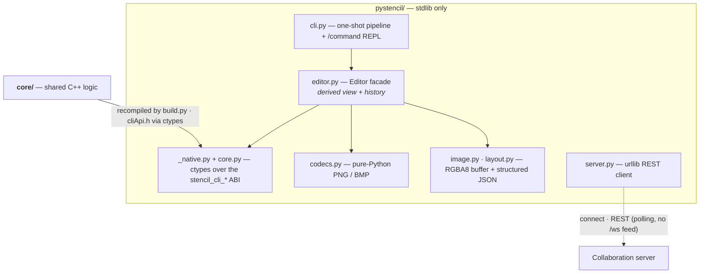

# Stencil — Python package (`pystencil`)

A **stdlib-only** Python mirror of the browser editor's `window.stencil` facade and the
Zig [CLI](../cli/README.md)'s editing capabilities, working efficiently against the **same C++ `core/`** over
`ctypes`: load an image, crop / rotate it, apply a filter (b&w / sepia / duotone), draw a
layout, save the result, build and save layout JSON, and connect to a Stencil
[collaboration server](../server/README.md) to fetch, edit, and publish projects. For the
project overview see the [repository README](../README.md).

```python
from pystencil import Editor

(Editor()
    .load("photo.jpg")
    .crop("x1=10% x2=90% y1=10% y2=90%")
    .rotate_right()
    .apply_filter("sepia")
    .save("out.png"))
```

## Architecture



> **Surface diagrams:** [core](../core/README.md#architecture) · [server](../server/README.md#architecture) — or the whole-system view in the [repository README](../README.md#architecture).

## What it is

`pystencil` is a fifth consumer of `core/`, alongside the browser, desktop, and CLI. It
does **no** pixel or geometry work of its own: every crop, rotate, blank fill, line
rasterise, colour parse, page-metric, and filter goes through the C++ core via its
`extern "C"` ABI (`core/cliApi.h`) — the exact same code the other front-ends run — so
results match the browser and desktop editors by construction. Python owns only the parts
the core deliberately leaves out: image codecs (a pure-Python PNG/BMP encoder/decoder),
HTTP (`urllib`), JSON, the structured edit/history model, and the server wire protocol.

Like the CLI, it is a real `core/` consumer, **not** a thin adapter: it recompiles the core
sources rather than linking the CMake library. That places it under the repo's
**parity contract** — see [the root `CLAUDE.md`](../CLAUDE.md):

> **The source list in `pystencil/build.py` must stay in sync** with `STENCIL_CORE_SOURCES`
> in [`core/CMakeLists.txt`](../core/CMakeLists.txt) (and with [`cli/build.zig`](../cli/build.zig)). Adding,
> removing, or renaming a core `.cpp` means editing all three.

## Dependencies

| Purpose | Tool | How it's provided |
|---|---|---|
| Language / runtime | **Python 3.9+** | the system `python3`; every module sets `from __future__ import annotations` so `X \| None` hints work on 3.9 |
| Calling the core | **`ctypes`** (stdlib) | loads the shared library built from `core/` and binds the `stencil_cli_*` ABI |
| Shared geometry / crop / raster / filter | **`../core/`** | the C++ core, **recompiled from source** by `build.py` and called over `../core/cliApi.h` |
| Image decode/encode (PNG/BMP) | **`zlib` + `struct`** (stdlib) | a pure-Python codec in `codecs.py` — no PIL/numpy |
| HTTP + server protocol | **`urllib` + `ssl` + `json`** (stdlib) | REST client for the collaboration server |

**No third-party packages** — stdlib only. PNG and BMP are supported natively; **JPEG
decoding needs the Zig [CLI](../cli/README.md)** (the core is codec-free, and a pure-Python
JPEG decoder is out of scope) — `codecs.decode` raises a clear `CodecError` pointing you at
the CLI for JPEG input.

## Layout

```
pystencil/
  README.md
  pyproject.toml          # stdlib-only metadata; `stencil-py` console script
  build.py                # compiles core/ into the shared lib (subprocess + a C++17 compiler)
  pystencil/
    __init__.py           # public exports (Editor/Image/Layout/… + Stencil alias)
    _native.py            # locate → (lazily) build → ctypes-load the shared lib
    core.py               # ctypes binding over the stencil_cli_* ABI → class Core
    codecs.py             # pure-python PNG + BMP encode/decode
    image.py              # class Image (RGBA8 buffer)
    layout.py             # Point / Line / Layout dataclasses (camelCase JSON)
    editor.py             # class Editor — the chainable facade
    server.py             # ServerConnection + ConnectionManager (urllib REST client)
    cli.py                # python -m pystencil — one-shot pipeline + /command REPL
  tests/
    test_codecs.py test_layout.py test_core.py
    test_editor.py test_server.py test_cli.py
```

> The core stays STL-only, codec-free, GUI-free: `pystencil` never pushes Qt, a codec, or
> DOM access into `core/`. It moves bytes over flat RGBA8 buffers and C strings, exactly
> like `core/cliApi.{h,cpp}` does for the CLI.

## Build

The native shared library is **not** committed; build it once from `core/`:

```bash
# from this directory (pystencil/)
python3 build.py            # compiles core/*.cpp + cliApi.cpp → the shared lib
```

`build.py` needs a **C++17 compiler on `PATH`** (clang or gcc; nothing else). It compiles
the source list mirrored from `STENCIL_CORE_SOURCES` and drops a platform-named shared
object (`.so` / `.dylib` / `.dll`) next to the package. You don't have to run it by hand:
the first time the package needs the core, `_native.py` builds it on demand and caches the
result — `build.py` is just the explicit, scriptable form (and what tests/CI invoke).

## Quickstart

```python
from pystencil import Editor, Layout, Line, Point

# Load → crop → rotate → filter → draw a layout → save the image and the layout JSON.
ed = Editor()
ed.load("photo.jpg")                              # path | http(s) URL | bytes | Image
ed.crop("x1=10% x2=90% y1=10% y2=90%")            # crop spec (px/cm/mm/in/%/bare-px edges)
ed.rotate_right()                                 # quarter-turn clockwise (= rotate(+1))
ed.apply_filter("sepia")                          # "bw" | "sepia" | "invert" | "contour" | "none" | a colour → duotone

# Draw a red triangle over the result (coordinates are image pixels).
ed.draw(Layout(
    image_width=ed.image_size[0], image_height=ed.image_size[1],
    lines=[Line(points=[Point(50, 50), Point(750, 50), Point(400, 550)], color="#ff0000")],
))

ed.save("out.png")             # encode the derived view → file (format from extension)
ed.save_layout("out.json")     # write the structured layout JSON (see /layout semantics)
ed.save_project("proj.stencil")  # portable project file: image + layout + metadata in one file
Editor().open_project("proj.stencil")  # …and read it back (or on any Stencil surface)
Editor.delete_project("old.stencil")   # delete a local .stencil file from disk (staticmethod)
```

A **`.stencil`** file bundles a whole project — the original image (base64), the layout, and
metadata — in one portable JSON document openable on every Stencil surface (see
`browser/README.md`). `save_project(path)` / `open_project(src)` (a path, JSON `bytes`/`str`,
or a parsed `dict`) are stdlib-only (`json` + `base64`); `open_project` decodes the image and
adopts the layout via `apply_layout`. `Editor.delete_project(path)` deletes a local `.stencil`
file from disk (parity with the browser/desktop trash button + the CLI `/delete` verb); it is a
stateless staticmethod scoped to `.stencil` paths — a loaded editor is unaffected.

The editor keeps an **untouched original** plus a history of edit snapshots; the current
view is **derived on demand** — `rotate → crop → filter → rasterise lines` — mirroring the
CLI's `console/session.zig` rebuild. Every edit is chainable and snapshotted, so `undo()`,
`redo()`, and `reset()` walk a full history.

## Public API

### `Editor` (alias `Stencil`) — the facade

Mirrors the browser's `window.stencil` and the CLI's console session.

| Group | Methods |
|---|---|
| Source | `load(src, *, frame=, name=, source=, resource=)`, `blank(width=, height=, color="#ffffff", page="A4")` |
| Edits (chainable) | `rotate(q)`, `rotate_left()`, `rotate_right()`, `crop(spec=None, *, x1=, y1=, x2=, y2=, album=False)`, `set_filter(mode)`, `set_filter_color(color)`, `apply_filter(mode)`, `set_page_format(name, width=, height=)`, `draw(layout)`, `apply_layout(layout)` |
| History | `undo() -> bool`, `redo() -> bool`, `reset()` |
| Render / save | `result() -> Image`, `save(path, fmt=None) -> Image`, `layout() -> Layout`, `save_layout(path=None) -> str` |
| Introspection | `image_size -> (w, h)`, `name -> str`, `page_format -> str`, `has_image() -> bool` |

`load` accepts a local path, an `http(s)://` URL (fetched with `urllib`), raw `bytes`, or
an existing `Image`. `blank`'s `page` is any ISO A/B/C format name (case-insensitive,
`A0`–`A10`, `B0`–`B10`, `C0`–`C10`); an unknown name quietly falls back to A4, mirroring
the CLI console. `apply_filter` takes the CLI's filter vocabulary — `bw` / `sepia` /
`invert` / `contour` / `none`, or any colour name/#hex for a custom duotone tint (`invert`
and `contour` are matched before the colour fallback). `set_page_format` picks the
project's page format (stored canonical, e.g. `"b5"` → `"B5"`; `"custom"` needs
`width`/`height` in cm within 0.1–500, NaN/inf rejected — the console's `parseCmDim`
range) — it rides the saved layout as `pageSize`/`customPageWidth`/`customPageHeight` and
round-trips through `apply_layout`, like every other client.
`crop` takes either a spec string or `x1/y1/x2/y2` edge kwargs and
resolves it through the core's `resolve_crop` with the same px-per-cm / page logic as the
CLI's `pipeline.zig`; the crop composes in rotated-original space. `draw` **appends** lines
from a `Layout` / dict / JSON string / list of `Line`; `apply_layout` **adopts** a layout's
rotation + crop + filter + lines wholesale (mirroring the server's project layout).

### `Image` — RGBA8 buffer

```python
from pystencil import Image

img = Image.open("pic.png")                 # decode via codecs (PNG/BMP)
img = Image.decode(raw_bytes)               # sniff + decode
img = Image.blank(800, 600, (255, 0, 0, 255))   # red canvas via core.fill_rgba
img.width, img.height, img.pixel_count
png_bytes = img.encode("png")
img.save("out.bmp")                         # format from extension, default png
clone = img.copy()
```

### `Layout` / `Line` / `Point` — structured JSON

Dataclasses whose JSON shape mirrors the browser's `buildLayoutPayload` and the MCP's
`layout.rs` (camelCase keys, optional fields omitted when `None`):

```python
from pystencil import Layout, Line, Point

lay = Layout(
    image_width=800, image_height=600,
    lines=[Line(points=[Point(50, 50), Point(750, 550)],
                color="#FFFF00", thickness=2.0, marker_size=4.0,
                style="solid", locked=False, fill_color="transparent")],
)
text = lay.to_json(indent=2)                # -> imageWidth/imageHeight/lines[...]
again = Layout.from_json(text)              # tolerant: missing fields → defaults
```

Line defaults match the rest of the project: `color="#FFFF00"`, `thickness=2.0`,
`marker_size=4.0`, `style="solid"`, `locked=False`, `fill_color="transparent"`. The
optional layout fields `imageFilter` / `filterColor` / `cropRect` / `rotationQuarters` /
`pageSize` / `customPageWidth` / `customPageHeight` / the formula trio are emitted only
when set, and `from_dict`/`from_json` parse them all back, so a layout round-trips its
page format like every other client.

### `Core` / `get_core()` — the ctypes binding

The low-level surface, if you want the core transforms directly. `get_core()` returns a
cached singleton; `Core.load()` finds (and, if needed, builds) the shared library and binds
every `stencil_cli_*` function with explicit `argtypes`/`restype`:

```python
from pystencil import get_core

core = get_core()
core.parse_color("rebeccapurple")           # -> (102, 51, 153, 255)
core.page_formats()                          # -> ["A0", "A1", ..., "C10"] (33 ISO names)
core.named_page_size("B5")                   # -> (17.6, 25.0) cm
core.default_blank_size_px(21.0, 29.7)       # -> (794, 1123) px @ 96 dpi
core.rotated_dims(800, 600, 1)               # -> (600, 800)
# in-place ops mutate the bytearray you pass:
buf = bytearray(b"\xff\x00\x00\xff" * (w * h))
core.apply_filter("bw", buf, w * h)
core.apply_contour(buf, w, h)                # Sobel edge detection (needs dimensions)
core.rasterize_line(buf, w, h, [(10, 10), (90, 90)], color="#00ff00")
```

### `ServerConnection` / `ConnectionManager` — collaboration

Mirrors the browser's `connectionManager.js` + `remoteSync.js` over `urllib` (REST,
`Authorization: Bearer <token>`):

```python
from pystencil import ServerConnection, Editor

conn = ServerConnection("http://host:8090").connect()    # mints a token
proj = conn.create_remote_project("Shared", image=Editor().load("photo.png").result())
listing = conn.list_projects()
# fetch, edit, and write back into a project:
got = conn.get_project(proj["project"]["id"])
ed = Editor().load(conn.get_file(proj["project"]["id"], "original"))
ed.apply_filter("sepia")
conn.save_remote_project(proj["project"]["id"],
                         version=got["project"]["version"],
                         layout=ed.layout().to_dict(), image=ed.result())
```

A `ConnectionManager` holds several connections at once (`connect`/`disconnect`/
`reconnect`/`remote_projects`). Version conflicts on update surface as
`ServerError(code="conflict")` (HTTP 409). Self-signed TLS is opt-in via an `ssl` context
option; the default verifies normally.

**Watching for project changes.** This client is REST-only (no `/ws` feed), so it tracks a
peer's name/colour/version changes by **polling** — the same model as the desktop's poll timer.
`diff_projects(prev, curr)` is a pure diff into `{id, kind, fields, project}` events
(`kind` = `created`/`updated`/`deleted`; `fields` names which of `name`/`color`/`version`
moved). `poll_project_changes(previous)` is one-shot (you own the loop); `watch_projects` is a
ready-made blocking loop — both exist on a single `ServerConnection` and, aggregated across
every server, on `ConnectionManager`:

```python
import threading

stop = threading.Event()
def on_change(c):
    if c["kind"] == "updated" and "color" in c["fields"]:
        print(c["id"], "recoloured →", c["project"].get("color") or "(default)")

# blocking loop (run in a thread); the first poll seeds a silent baseline
t = threading.Thread(target=mgr.watch_projects, kwargs={"on_change": on_change,
                                                        "interval": 2.0, "stop": stop})
t.start()
# … later …
stop.set(); t.join()

# or drive the polling yourself:
prev = None
prev, changes = conn.poll_project_changes(prev)   # repeat on your own schedule
```

## Command line

`python -m pystencil` (installed as **`stencil-py`**) runs a one-shot pipeline, or a
`/command` REPL — the same model as the [CLI's](../cli/README.md) flag pipeline and console.

```bash
# one-shot: load → crop → rotate → filter → write
python3 -m pystencil -i photo.jpg -c "x1=10% x2=90% y1=10% y2=90%" -r 1 --filter sepia out.png

# blank page + a drawn layout
python3 -m pystencil --blank 800 600 red --layout notes.json out.png

# a named-format blank page: [format] [w h] [color] (format and w h are exclusive)
python3 -m pystencil --blank b5 pink out.png

# interactive REPL: /command lines applied to one in-memory working image
python3 -m pystencil --repl
```

REPL commands mirror the CLI console — `/upload`, `/blank`, `/format`, `/crop`, `/rotate`,
`/filter`, `/apply`, `/undo`, `/redo`, `/reset`, `/save`, and `/layout`. `/blank` takes the
same `[format] [w h] [color]` grammar as `--blank`, and the page the blank is created on
becomes the session's picked format (so `/blank b5` drives the next bare `/blank` and the
exported layout's `pageSize`, while a dims-only blank clears it — exactly like the Zig
console); **`/format`** bare lists every page
format with its size (the current one marked), `/format <name>` sets the session's format
(case-insensitive; it drives the `/blank` default page and the layout's `pageSize`), and
`/format custom <w> <h>` picks a custom page in cm. A bare `/filter` lists the filter
variants (`bw`, `sepia`, `invert`, `contour`, `none`, or a colour) instead of erroring.
The **`/layout [path]`**
command writes the current structured layout JSON, with path semantics **identical** to the
Python `Editor.save_layout` and the Zig [CLI](../cli/README.md):

- a path ending in **`.json`** (case-insensitive) → write the JSON to exactly that path;
- a non-empty path **without** `.json` → treat it as a directory/prefix and write
  `<path>/<project_name>.json` (no doubled trailing slash);
- **empty / omitted** → write `<project_name>.json` in the current directory.

`project_name` is the editor's project name (the image's base name without extension,
falling back to `layout`).

## Testing

```bash
# from this directory (pystencil/)
python3 -m unittest discover -s tests
```

Tests use the stdlib `unittest` runner (no deps). They cover the codec round-trips
(`encode_png` → `decode_png` returns identical pixels), the layout JSON shapes, the core
ctypes binding, the editor's derived-view / history model, the server client (URL
normalization, request building and error parsing — no network), and the CLI's argument +
`/layout` path handling. The whole suite is hermetic: no running server is ever required.
Tests that need the native library build it on demand via `build.py`, so a C++17 compiler
must be on `PATH`.
