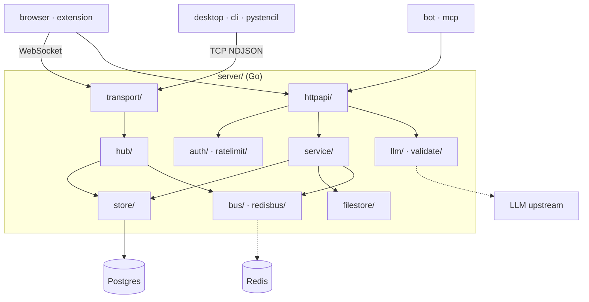
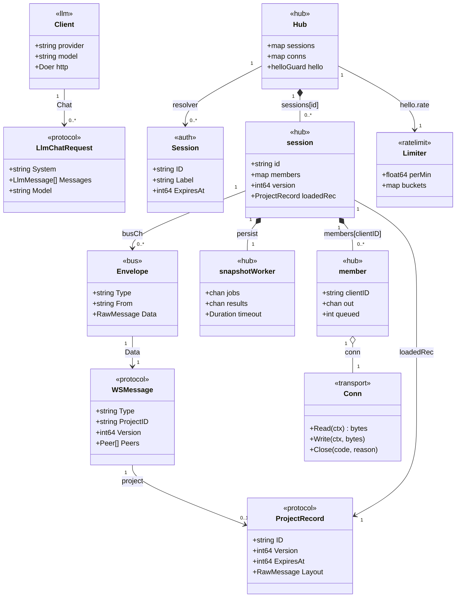

# Collaboration server architecture

The system-wide design — the parity contract, canonical data, the layer model, the pattern vocabulary — is in the root [`ARCHITECTURE.md`](../ARCHITECTURE.md).

A **protocol adapter, not a core consumer**: it never links or recompiles `core/`, never
decodes images (dimensions are passed in by the uploader), and keeps the parity contract out
of scope. Its contract is `internal/protocol`, which every client mirrors.

## Layers

`cmd/` → `internal/httpapi` (**transport only**: decode, authorize, encode) → `service` →
`store` + `filestore` → `hub` → `protocol`. No business rule lives in a handler; `service/`
owns no transport concept (no `ResponseWriter`, no statuses). `auth`, `ratelimit` and
`config` are shared infrastructure on the request path. By convention; no lint.

## Where things go

| Path | Holds | Rule |
|---|---|---|
| `cmd/stencil-server/` | `main.go` (flags + signals), `boot.go` (config → store + migrate → filestore → bus), `serve.go` (HTTP/WS + TCP listeners, CORS, healthz), `sweep.go` (project expiry) | wiring only |
| `internal/protocol/` | the wire DTOs and the WS message envelope | **the contract**, mirrored by every client (`browser/js/net`, `browser-extension/src/lib/connections`, `desktop/src/net`, `cli/src/server`, `pystencil/pystencil/server`, the bot's server client) |
| `internal/config/` | the environment configuration, one file per group (db, redis, llm, parse) | every key appears in `.env.example` and the README table |
| `internal/auth/`, `internal/ratelimit/` | opaque bearer tokens (sha256-hashed, constant-time compare, expiry) + the HTTP/WS gate; the shared token buckets + `clientip.go` (`X-Forwarded-For` behind `TRUSTED_PROXY_CIDRS`) | a token travels as a header; `?token=` only on an RFC 6455 upgrade |
| `internal/httpapi/` | the REST handlers, the LLM routes, `assets/` + `goldens/` for the pinned user-facing text | decode · authorize · call a service · encode — nothing else |
| `internal/service/` | project and file policy, driven by both the handlers and the expiry sweep | |
| `internal/store/` | the pgx `Store` (`projects.go` + `sessions.go`), the pool, keyset listing, embedded SQL migrations | migrations are idempotent and applied in lexical order at boot; Postgres is the sole source of truth |
| `internal/filestore/` | the path-confined byte store: `safeJoin` (clean + root-prefix re-check + symlink-escape guard), atomic put (fsync before rename), quota | never touches a client-supplied filename; path-confined, not encrypted |
| `internal/transport/`, `internal/hub/` | the `Conn` abstraction over WebSocket (with keepalive) and TCP NDJSON; one run-loop per project relaying edits and committing saves | all transports join the same session |
| `internal/eventbus/`, `internal/redisbus/` | pub/sub fan-out, in-process and Redis; `drop.go` | both drop a delivery rather than stall a slow subscriber, and warn (rate-limited) because a silent drop reads like a lost edit; `Subscribe` returns only once the backend has the subscription, so the first publish after it cannot be lost |
| `internal/llm/`, `internal/validate/` | the upstream proxy (one file per wire shape, enablement, upstream failure classification, sanitize); the chat-request check | requests validate before leaving; upstream text is untrusted and sanitized; the key and image payloads are never logged |
| `internal/clock/`, `internal/testutil/`, `internal/lint/` | the injectable `now()`, the shared test rigs, the test-count floor (run as a test) | |
| `vendor/` | `go mod vendor` output | gitignored, as is `go.sum`; the only non-stdlib deps are `pgx`, `go-redis`, `coder/websocket` |

## Entities

| Entity | What it is | Owned by / lifetime | Relates to |
|---|---|---|---|
| `WSMessage` (`protocol/ws.go`) | the flat envelope for every WS frame and TCP line; `Type` selects the live fields | built per frame by a client or by `hub`; the server's `internal/protocol` is canonical and every client mirrors it | carries `Peer`s (the `welcome` roster) and a `ProjectRecord`; wrapped in an `Envelope` on the bus |
| `ProjectRecord` (`protocol/project.go`) | project metadata plus the server-only storage fields; `Version` is the last-writer-wins guard | a Postgres row in `store`; canonical here, mirroring `core/state/ProjectsStore.hpp` `ProjectMeta` semantics; the `Layout` payload is the browser's `buildLayoutPayload` | cached as `session.loadedRec`; the body of every REST project response |
| `LlmChatRequest` / `LlmChatResponse` (`protocol/llm.go`) | one canonical chat turn and its reply; the provider wire shape never leaves `llm/` | per request, `llm-contract.md` §6.3 is canonical | validated by `validate.LLMChat`; mapped by a `providerMapping` |
| `Session` (`auth/token.go`) | the authenticated principal resolved from a bearer token's SHA-256 hash | a `sessions` row created by `Store.CreateSession`, live until `ExpiresAt` | resolved by `auth.Verify` for REST and for the hub's hello; keys the per-session `Limiter` |
| `Hub` (`hub/hub.go`) | the registry of live sessions and tracked connections | one per process; its own context, ended by `Close` after the drain | acquires and releases a `session` per project id; meters hellos through its `helloGuard` |
| `session` (`hub/session.go`) | the single-goroutine owner of one project's live state: members, version, cached snapshot | created by `Hub.acquire` on the first join, refcounted, torn down when the last member leaves | fans `Envelope`s out to `member`s; delegates store I/O to its `snapshotWorker` |
| `member` (`hub/member.go`) | one connected client inside a session, with its bounded outbound queue and `writeLoop` | per connection, from `serveProject` until disconnect | owns a `Conn`; addressed by `clientID` |
| `snapshotWorker` (`hub/persist.go`) | the session's DB arm: `persistJob` in, `persistResult` out, one blocking store call at a time | one per session, exits when the session's `done` closes | calls `hub.Store` (`GetProject`, `UpdateProject`) |
| `Conn` (`transport/transport.go`) | one message stream, `wsConn` (a text frame each) or `tcpConn` (an NDJSON line each) | per accepted socket, closed by the handler that owns it | read and written by `Hub.HandleConn`, `serveProject`, `serveEvents` |
| `Envelope` (`eventbus/eventbus.go`) | a marshalled frame plus the two routing fields (`Type`, `From`) fan-out reads without re-parsing | published to `proj:<id>` or `events` on `inProc` or `redisBus`; dropped, not queued, for a slow subscriber | delivered to `session.busCh` and to `serveEvents` subscribers |
| `Limiter` (`ratelimit/limiter.go`) | a per-key token bucket, capacity one minute's spend, refilled continuously; `nil` means unlimited | one per metered surface, held by `API` (`authRate`, `writeRate`, `llmRate`) and by `helloGuard` | keyed by client IP or `Session.ID` |
| `Client` (`llm/client.go`) | the upstream proxy: provider id, base URL, key, default model, bounded `Doer` | one per process when a provider is configured, else `Deps.LLM` is nil | dispatches to a `providerMapping`; failures come back as `*UpstreamError` |

## Patterns

| Pattern | Where | Notes |
|---|---|---|
| Repository | `store.Store` behind `httpapi.ProjectStore` / `SessionStore` / `hub.Store` / `service.ProjectStore`; `filestore.Store` behind `httpapi.FileStore` / `service.UploadFiles` | each consumer names only the methods it calls, so `testutil.MemStore` stands in without a database |
| Observer | `bus.Bus` (`inProc`, `redisBus`) with `session.busCh` and `serveEvents` as subscribers | the session's own publish loops back through the bus, the single delivery path to local members |
| Strategy | `llm.providerMapping` in the `mappings` table (`anthropicMapping`, `ollamaMapping`, `openAIMapping`) | `Client.Chat` looks the mapping up by provider id; adding a provider is a table entry plus its file |
| Chain of Responsibility | `httpapi.CORS` → `auth.Middleware` → `limitByIP` / `limitBySession` → handler; `Hub.HandleConn` → `checkHello` → `serveProject` / `serveEvents` | each link either answers the request itself or passes it on |
| Run-loop per project | `session.run` owning `members`, `version`, `loadedRec`; `snapshotWorker.run` as its only blocking arm | one goroutine per open project serialises registration, inbound frames, bus deliveries and persist results, so session state needs no lock |
| Adapter | `transport.wsConn` and `transport.tcpConn` behind `transport.Conn` | WebSocket text frames and NDJSON lines land in the same hub session |
| Saga | `service.FileService.Store` | one upload spans `filestore` and `store`; a row deleted mid-upload is compensated by `RemoveKind` |
| Golden pin | `httpapi/goldens/` read by `textgolden_test.go` | the user-facing LLM prompt heads and the `/llm/info` body are pinned as text |

## Design

- **Boot.** `run()` in `main.go` loads `config.Config`, opens the pgx pool and applies the
  embedded migrations, opens the `filestore.Store` under its quota, then `openBus` picks
  `redisbus` or `bus.NewInProc`. `startExpirySweep` gets its own `ProjectService`,
  `hub.New` is built with `WithHelloLimit`, `apiDeps` composes `httpapi.Deps` and
  `configureLLM` attaches a `llm.Client` when a provider is configured. `newHTTPServer`
  wraps the mux (REST routes, `/ws`, `/healthz`) in `CORS`; `listenTCP` opens the NDJSON
  listener under the same TLS config. Shutdown drains in order: the sweep, TCP accepts,
  `Hub.CloseAll` (a `shuttingDown` frame to every live connection), HTTP, then `Hub.Close`.
  The hub holds a context of its own, carrying the signal context's values but not its
  cancellation: TCP editors are served under it, so the signal cannot hang them up before the
  notice is written, and the last peer-leave publish and an in-flight save still land.
- **A REST project write.** `PUT /projects/{id}` passes `CORS`, then `auth.Middleware`
  (`BearerToken` → `auth.Verify` → `Session` on the context), then `handleUpdateProject`
  decodes an `UpdateProjectRequest`, opens an `opCtx` and calls `Store.UpdateProject` with a
  `ProjectPatch` and the expected version; `ErrConflict` becomes `409 conflict`, success
  publishes `updated` on the global feed. `POST /projects` runs `limitBySession` and
  `ProjectService.Create` (the image rule, the `PROJECT_TTL` stamp). `POST
  /projects/{id}/files/{kind}` runs `FileService.Store`: `GetProject`, `filestore.PutStream`
  through `safeJoin` and the atomic put, `Store.SetFile` for `original`/`result`, `updated`
  on the feed; a row gone mid-upload is compensated with `RemoveKind`.
- **A live session.** `/ws` (`transport.AcceptWS`) or the TCP listener (`transport.NewTCP`)
  hands a `Conn` to `Hub.HandleConn`, which reads the `hello` within `helloTimeout` and
  runs `checkHello` (the per-IP `Limiter`, `auth.Verify`, a refund on success). An empty
  `projectId` joins `serveEvents` on the `events` channel; otherwise `serveProject` makes a
  `member`, `Hub.acquire` starts the project's `session.run` and `snapshotWorker.run`, and
  `register` triggers `ensureLoaded`. `subscribe` answers `welcome` from `loadedRec`
  (deferred until the load lands). An `edit` behind `session.version` gets `badVersion`;
  otherwise it is stamped with `FromClientID`, published as an `Envelope` on
  `proj:<id>`, and `fanout` enqueues it to every member but its originator, each member's
  `writeLoop` draining to its `Conn`. A `save` becomes a `persistJob`; `applySaveResult`
  bumps the version, acks the saver with `synced`, broadcasts `synced` to peers and
  publishes `updated` on the global feed.
- **An LLM turn.** `POST /llm/chat` passes the auth guard, spends `llmRate` for the
  `Session.ID` before the body is read, decodes an `LlmChatRequest`, runs
  `validate.LLMChat`, takes an `llmGate` slot (refused, not queued, when full) and calls
  `Client.Chat`, which resolves the model and dispatches to `mappingFor(provider).chat`.
  The reply is an `LlmChatResponse`; an `*UpstreamError` answers `502 llmUpstream` with its
  `ClientMessage`, and the full detail goes only to the server log.
- **The expiry sweep.** `startExpirySweep` runs once at boot and then every
  `SweepInterval`: `Store.DeleteExpiredProjects` takes up to `sweepBatch` rows per round
  trip and repeats while a pass comes back full; `dropEach` fans the ids over
  `sweepWorkers` to `ProjectService.Dropped`, which removes the filestore directory and
  publishes `deleted` on `events`, so a swept project looks exactly like a manual delete to
  every `serveEvents` subscriber.
- **Wire schema.** One `protocol.WSMessage` per WebSocket text frame or per TCP NDJSON line — a flat envelope
  whose `type` decides which of the optional fields are set:

  | Group | Fields |
  |---|---|
  | identity (`hello`) | `token`, `clientId`, `name`, `projectId` (empty = the global `/events` feed) |
  | edit / sync | `version`, `op`, `payload` (raw JSON) |
  | snapshots / events | `project` (a `ProjectRecord`), `layout` (raw JSON), `peers`, `event`, `resultPath` |
  | relay | `fromClientId` |
  | presence / cursor | `x`, `y`, `state` |
  | errors | `code`, `message` |

  Kinds — client → server: `hello`, `subscribe`, `edit`, `cursor`, `presence`, `save`, `ping`;
  server → client: `welcome`, `peer-join`, `peer-leave`, `edit`, `synced`, `project-event`,
  `error`, `pong`.

  REST bodies are the `protocol` DTOs. A `ProjectRecord` carries `id`, `name`, `createdAt`,
  `updatedAt`, `expiresAt`, `hasImage`, `imageW`, `imageH`, `source`, `resource`, `color`,
  `keywords`, `description`, `blank`, `blankColor`, `originalPath`, `resultPath`,
  `originalContent`, `layout`, `version`, `ownerSession`; the list response is
  `{ projects, nextCursor? }`, the single response `{ project, layout, originalContent }`, a file
  write `{ path, w, h }`, and every error `{ code, message }`. Layout JSON is opaque to the
  server (`json.RawMessage`) — its shape is the browser's `buildLayoutPayload`.

## Rules

1. **Live relay vs. durable snapshot.** `edit` frames are relayed without persistence; `save`
   writes the full layout under the last-writer-wins version guard and broadcasts the new
   version. A shutdown sends `shuttingDown` to every connection before closing.
2. **Two transports, one session**, so that browsers use the native WebSocket API while Qt
   and Zig use raw TCP NDJSON — no third-party WS client anywhere.
3. **One shared workspace.** A valid token grants every project, including persisted chats;
   there is no per-project ACL layer, and none goes in a handler.
4. **Issuance is always gated** by the admin token (set or per-boot generated), which is why
   the LLM proxy enables whenever a provider is configured. `AUTH_OPEN=1` is a loud opt-in.
5. **Every limiter is a bucket in `ratelimit/`** keyed on the client IP or the session;
   never an ad-hoc counter. LLM in-flight over the cap is refused, not queued.
6. **Upstream failures are said once**: classified in `llm/upstream.go` into the condition
   the user can act on; anything unclassified is stripped of control characters, redacted of
   URLs and token-shaped runs, capped at 200 characters, and dropped entirely if a fragment
   of the key appears. The `code` is always the server's.
7. **Store calls run under `OP_TIMEOUT_SECONDS`** in every handler, and under `hub.opTimeout`
   in the hub — the hello's token lookup included, since the handshake deadline is spent by then.

## Tests

Offline by default; only `store/` and `redisbus/` touch a real Postgres or Redis and
self-skip without one. The store tests read a dedicated `TEST_DATABASE_URL`, never
`DATABASE_URL`, because they truncate the database they name. The `httpapi` and `hub`
suites run against the rigs in `internal/testutil` (`MemStore` for projects and sessions,
`EchoLLM` for the proxy, `wsClient` for a driven socket), and `llm/` injects a `Doer` to
assert the exact upstream request without a network. The hub's session loop is
covered under the race detector. Benchmarks are opt-in and assert properties, not numbers:
fan-out allocation-free and linear in peers, `Put` costing one `fsync` regardless of size,
chat validation free without attachments, one keyset page a fraction of the whole list.
