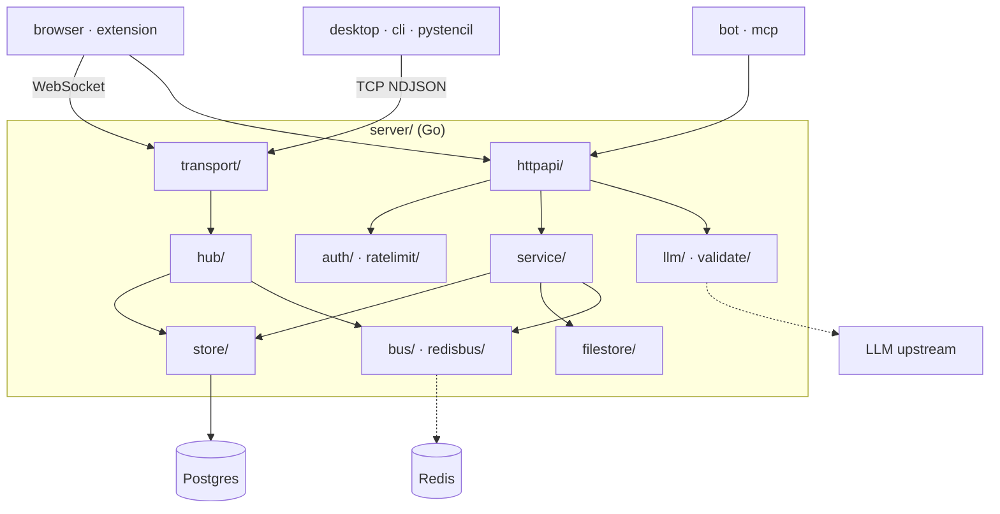

# Collaboration server architecture

The system-wide design — the parity contract, canonical data, the layer model, the pattern vocabulary — is in the root [`ARCHITECTURE.md`](../ARCHITECTURE.md).

A **protocol adapter, not a core consumer**: it never links or recompiles `core/`, never
decodes images (dimensions are passed in by the uploader), and keeps the parity contract out
of scope. Its contract is `internal/protocol`, which every client mirrors.

## Layers

`cmd/` → `internal/httpapi` (**transport only**: decode, authorize, encode) → `service` →
`store` + `filestore` → `hub` → `protocol`. No business rule lives in a handler; `service/`
owns no transport concept (no `ResponseWriter`, no statuses). `auth`, `ratelimit` and
`config` are shared infrastructure on the request path.

## Where things go

| Path | Holds | Rule |
|---|---|---|
| `cmd/stencil-server/` | `main.go` (flags + signals), `boot.go` (config → store + migrate → filestore → bus), `serve.go` (HTTP/WS + TCP listeners, CORS, healthz), `sweep.go` (project expiry) | wiring only |
| `internal/protocol/` | the wire DTOs and the WS message envelope | **the contract**, mirrored by every client (`browser/js/net`, `extension/src/lib/connections`, `desktop/src/net`, `cli/src/server`, `pystencil/pystencil/server`, the bot's server client) |
| `internal/config/` | the environment configuration, one file per group (db, redis, llm, parse) | every key appears in `.env.example` and the README table |
| `internal/auth/`, `internal/ratelimit/` | opaque bearer tokens (sha256-hashed, constant-time compare, expiry) + the HTTP/WS gate; the shared token buckets + `clientip.go` (`X-Forwarded-For` behind `TRUSTED_PROXY_CIDRS`) | a token travels as a header; `?token=` only on an RFC 6455 upgrade |
| `internal/httpapi/` | the REST handlers, the LLM routes, `assets/` + `goldens/` for the pinned user-facing text | decode · authorize · call a service · encode — nothing else |
| `internal/service/` | project and file policy, driven by both the handlers and the expiry sweep | |
| `internal/store/` | pgx `ProjectRepository` + `SessionRepository`, the pool, keyset listing, embedded SQL migrations | migrations are idempotent and applied in lexical order at boot; Postgres is the sole source of truth |
| `internal/filestore/` | the path-confined byte store: `safeJoin` (clean + root-prefix re-check + symlink-escape guard), atomic put (fsync before rename), quota | never touches a client-supplied filename; path-confined, not encrypted |
| `internal/transport/`, `internal/hub/` | the `Conn` abstraction over WebSocket (with keepalive) and TCP NDJSON; one run-loop per project relaying edits and committing saves | all transports join the same session |
| `internal/bus/`, `internal/redisbus/` | pub/sub fan-out, in-process and Redis; `drop.go` | both drop a delivery rather than stall a slow subscriber, and warn (rate-limited) because a silent drop reads like a lost edit |
| `internal/llm/`, `internal/validate/` | the upstream proxy (one file per wire shape, enablement, upstream failure classification, sanitize); the chat-request check | requests validate before leaving; upstream text is untrusted and sanitized; the key and image payloads are never logged |
| `internal/clock/`, `internal/testutil/`, `internal/lint/` | the injectable `now()`, the shared test rigs, the source-tree lint (run as a test) | |
| `vendor/` | `go mod vendor` output | gitignored, as is `go.sum`; the only non-stdlib deps are `pgx`, `go-redis`, `coder/websocket` |

## Rules

1. **Live relay vs. durable snapshot.** `edit` frames are relayed without persistence; `save`
   writes the full layout under the last-writer-wins version guard and broadcasts the new
   version. A shutdown sends `shuttingDown` to every connection before closing.
2. **Two transports, one session**, so that browsers use the native WebSocket API while Qt
   and Zig use raw TCP NDJSON — no third-party WS client anywhere.
3. **One shared workspace.** A valid token grants every project, including persisted chats;
   there is no per-project ACL layer, and none goes in a handler.
4. **Issuance is always gated** by the admin token (set or per-boot generated), which is why
   the LLM proxy enables whenever a provider is configured. `AUTH_OPEN=1` is a loud opt-in.
5. **Every limiter is a bucket in `ratelimit/`** keyed on the client IP or the session;
   never an ad-hoc counter. LLM in-flight over the cap is refused, not queued.
6. **Upstream failures are said once**: classified in `llm/upstream.go` into the condition
   the user can act on; anything unclassified is stripped of control characters, redacted of
   URLs and token-shaped runs, capped at 200 characters, and dropped entirely if a fragment
   of the key appears. The `code` is always the server's.
7. **Store calls run under `OP_TIMEOUT_SECONDS`** in every handler.

## Wire schema

One `protocol.WSMessage` per WebSocket text frame or per TCP NDJSON line — a flat envelope
whose `type` decides which of the optional fields are set:

| Group | Fields |
|---|---|
| identity (`hello`) | `token`, `clientId`, `name`, `projectId` (empty = the global `/events` feed) |
| edit / sync | `version`, `op`, `payload` (raw JSON) |
| snapshots / events | `project` (a `ProjectRecord`), `layout` (raw JSON), `peers`, `event`, `resultPath` |
| relay | `fromClientId` |
| presence / cursor | `x`, `y`, `state` |
| errors | `code`, `message` |

Kinds — client → server: `hello`, `subscribe`, `edit`, `cursor`, `presence`, `save`, `ping`;
server → client: `welcome`, `peer-join`, `peer-leave`, `edit`, `synced`, `project-event`,
`error`, `pong`.

REST bodies are the `protocol` DTOs. A `ProjectRecord` carries `id`, `name`, `createdAt`,
`updatedAt`, `expiresAt`, `hasImage`, `imageW`, `imageH`, `source`, `resource`, `color`,
`keywords`, `description`, `blank`, `blankColor`, `originalPath`, `resultPath`,
`originalContent`, `layout`, `version`, `ownerSession`; the list response is
`{ projects, nextCursor? }`, the single response `{ project, layout, originalContent }`, a file
write `{ path, w, h }`, and every error `{ code, message }`. Layout JSON is opaque to the
server (`json.RawMessage`) — its shape is the browser's `buildLayoutPayload`.

## Tests

Offline by default; only `store/` and `redisbus/` touch a real Postgres or Redis and
self-skip without one. The store tests read a dedicated `TEST_DATABASE_URL`, never
`DATABASE_URL`, because they truncate the database they name. The hub's session loop is
covered under the race detector. Benchmarks are opt-in and assert properties, not numbers:
fan-out allocation-free and linear in peers, `Put` costing one `fsync` regardless of size,
chat validation free without attachments, one keyset page a fraction of the whole list.
