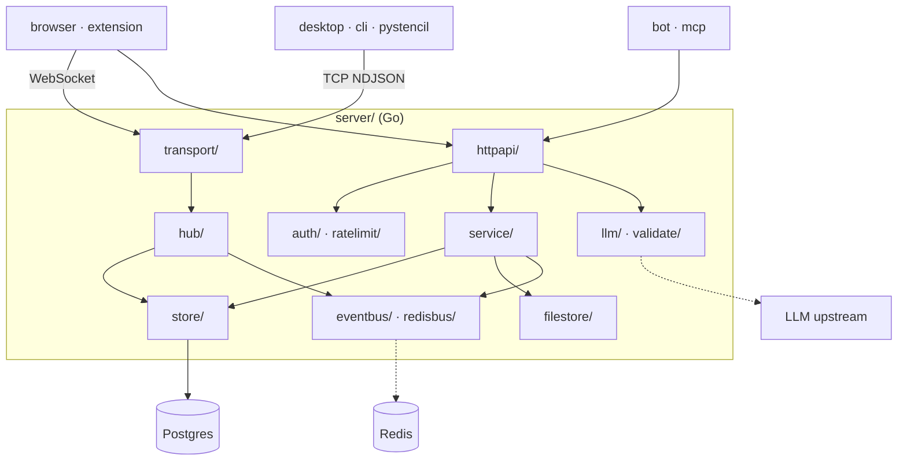
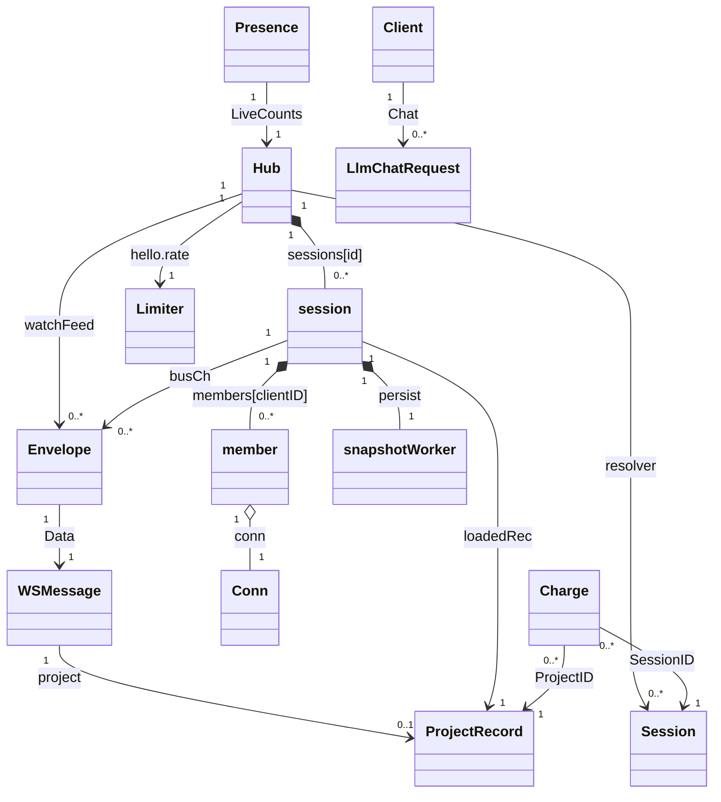

# Collaboration server architecture

The system-wide design — the parity contract, canonical data, the layer model, the pattern vocabulary — is in the root [`ARCHITECTURE.md`](../ARCHITECTURE.md).

A **protocol adapter, not a core consumer**: it never links or recompiles `core/`, never
decodes images (the uploader passes dimensions), and keeps the parity contract out
of scope.

```mermaid
graph TD
    WS["browser · extension"]
    TCP["desktop · cli · pystencil"]
    REST["bot · mcp"]
    subgraph SRV["server/ (Go)"]
      API["httpapi/"]
      TRANS["transport/"]
      SVC["service/"]
      HUB["hub/"]
      AUTH["auth/ · ratelimit/"]
      LLM["llm/ · validate/"]
      STORE["store/"]
      FILES["filestore/"]
      BUS["eventbus/ · redisbus/"]
    end
    PG[("Postgres")]
    RD[("Redis")]
    UP["LLM upstream"]

    WS -->|"WebSocket"| TRANS
    TCP -->|"TCP NDJSON"| TRANS
    WS & REST --> API
    API --> AUTH & SVC & LLM
    LLM -.-> UP
    TRANS --> HUB
    SVC --> STORE & FILES & BUS
    HUB --> STORE & BUS
    STORE --> PG
    BUS -.-> RD
```

## Layers

`cmd/` → `internal/httpapi` (**transport only**: decode, authorize, encode) → `service` →
`store` + `filestore` → `hub` → `protocol`. No business rule lives in a handler; `service/`
owns no transport concept (no `ResponseWriter`, no statuses). `auth`, `ratelimit` and
`config` are shared infrastructure on the request path. By convention; no lint.

## Where things go

| Path | Holds | Rule |
|---|---|---|
| `cmd/stencil-server/` | flags, signals, boot, the listeners, the sweep, presence and reconcile loops | wiring only |
| `internal/protocol/` | the wire DTOs and the WS message envelope | **the contract**, mirrored by every client (`browser/js/net`, `browser-extension/src/lib/connection`, `desktop/src/net`, `cli/src/server`, `pystencil/pystencil/server`, the bot's server client) |
| `internal/config/` | the environment configuration; `assets/providers.json`, a copy of the canonical `browser/js/config/llm/providers.json` whose `serverDefaults` default `LLM_MODEL`/`LLM_MAX_TOKENS` | every key is in `.env.example` and the README table; the copy stays byte-equal (`llmdefaults_test.go`) |
| `internal/auth/`, `internal/ratelimit/` | opaque bearer tokens (sha256-hashed, constant-time compare, expiry) + the HTTP/WS gate; the token buckets + `clientip.go` (`X-Forwarded-For` behind `TRUSTED_PROXY_CIDRS`) | a token travels as a header; `?token=` only on an RFC 6455 upgrade |
| `internal/httpapi/` | the REST handlers, the LLM routes, `assets/` + `goldens/` for the pinned user-facing text | decode · authorize · call a service · encode — nothing else |
| `internal/service/` | project and file policy for the handlers and the sweep, and the cross-instance presence both read | |
| `internal/store/` | the pgx `Store` over projects, sessions, charges and presence, keyset listing, the migrations (SQL + the Go 0006 step) | migrations are idempotent, applied once each in lexical order under an advisory lock (`schema_migrations`); Postgres is the sole source of truth |
| `internal/filestore/` | the path-confined byte store: `safeJoin` (clean + root-prefix re-check + symlink-escape guard), atomic put (fsync before rename), the quotas, the reconcile pass | never touches a client-supplied filename; confined, not encrypted |
| `internal/transport/`, `internal/hub/` | the `Conn` abstraction over WebSocket (with keepalive) and TCP NDJSON; one run-loop per project relaying edits and committing saves | |
| `internal/eventbus/`, `internal/redisbus/` | pub/sub fan-out, in-process and Redis | both drop rather than stall a slow subscriber, with a rate-limited warning; `Subscribe` returns once the backend holds the subscription |
| `internal/llm/`, `internal/validate/` | the upstream proxy (one file per wire shape, enablement, failure classification, sanitize); the pure request predicates | requests validate before leaving; upstream text is untrusted and sanitized; the key and image payloads are never logged; `validate/` does no I/O |
| `internal/clock/`, `internal/testutil/`, `internal/lint/` | the injectable `now()`, the shared test rigs, the test-count floor (run as a test) | |
| `vendor/` | `go mod vendor` output | gitignored, as is `go.sum`; the only non-stdlib deps are `pgx`, `go-redis`, `coder/websocket` |

## Entities

```mermaid
classDiagram
    WSMessage "1" --> "0..1" ProjectRecord : project
    Envelope "1" --> "1" WSMessage : Data
    Hub "1" *-- "0..*" session : sessions[id]
    Hub "1" --> "1" Limiter : hello.rate
    Hub "1" --> "0..*" Session : resolver
    Hub "1" --> "0..*" Envelope : watchFeed
    session "1" *-- "0..*" member : members[clientID]
    session "1" *-- "1" snapshotWorker : persist
    session "1" --> "1" ProjectRecord : loadedRec
    session "1" --> "0..*" Envelope : busCh
    member "1" o-- "1" Conn : conn
    Client "1" --> "0..*" LlmChatRequest : Chat
    Charge "0..*" --> "1" Session : SessionID
    Charge "0..*" --> "1" ProjectRecord : ProjectID
    Presence "1" --> "1" Hub : LiveCounts
```

| Entity | What it is | Owned by / lifetime | Relates to |
|---|---|---|---|
| `WSMessage` (`protocol/ws.go`) | the flat envelope of every WS frame and TCP line; `Type` selects the live fields | per frame | carries `Peer`s and a `ProjectRecord`; wrapped in an `Envelope` on the bus |
| `ProjectRecord` (`protocol/project.go`) | project metadata plus server-only storage fields; `Version` is the last-writer-wins guard | a Postgres row; mirrors `core/state/ProjectsStore.hpp` `ProjectMeta` | cached as `session.loadedRec`; the body of every REST project response |
| `LlmChatRequest` / `LlmChatResponse` (`protocol/llm.go`) | one chat turn and its reply; the provider wire shape never leaves `llm/` | per request; `llm-contract.md` §6.3 is canonical | validated by `validate.LLMChat`; mapped by a `providerMapping` |
| `Session` (`auth/token.go`) | the principal a bearer token's SHA-256 hash resolves to | a `sessions` row, live until `ExpiresAt` | resolved by `auth.Verify`; keys the per-session `Limiter` |
| `Hub` (`hub/hub.go`) | the registry of live sessions and connections | one per process; its own context, ended by `Close` after the drain | holds a `session` per project id; meters hellos; watches `events` for foreign writes |
| `session` (`hub/session.go`) | the single-goroutine owner of one project's live state: members, version, cached snapshot | refcounted, from the first join until the last member leaves; subscribes outside the hub lock | fans `Envelope`s out to `member`s; stores through its `snapshotWorker` |
| `member` (`hub/member.go`) | one client in a session, with its bounded outbound queue and `writeLoop` | per connection | owns a `Conn`; addressed by `clientID` |
| `snapshotWorker` (`hub/persist.go`) | the session's DB arm, one blocking store call at a time | one per session | takes `persistJob`s, returns `persistResult`s |
| `Conn` (`transport/transport.go`) | one message stream: `wsConn` (a text frame each) or `tcpConn` (an NDJSON line each) | per socket | read and written by the hub |
| `Envelope` (`eventbus/eventbus.go`) | a marshalled frame plus the routing fields (`Type`, `From`) fan-out reads unparsed | published to `proj:<id>` or `events` | delivered to `session.busCh` and `serveEvents` |
| `Charge` (`store/charges.go`) | one stored file's bytes, charged to the session that wrote them | a `file_charges` row per (project, kind) while the cap is on; moved by a replacement, dropped by a credit or cascade | summed per `Session` under its row lock |
| `Presence` (`service/presence.go`) | this instance's lease on its live projects in `project_presence`: an instance id, member counts, a TTL | one per process while `PRESENCE_TTL_SECONDS` > 0 | beats the `Hub`'s `LiveCounts`; read by `Expiry` and the delete guard |
| `Limiter` (`ratelimit/limiter.go`) | a per-key token bucket holding one minute's spend, refilled continuously; `nil` is unlimited | one per metered surface (`authRate`, `writeRate`, `llmRate`, the hello) | keyed by client IP or `Session.ID` |
| `Client` (`llm/client.go`) | the upstream proxy: provider, base URL, key, default model, bounded `Doer` | one per process when a provider is configured | dispatches to a `providerMapping`; fails as `*UpstreamError` |

## Patterns

| Pattern | Where | Notes |
|---|---|---|
| Repository | `store.Store` and `filestore.Store` behind the interfaces `httpapi`, `hub` and `service` declare | each consumer names only the methods it calls, so `testutil.MemStore` stands in without a database |
| Observer | `bus.Bus` (`inProc`, `redisBus`) with `session.busCh`, `serveEvents` and the hub's `watchFeed` as subscribers | the session's own publish loops back through the bus, the single delivery path to local members |
| Strategy | `llm.providerMapping` in the `mappings` table | keyed by provider id; a new provider is a table entry plus its file |
| Chain of Responsibility | `httpapi.CORS` → `auth.Middleware` → `limitByIP` / `limitBySession` → handler; `Hub.HandleConn` → `checkHello` → `serveProject` / `serveEvents` | each link answers or passes on |
| Run-loop per project | `session.run` owning `members`, `version`, `loadedRec`; `snapshotWorker.run` as its only blocking arm | one goroutine per open project serialises joins, frames, bus deliveries and persist results, so session state needs no lock |
| Adapter | `transport.wsConn` and `transport.tcpConn` behind `transport.Conn` | text frames and NDJSON lines reach one hub session |
| Saga | `service.FileService.Store`, `service.ProjectService.Create` | one upload spans `filestore` and `store`; `RemoveKind` compensates a row deleted mid-upload, the reconcile pass the rest; a refused inline original deletes its new row and directory |
| Golden pin | `httpapi/goldens/` read by `textgolden_test.go` | user-facing LLM text and response bodies are pinned as text |
| Lease | `service.Presence` over `project_presence` | a row is trusted until its `live_until` on the database clock, so a stopped instance's claim lapses on its own; for their own projects readers use the hub's exact counts |

## Design

- **Boot.** `main.go` loads `config.Config`, migrates in one transaction, then builds the
  quota'd `filestore.Store`, the bus, the hub, `httpapi.Deps` and any `llm.Client`; the presence
  heartbeat and the sweeps start last, as both ask the hub what is live. TCP shares the HTTP TLS
  config. Shutdown drains the sweep, TCP accepts, `Hub.CloseAll`, HTTP, then
  `Hub.Close`, whose context drops the signal's cancellation so the `shuttingDown` notice, the
  last peer-leave and an in-flight save land.
- **A REST project write.** `PUT /projects/{id}` passes the guard chain (Patterns) and calls
  `Store.UpdateProject` with the expected version (`ErrConflict` is
  `409 conflict`), then publishes `updated` on the global feed. `POST /projects` runs
  `ProjectService.Create` (the image rule, the `PROJECT_TTL` stamp); a legacy
  `originalContent` data URL is uploaded as the creator's, so `created` carries its path and hash.
  `POST /projects/{id}/files/{kind}` runs the `FileService.Store` saga and publishes `updated`;
  its `DELETE` credits the writer before the bytes go.
- **A live session.** `Hub.HandleConn` reads a `Conn`'s `hello` within `helloTimeout`, runs
  `checkHello` (per-IP `Limiter`, `auth.Verify`, a refund on success) and arms `expireAt`,
  which hangs up with `unauthorized` when the session expires. An empty `projectId` joins
  `serveEvents`; a malformed or unknown id gets `notFound`; otherwise `serveProject` adds a
  `member` to the project's `session`, whose first join loads the snapshot `welcome` waits for.
  An `edit` behind `session.version` (absent = 0) gets `badVersion`; otherwise it is stamped
  `FromClientID`, published on `proj:<id>` and fanned out to every other member. A `save` bumps
  the version, sends `synced` to all and publishes `updated`. Any other write reaches the
  session through `Hub.watchFeed`: a newer version re-reads the snapshot and `subscribe` waits
  for it, so no welcome predates a known write.
- **An LLM turn.** `POST /llm/chat` passes the auth guard, spends `llmRate` before the body is
  read, runs `validate.LLMChat`, takes an `llmGate` slot and calls `Client.Chat`, which
  dispatches to the provider's mapping. An `*UpstreamError` answers `502 llmUpstream` with its
  `ClientMessage`; the full detail goes only to the server log.
- **Presence.** Every `PRESENCE_HEARTBEAT_SECONDS`, and once a burst of joins or leaves settles
  for `PRESENCE_SETTLE_MS` (`Hub.LiveChanged`), `Presence.Beat` replaces this instance's
  `project_presence` rows with the hub's `LiveCounts`, live for `PRESENCE_TTL_SECONDS`, and purges
  rows lapsed a further TTL; they outlive a shutdown to cover reconnects elsewhere.
  `DELETE /projects/{id}` refuses at two editors across every instance.
- **The expiry sweep.** At boot and every `SweepInterval`, `service.Expiry` deletes expired
  rows in `SWEEP_BATCH` round trips, sparing every project live here or in another instance's
  presence (an unreadable presence sweeps nothing); `SWEEP_WORKERS` run `ProjectService.Dropped`,
  so a swept project looks exactly like a manual delete. Expired sessions go too, their charges
  by cascade. The reconcile loop removes a directory no row owns and a stale `.tmp-*` upload.
- **Storage quotas.** Three caps, each off at `0`, refuse with `filestore.ErrQuotaExceeded`
  (`507`): aggregate and per-owner, metered on disk under one in-process lock; per-session, in
  the charge ledger. `Store.Admit` locks the writer's `sessions` row (then the meter), sums its
  other files, upserts the (project, kind) charge and commits the meter in that transaction, so
  one session's uploads are judged one at a time on every instance and a refusal stores nothing.
  The ledger errs toward charging too little; with the cap off a boot clears it.
- **The inline original (0006).** Before `0006_original_content_drop.sql`, in the migration
  transaction over an unmetered filestore, each row's data-URL original becomes
  `original.<subtype>` with its hash, the version untouched; a non-image payload is logged and
  cleared. The drop refuses a column still holding one.
- **Project list.** A page is `?limit=` rows, else `PROJECTS_PAGE_SIZE` (100; 0 = every project),
  under a strong `ETag`; every client walks `nextCursor` to the end, so the default bounds one
  response, never the list.
- **Wire schema.** A `protocol.WSMessage`'s `type` decides which optional fields are set:

  | Group | Fields |
  |---|---|
  | identity (`hello`) | `token`, `clientId`, `name`, `projectId` (empty = the global `/events` feed) |
  | edit / sync | `version`, `op`, `payload` (raw JSON) |
  | snapshots / events | `project` (a `ProjectRecord`), `layout` (raw JSON), `peers`, `event`, `resultPath` |
  | relay | `fromClientId` |
  | presence / cursor | `x`, `y`, `state` |
  | errors | `code`, `message` |

  Kinds — client → server: `hello`, `subscribe`, `edit`, `cursor`, `presence`, `save`, `ping`;
  server → client: `welcome`, `peer-join`, `peer-leave`, `edit`, `synced`, `project-event`,
  `error`, `pong`.

  REST bodies are the `protocol` DTOs; a create, an update, an event and a welcome's `project`
  carry metadata only. Layout JSON is opaque (`json.RawMessage`) — its shape is the browser's
  `buildLayoutPayload`.

## Rules

1. **Live relay vs. durable snapshot.** `edit` frames are relayed without persistence; `save`
   writes the full layout under the last-writer-wins version guard and broadcasts the new
   version. A shutdown sends `shuttingDown` to every connection before closing.
2. **Two transports, one session**, so that browsers use the native WebSocket API while Qt
   and Zig use raw TCP NDJSON — no third-party WS client anywhere.
3. **One shared workspace.** A valid token grants every project, including persisted chats;
   there is no per-project ACL layer, and none goes in a handler.
4. **Issuance is always gated** by the admin token (set or per-boot generated), which is why
   the LLM proxy enables whenever a provider is configured. `AUTH_OPEN=1` is a loud opt-in.
5. **Every limiter is a bucket in `ratelimit/`** keyed on the client IP or the session;
   never an ad-hoc counter. LLM in-flight over the cap is refused, not queued.
6. **Upstream failures are said once**: classified in `llm/upstream.go` into the condition
   the user can act on; anything unclassified is stripped of control characters, redacted of
   URLs and token-shaped runs, capped at 200 characters, and dropped entirely if a fragment
   of the key appears. The `code` is always the server's.
7. **Store calls run under `OP_TIMEOUT_SECONDS`** in every handler and in the hub, the REST
   guard's and the hello's token lookups included.
8. **The payload reads once.** The layout leaves Postgres only for `GET /projects/{id}` and a
   welcome; writes, lists, events and the file routes read metadata. An image is never a
   column: its bytes leave the filestore only by the files route, never in a project body, the
   feed or Redis.

## Tests

Offline by default; only `store/` and `redisbus/` touch a real Postgres or Redis and
self-skip without one. The store suite proves the migration ledger under concurrent boots,
the 0006 upgrade, the per-session ledger and cross-instance presence; it reads a dedicated
`TEST_DATABASE_URL`, never `DATABASE_URL`, because it truncates the database it names.
`httpapi` and `hub` run against `internal/testutil`'s rigs; `llm/` injects a `Doer` to assert
the exact upstream request. The hub's session loop runs under the race detector, and the hub
suite drives the REST API over its own store and bus, proving a later joiner's welcome follows
a REST write. Opt-in benchmarks assert properties, not numbers: fan-out allocation-free and
linear in peers, `Put` one `fsync` at any size, a keyset page a fraction of the list.
