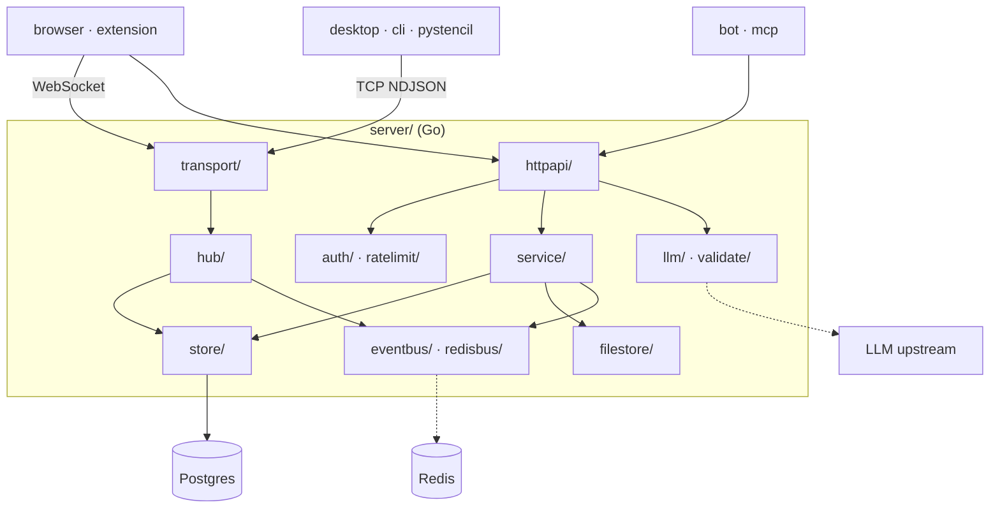
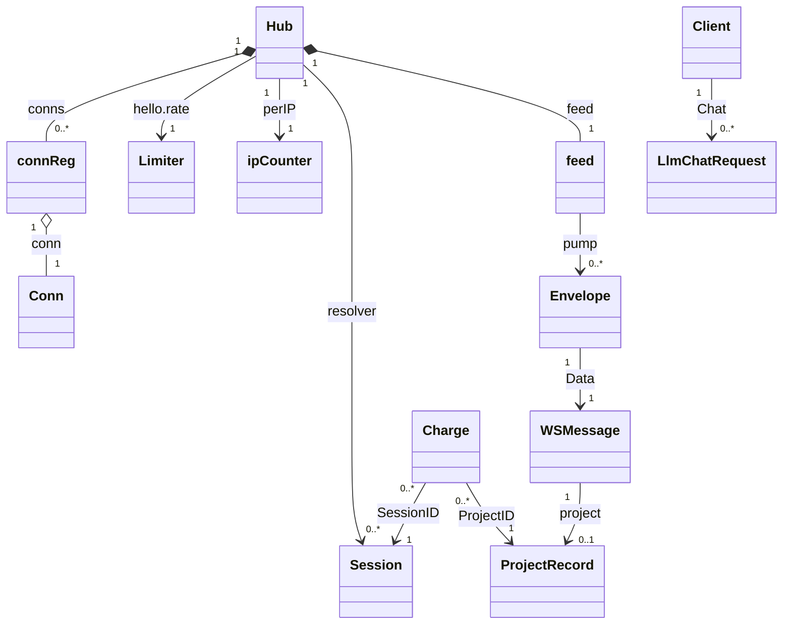

# Collaboration server architecture

The system-wide design — the parity contract, canonical data, the layer model, the pattern vocabulary — is in the root [`ARCHITECTURE.md`](../ARCHITECTURE.md).

A **protocol adapter, not a core consumer**: it never links or recompiles `core/`, never
decodes images (the uploader passes dimensions), and keeps the parity contract out
of scope.

```mermaid
graph TD
    WS["browser · extension"]
    TCP["desktop · cli · pystencil"]
    REST["bot · mcp"]
    subgraph SRV["server/ (Go)"]
      API["httpapi/"]
      TRANS["transport/"]
      SVC["service/"]
      HUB["hub/"]
      AUTH["auth/ · ratelimit/"]
      LLM["llm/ · validate/"]
      STORE["store/"]
      FILES["filestore/"]
      BUS["eventbus/ · redisbus/"]
    end
    PG[("Postgres")]
    RD[("Redis")]
    UP["LLM upstream"]

    WS -->|"WebSocket"| TRANS
    TCP -->|"TCP NDJSON"| TRANS
    WS & REST --> API
    API --> AUTH & SVC & LLM
    LLM -.-> UP
    TRANS --> HUB
    SVC --> STORE & FILES & BUS
    HUB --> STORE & BUS
    STORE --> PG
    BUS -.-> RD
```

## Layers

`protocol`, `clock`, `ratelimit`, `transport` → `validate`, `auth`, `eventbus`, `llm` →
`store`, `filestore`, `redisbus` → `service`, `hub`, `config` → `httpapi` (**transport
only**: decode, authorize, encode) → `cmd/`. A layer may use everything to its left and
nothing in its own tier or to its right. `internal/lint/layers_test.go` parses every non-test
import block and fails an edge that does not point left; it seats `testutil`, `lint` and
`tools` beside `cmd/`, so no product package imports them. `service/` owns no transport
concept (no `ResponseWriter`, no statuses). No business rule lives in a handler beyond three
the handlers hold: the token lifetime `handleIssueToken` stamps (`TOKEN_TTL_HOURS`), the refusal to
delete a file kind that belongs to the project record (`handleDeleteFile`), and the list's
cursor rule (a full page carries a `nextCursor`, a short one ends the list).

## Where things go

| Path | Holds | Rule |
|---|---|---|
| `cmd/stencil-server/` | flags, signals, boot, the listeners and the background loops | wiring only |
| `internal/protocol/` | the wire DTOs and the WS message envelope | **the contract** every client speaks |
| `internal/config/` | the environment configuration; an embedded `providers.json` generated from `common/config/llm/providers.json` by `go generate` | every key is in `.env.example` and the README table; the generated copy stays byte-equal (`llmdefaults_test.go`) and is never committed |
| `internal/auth/`, `internal/ratelimit/` | opaque bearer tokens (hashed, constant-time compare, expiry) + the HTTP gate; the token buckets + `clientip.go` | a token travels in the `Authorization` header or the WS hello, never in a URL; an IPv6 client is keyed by its /64 |
| `internal/httpapi/` | the REST handlers, the LLM routes, `assets/` (generated from `common/config/`, gitignored) + `goldens/` | decode · authorize · call a service · encode — nothing else |
| `internal/service/` | project and file policy | |
| `internal/store/` | the pgx `Store` over projects, sessions and charges, keyset listing, the migrations | migrations are idempotent, applied once each in order under an advisory lock; Postgres is the sole source of truth |
| `internal/filestore/` | the path-confined byte store: `safeJoin`, atomic put, the quotas, the reconcile pass | never touches a client-supplied filename; confined, not encrypted |
| `internal/transport/`, `internal/hub/` | the `Conn` abstraction over WebSocket and TCP NDJSON, read under the hello cap until the hello passes; the handshake, the per-IP connection cap and the events feed | a connection serves the feed and nothing else |
| `internal/eventbus/`, `internal/redisbus/` | pub/sub fan-out, in-process and Redis | both drop rather than stall a slow subscriber; the in-proc `Subscribe` returns subscribed, the Redis one after the acknowledgement or, unconfirmed and logged, after `REDIS_SUBSCRIBE_TIMEOUT_SECONDS` |
| `internal/llm/`, `internal/validate/` | the upstream proxy (one file per wire shape); the pure request predicates, the project field caps among them | requests validate before leaving; upstream text is untrusted and sanitized; the key and image payloads are never logged; `validate/` does no I/O |
| `internal/clock/`, `internal/testutil/`, `internal/lint/` | the injectable `now()`, the shared test rigs, the test-count floor (run as a test) | |
| `vendor/` | `go mod vendor` output | gitignored, as is `go.sum`; the only non-stdlib deps are `pgx`, `go-redis`, `coder/websocket` |

## Entities

```mermaid
classDiagram
    WSMessage "1" --> "0..1" ProjectRecord : project
    Envelope "1" --> "1" WSMessage : Data
    Hub "1" *-- "0..*" connReg : conns
    Hub "1" --> "1" Limiter : hello.rate
    Hub "1" --> "1" ipCounter : perIP
    Hub "1" --> "0..*" Session : resolver
    Hub "1" *-- "1" feed : feed
    feed --> "0..*" Envelope : pump
    connReg "1" o-- "1" Conn : conn
    Client "1" --> "0..*" LlmChatRequest : Chat
    Charge "0..*" --> "1" Session : SessionID
    Charge "0..*" --> "1" ProjectRecord : ProjectID
```

| Entity | What it is | Owned by / lifetime | Relates to |
|---|---|---|---|
| `WSMessage` (`protocol/ws.go`) | the flat envelope of every WS frame and TCP line; `Type` selects the live fields | per frame | carries a `ProjectRecord`; wrapped in an `Envelope` on the bus |
| `ProjectRecord` (`protocol/project.go`) | project metadata plus server-only storage fields; `Version` is the last-writer-wins guard | a Postgres row | the body of every REST project response and feed event |
| `LlmChatRequest` / `LlmChatResponse` (`protocol/llm.go`) | one chat turn and its reply; the provider wire shape never leaves `llm/` | per request; `llm-contract.md` §6.3 is canonical | validated by `validate.LLMChat`; mapped by a `providerMapping` |
| `Session` (`auth/token.go`) | the principal a bearer token's hash resolves to | a `sessions` row, live until `ExpiresAt` | resolved by `auth.Verify`; keys the per-session `Limiter` |
| `Hub` (`hub/hub.go`) | the registry of live connections | one per process | tracks a `connReg` per connection for the shutdown notice |
| `connReg` (`hub/hub.go`) | one live connection's cancel and `Conn` | from accept until the handler returns | cancelled by `CloseAll`; noticed through its `Conn` |
| `ipCounter` (`hub/conncap.go`) | the live connections per client IP, against `MaxConnsPerIP` | one per hub | taken before the hello is read, released when the handler returns |
| `Conn` (`transport/transport.go`) | one message stream: `wsConn` (a text frame each) or `tcpConn` (an NDJSON line each), reading under `MaxHelloBytes` until `SetReadLimit` | per socket | read and written by the hub |
| `feed` (`hub/feed.go`) | the hub's one `events` subscription and the bounded channel of each listening connection | one per hub; closed when the subscription ends | `pump` copies each `Envelope`'s frame to every listener |
| `Envelope` (`eventbus/eventbus.go`) | a marshalled frame plus the type fan-out reads unparsed | published to `events` | delivered to each hub's `feed` |
| `Charge` (`store/charges.go`) | one stored file's bytes, charged to the session that wrote them | a `file_charges` row per (project, kind) while the cap is on | summed per `Session` under its row lock |
| `Limiter` (`ratelimit/limiter.go`) | a per-key token bucket; `nil` is unlimited | one per metered surface (auth, writes, LLM, the hello) | keyed by client IP or `Session.ID` |
| `Client` (`llm/client.go`) | the upstream proxy: provider, base URL, key, default model, bounded `Doer` | one per process when a provider is configured | dispatches to a `providerMapping`; fails as `*UpstreamError` |

## Patterns

| Pattern | Where | Notes |
|---|---|---|
| Repository | `store.Store` and `filestore.Store` behind the interfaces `httpapi`, `hub` and `service` declare | each consumer names only the methods it calls, so `testutil.MemStore` stands in without a database |
| Observer | `bus.Bus` (`inProc`, `redisBus`) with each hub's `feed` as its one subscriber, and every `serveEvents` a listener of the feed | a REST write publishes once; the bus reaches every instance, the feed every connection on it |
| Strategy | `llm.providerMapping` in the `mappings` table | keyed by provider id; a new provider is a table entry plus its file |
| Chain of Responsibility | `httpapi.CORS` → `auth.Middleware` → `limitByIP` / `limitBySession` → `validate` → handler; `Hub.HandleConn` → `ipCounter` → `checkHello` → `checkHelloFields` → `serveEvents` | each link answers or passes on |
| Adapter | `transport.wsConn` and `transport.tcpConn` behind `transport.Conn` | text frames and NDJSON lines reach one hub feed |
| Saga | `service.FileService.Store`, `service.ProjectService.Create` | one upload spans `filestore` and `store`; a compensating step or the reconcile pass undoes a half-done one |
| Golden pin | `httpapi/goldens/` read by `textgolden_test.go` | user-facing LLM text and response bodies are pinned as text |

## Design

- **Boot.** `main.go` loads `config.Config`, migrates, then builds the filestore, the bus, the
  hub, `httpapi.Deps` and any `llm.Client`; the sweeps start last.
- **Shutdown.** Within `SHUTDOWN_TIMEOUT_SECONDS`: the sweeps stop and are joined, the TCP
  listener closes, `Hub.CloseAll` sends `shuttingDown` to every connection and cancels it, and
  `http.Server.Shutdown` stops accepting and waits for the REST handlers. Only then does
  `Hub.Close` end the hub's context, and the bus and the pool close.
- **A REST project write.** `PUT /projects/{id}` passes the guard chain and
  `validate.UpdateProject` (the per-field caps answer `400` with the field and its bound), then
  calls `Store.UpdateProject` with the expected version (`ErrConflict` is `409 conflict`) and
  publishes `updated` on the global feed. `POST /projects` passes `validate.CreateProject` and
  runs `ProjectService.Create`; a file upload passes `validate.ImageSize` before any byte moves,
  runs the `FileService.Store` saga and publishes `updated` (a record write that fails takes
  the new bytes back and uncharges them); a file delete credits the writer before the bytes go.
  An expected version outside int4 is a `400`, never a store error. A delete takes the row, then
  the bytes, then publishes `deleted`.
- **A feed connection.** `Hub.HandleConn` takes the client IP's slot in the `ipCounter`
  (refusing `rateLimited` past `MaxConnsPerIP`), reads the `hello` under `MaxHelloBytes` and
  `HelloTimeout`, runs `checkHello` (per-IP `Limiter`, `auth.Verify`), refuses a hello that
  names a `projectId` or overruns the name cap with `badRequest`, raises the read limit to
  `MaxMessageBytes` and serves `serveEvents`: every frame the hub's `feed` delivers is written
  to the connection until the peer hangs up, the token's session expires (`unauthorized`), the
  feed's subscription ends or the server shuts down. Inbound frames after the hello are read
  and discarded. A TCP accept error other than a closed listener is logged and retried after a
  backoff doubling from 5 ms to 1 s.
- **An LLM turn.** `POST /llm/chat` passes the auth guard, spends the LLM bucket before the body
  is read, runs `validate.LLMChat`, takes an `llmGate` slot and calls `Client.Chat`. An
  `*UpstreamError` answers `502 llmUpstream` with its `ClientMessage` (Rule 6).
- **The expiry sweep.** `service.Expiry` deletes expired rows in batches through
  `ProjectService.Dropped`, so a swept project looks exactly like a manual delete. Expired
  sessions go too. The reconcile loop removes a directory no row owns and a stale upload.
- **Storage quotas.** Aggregate, per-owner and per-session caps refuse with
  `filestore.ErrQuotaExceeded`. `Store.Admit` locks the writer's `sessions` row, sums its other
  files and upserts the charge in one transaction, so one session's uploads are judged one at a
  time on every instance and a refusal stores nothing.
- **Project list.** A page is bounded and keyset-paged under a strong `ETag`; every client walks
  `nextCursor` to the end, so the page size bounds one response, never the list.
- **Wire schema.** A `protocol.WSMessage`'s `type` decides which optional fields are set:

  | Group | Fields |
  |---|---|
  | identity (`hello`) | `token`, `clientId`, `name`, `projectId` (refused when set) |
  | events | `project` (a `ProjectRecord`), `event` |
  | errors | `code`, `message` |

  Kinds — client → server: `hello`, `ping`; server → client: `project-event`, `error`, `pong`.

  REST bodies are the `protocol` DTOs; a create, an update and an event's `project` carry
  metadata only. Layout JSON is opaque (`json.RawMessage`) to the server.

## Concurrency

Every goroutine belongs to one of three scopes. The process runs the HTTP server, the TCP
accept loop, the hub's feed `pump`, and the expiry and reconcile loops `cmd/` joins through one
`WaitGroup`. Each
connection runs its handler (the feed writer), the `serveEvents` reader, a token-expiry timer
and, on WebSocket, a keepalive; each Redis subscription runs one pump. Everything shared across
goroutines is in the table. Quotas hold at three scopes: the per-session cap under the writer's
`sessions` row lock in `Store.Admit` (every instance), the per-owner and aggregate caps under
the filestore meter's mutex (this process only).

| Owner | Runs on | Shares | Guard | On overflow or teardown |
|---|---|---|---|---|
| `Hub` registry (`hub/hub.go`) | connection handlers, `CloseAll` | `conns` | `Hub.mu`, never held across I/O or a channel send | the handler's return forgets its `connReg` |
| `ipCounter` (`hub/conncap.go`) | connection handlers | the per-IP counts | `ipCounter.mu` | a take past `MaxConnsPerIP` is refused `rateLimited` before the hello is read |
| feed `pump` (`hub/feed.go`) | one goroutine per hub, over its one `events` subscription | the listener set, each listener a channel of `BUS_SUB_BUFFER` (64) frames | `feed.mu`; delivery never blocks | a full listener drops and `DropLog` reports it, the client re-reads the list; the subscription's end closes every listener, which hangs its connection up |
| `tcpConn` writer (`transport/tcp.go`) | the feed writer and any notice | the socket | a one-slot semaphore taken under the caller's context | a frame waits at most `TCP_WRITE_TIMEOUT_SECONDS` (30 s); a notice gives up at its own `NoticeTimeout` (1 s) |
| `tcpConn` read limit (`transport/tcp.go`) | the handler raises it, the reader reads it | `limit` | an atomic | a frame past it fails the read with `ErrFrameTooLarge` and the handler hangs up |
| `wsConn` keepalive (`transport/ws.go`) | one goroutine per WebSocket | the connection | `coder/websocket` | a peer silent past `WS_PONG_TIMEOUT_SECONDS` is closed |
| Redis pump (`redisbus/redisbus.go`) | one goroutine per subscription | the subscriber channel | `BUS_SUB_BUFFER` slots | a full channel drops and logs; the unsubscribe closes the pubsub, which ends the pump and closes the channel |
| in-proc bus (`eventbus/eventbus.go`) | publishers' goroutines | the subscriber map | `inProc.mu`; delivery never blocks | a full subscriber drops and `DropLog` reports it |
| `ratelimit.Limiter` | request handlers, the hello | per-key buckets | `Limiter.mu` | an idle bucket is evicted after `RATE_BUCKET_IDLE_MINUTES`, by a sweep a new key runs once half that time has passed or the map has doubled |
| `llmGate` (`httpapi/llmlimit.go`) | `/llm/chat` handlers | in-flight slots | a buffered channel, taken without blocking | over the cap answers `rateLimited` at once |
| filestore meter (`filestore/quota.go`) | upload and delete handlers, the reconcile pass | the per-process byte counts | `capped.mu` across each measure-and-swap | a write past a quota is refused before its rename |
| maintenance loops (`cmd/stencil-server/`) | one goroutine each | the store, the filestore | each store call under `OP_TIMEOUT_SECONDS`; the sweep's byte drops over `SWEEP_WORKERS` | the signal context stops them and shutdown joins them before the connections close |

## Rules

1. **Every write is a REST save under the version guard**, announced on the feed; the server
   relays no edit and holds no layout outside Postgres. A shutdown sends `shuttingDown` to
   every connection before closing.
2. **Two transports, one feed**, so that browsers use the native WebSocket API while native
   clients use raw TCP NDJSON — no third-party WS client anywhere. A hello that names a project
   is refused: no connection is ever more than a feed.
3. **One shared workspace.** A valid token grants every project, including persisted chats;
   there is no per-project ACL layer, and none goes in a handler.
4. **Issuance is always gated** by the admin token (set or per-boot generated), which is why
   the LLM proxy enables whenever a provider is configured. `AUTH_OPEN=1` is a loud opt-in.
5. **Every rate limit is a bucket in `ratelimit/`** keyed on the client IP or the session;
   never an ad-hoc counter. The other bounds are capacities, not rates: the `llmGate`
   (`httpapi/llmlimit.go`) refuses LLM in-flight over its cap rather than queueing, the hub's
   `ipCounter` refuses the connection past `MAX_CONNECTIONS_PER_IP`, a hello is read under
   `MaxHelloBytes`, and `eventbus.DropLog` only counts and reports drops.
6. **Upstream failures are said once**: classified in `llm/upstream.go` into the condition
   the user can act on; anything unclassified is stripped, redacted of URLs and token-shaped
   runs, capped, and dropped entirely if a fragment of the key appears. The `code` is always
   the server's.
7. **Store calls run under the operation timeout** in every handler, in the hub and in the
   sweeps, token lookups included. An upload's body streams under the request's context, and
   each store call around it takes a fresh timeout of its own.
8. **The payload reads once.** The layout leaves Postgres only for `GET /projects/{id}`;
   writes, lists, events and the file routes read metadata. An image is never a column: its
   bytes leave the filestore only by the files route, never in a project body, the feed or
   Redis.
9. **Every project field is capped in `validate/`** — name, description, provenance URLs,
   colours and keywords — and the hello's name with it, so no field rides the feed, Redis or a
   list page unbounded.

## Tests

Offline by default; only `store/` and `redisbus/` touch a real Postgres or Redis and
self-skip without one. The store suite proves the migration ledger under concurrent boots,
the migrations' upgrades and the per-session ledger; it reads a dedicated `TEST_DATABASE_URL`,
never `DATABASE_URL`, because it truncates the database it names. `httpapi` and `hub` run
against `internal/testutil`'s rigs; `llm/` injects a `Doer` to assert the exact upstream
request. The whole suite runs under the race detector; the hub's proves the feed delivers on
both transports and over TLS through one bus subscription, that a stalled listener drops alone,
that a transient accept error is retried, that a hello past the hello cap, naming a project or over the
per-IP connection cap is refused and closed, that the read limit rises only after the hello,
and that a shutdown notices every connection before hanging up. `internal/lint/` holds the
test-count floor and the layer lint. Opt-in benchmarks assert properties, not numbers.
