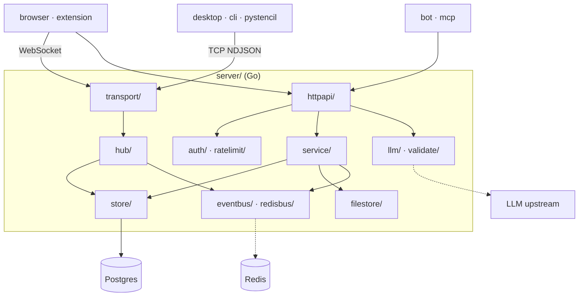
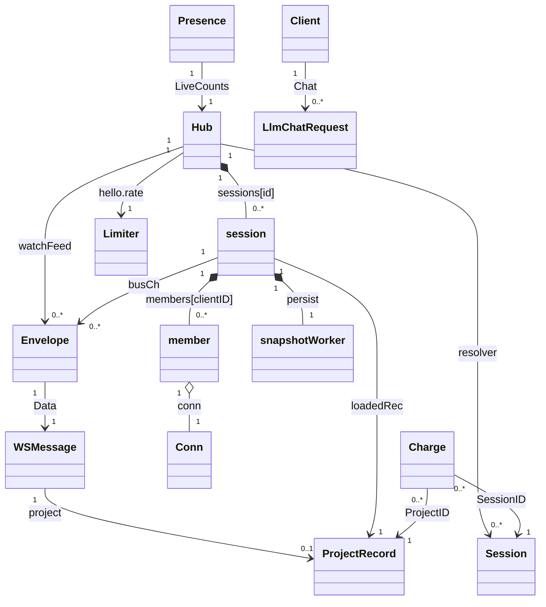

# Collaboration server architecture

The system-wide design — the parity contract, canonical data, the layer model, the pattern vocabulary — is in the root [`ARCHITECTURE.md`](../ARCHITECTURE.md).

A **protocol adapter, not a core consumer**: it never links or recompiles `core/`, never
decodes images (the uploader passes dimensions), and keeps the parity contract out
of scope.

```mermaid
graph TD
    WS["browser · extension"]
    TCP["desktop · cli · pystencil"]
    REST["bot · mcp"]
    subgraph SRV["server/ (Go)"]
      API["httpapi/"]
      TRANS["transport/"]
      SVC["service/"]
      HUB["hub/"]
      AUTH["auth/ · ratelimit/"]
      LLM["llm/ · validate/"]
      STORE["store/"]
      FILES["filestore/"]
      BUS["eventbus/ · redisbus/"]
    end
    PG[("Postgres")]
    RD[("Redis")]
    UP["LLM upstream"]

    WS -->|"WebSocket"| TRANS
    TCP -->|"TCP NDJSON"| TRANS
    WS & REST --> API
    API --> AUTH & SVC & LLM
    LLM -.-> UP
    TRANS --> HUB
    SVC --> STORE & FILES & BUS
    HUB --> STORE & BUS
    STORE --> PG
    BUS -.-> RD
```

## Layers

`protocol`, `clock`, `ratelimit`, `transport` → `validate`, `auth`, `eventbus`, `llm` →
`store`, `filestore`, `redisbus` → `service`, `hub`, `config` → `httpapi` (**transport
only**: decode, authorize, encode) → `cmd/`. A layer may use everything to its left and
nothing in its own tier or to its right. `internal/lint/layers_test.go` parses every non-test
import block and fails an edge that does not point left; it seats `testutil`, `lint` and
`tools` beside `cmd/`, so no product package imports them. `service/` owns no transport
concept (no `ResponseWriter`, no statuses). No business rule lives in a handler beyond three
the handlers hold: the token lifetime `handleIssueToken` stamps (`TOKEN_TTL_HOURS`), the refusal to
delete a file kind that belongs to the project record (`handleDeleteFile`), and the list's
cursor rule (a full page carries a `nextCursor`, a short one ends the list).

## Where things go

| Path | Holds | Rule |
|---|---|---|
| `cmd/stencil-server/` | flags, signals, boot, the listeners and the background loops | wiring only |
| `internal/protocol/` | the wire DTOs and the WS message envelope | **the contract** every client speaks |
| `internal/config/` | the environment configuration; an embedded `providers.json` generated from `common/config/llm/providers.json` by `go generate` | every key is in `.env.example` and the README table; the generated copy stays byte-equal (`llmdefaults_test.go`) and is never committed |
| `internal/auth/`, `internal/ratelimit/` | opaque bearer tokens (hashed, constant-time compare, expiry) + the HTTP/WS gate; the token buckets + `clientip.go` | a token travels as a header; `?token=` only on a WebSocket upgrade to `auth.WSRoute` |
| `internal/httpapi/` | the REST handlers, the LLM routes, `assets/` (generated from `common/config/`, gitignored) + `goldens/` | decode · authorize · call a service · encode — nothing else |
| `internal/service/` | project and file policy, and the cross-instance presence | |
| `internal/store/` | the pgx `Store` over projects, sessions, charges and presence, keyset listing, the migrations | migrations are idempotent, applied once each in order under an advisory lock; Postgres is the sole source of truth |
| `internal/filestore/` | the path-confined byte store: `safeJoin`, atomic put, the quotas, the reconcile pass | never touches a client-supplied filename; confined, not encrypted |
| `internal/transport/`, `internal/hub/` | the `Conn` abstraction over WebSocket and TCP NDJSON; one run-loop per project relaying edits and committing saves | |
| `internal/eventbus/`, `internal/redisbus/` | pub/sub fan-out, in-process and Redis | both drop rather than stall a slow subscriber; the in-proc `Subscribe` returns subscribed, the Redis one after the acknowledgement or, unconfirmed and logged, after `REDIS_SUBSCRIBE_TIMEOUT_SECONDS` |
| `internal/llm/`, `internal/validate/` | the upstream proxy (one file per wire shape); the pure request predicates | requests validate before leaving; upstream text is untrusted and sanitized; the key and image payloads are never logged; `validate/` does no I/O |
| `internal/clock/`, `internal/testutil/`, `internal/lint/` | the injectable `now()`, the shared test rigs, the test-count floor (run as a test) | |
| `vendor/` | `go mod vendor` output | gitignored, as is `go.sum`; the only non-stdlib deps are `pgx`, `go-redis`, `coder/websocket` |

## Entities

```mermaid
classDiagram
    WSMessage "1" --> "0..1" ProjectRecord : project
    Envelope "1" --> "1" WSMessage : Data
    Hub "1" *-- "0..*" session : sessions[id]
    Hub "1" --> "1" Limiter : hello.rate
    Hub "1" --> "0..*" Session : resolver
    Hub "1" --> "0..*" Envelope : watchFeed
    session "1" *-- "0..*" member : members[clientID]
    session "1" *-- "1" snapshotWorker : persist
    session "1" --> "1" ProjectRecord : loadedRec
    session "1" --> "0..*" Envelope : busCh
    member "1" o-- "1" Conn : conn
    Client "1" --> "0..*" LlmChatRequest : Chat
    Charge "0..*" --> "1" Session : SessionID
    Charge "0..*" --> "1" ProjectRecord : ProjectID
    Presence "1" --> "1" Hub : LiveCounts
```

| Entity | What it is | Owned by / lifetime | Relates to |
|---|---|---|---|
| `WSMessage` (`protocol/ws.go`) | the flat envelope of every WS frame and TCP line; `Type` selects the live fields | per frame | carries `Peer`s and a `ProjectRecord`; wrapped in an `Envelope` on the bus |
| `ProjectRecord` (`protocol/project.go`) | project metadata plus server-only storage fields; `Version` is the last-writer-wins guard | a Postgres row | cached as `session.loadedRec`; the body of every REST project response |
| `LlmChatRequest` / `LlmChatResponse` (`protocol/llm.go`) | one chat turn and its reply; the provider wire shape never leaves `llm/` | per request; `llm-contract.md` §6.3 is canonical | validated by `validate.LLMChat`; mapped by a `providerMapping` |
| `Session` (`auth/token.go`) | the principal a bearer token's hash resolves to | a `sessions` row, live until `ExpiresAt` | resolved by `auth.Verify`; keys the per-session `Limiter` |
| `Hub` (`hub/hub.go`) | the registry of live sessions and connections | one per process | holds a `session` per project id; watches `events` for foreign writes |
| `session` (`hub/session.go`) | the single-goroutine owner of one project's live state: members, version, cached snapshot | refcounted, from the first join until the last member leaves | fans `Envelope`s out to `member`s; stores through its `snapshotWorker` |
| `member` (`hub/member.go`) | one client in a session, with its bounded outbound queue and `writeLoop` | per connection | owns a `Conn`; addressed by `clientID` |
| `snapshotWorker` (`hub/persist.go`) | the session's DB arm, one blocking store call at a time | one per session, until the run loop closes its queue | takes at most one load and one save as `persistJob`s, returns `persistResult`s |
| `Conn` (`transport/transport.go`) | one message stream: `wsConn` (a text frame each) or `tcpConn` (an NDJSON line each) | per socket | read and written by the hub |
| `Envelope` (`eventbus/eventbus.go`) | a marshalled frame plus the routing fields fan-out reads unparsed, and the publishing hub's `Origin` | published to `proj:<id>` or `events` | delivered to `session.busCh` (another instance's only) and `serveEvents` |
| `Charge` (`store/charges.go`) | one stored file's bytes, charged to the session that wrote them | a `file_charges` row per (project, kind) while the cap is on | summed per `Session` under its row lock |
| `Presence` (`service/presence.go`) | this instance's lease on its live projects in `project_presence` | one per process while presence is enabled | beats the `Hub`'s `LiveCounts`; read by `Expiry` and the delete guard |
| `Limiter` (`ratelimit/limiter.go`) | a per-key token bucket; `nil` is unlimited | one per metered surface (auth, writes, LLM, the hello) | keyed by client IP or `Session.ID` |
| `Client` (`llm/client.go`) | the upstream proxy: provider, base URL, key, default model, bounded `Doer` | one per process when a provider is configured | dispatches to a `providerMapping`; fails as `*UpstreamError` |

## Patterns

| Pattern | Where | Notes |
|---|---|---|
| Repository | `store.Store` and `filestore.Store` behind the interfaces `httpapi`, `hub` and `service` declare | each consumer names only the methods it calls, so `testutil.MemStore` stands in without a database |
| Observer | `bus.Bus` (`inProc`, `redisBus`) with `session.busCh`, `serveEvents` and the hub's `watchFeed` as subscribers | a session fans each frame out to its local members itself and publishes it for the other instances; an envelope stamped with its own hub's `Origin` is skipped on receipt |
| Strategy | `llm.providerMapping` in the `mappings` table | keyed by provider id; a new provider is a table entry plus its file |
| Chain of Responsibility | `httpapi.CORS` → `auth.Middleware` → `limitByIP` / `limitBySession` → handler; `Hub.HandleConn` → `checkHello` → `serveProject` / `serveEvents` | each link answers or passes on |
| Run-loop per project | `session.run`; `snapshotWorker.run` as its only blocking arm | one goroutine per open project serialises joins, frames, bus deliveries and persist results, so session state needs no lock |
| Adapter | `transport.wsConn` and `transport.tcpConn` behind `transport.Conn` | text frames and NDJSON lines reach one hub session |
| Saga | `service.FileService.Store`, `service.ProjectService.Create` | one upload spans `filestore` and `store`; a compensating step or the reconcile pass undoes a half-done one |
| Golden pin | `httpapi/goldens/` read by `textgolden_test.go` | user-facing LLM text and response bodies are pinned as text |
| Lease | `service.Presence` over `project_presence` | a row is trusted until its `live_until` on the database clock, so a stopped instance's claim lapses on its own |

## Design

- **Boot.** `main.go` loads `config.Config`, migrates, then builds the filestore, the bus, the
  hub, `httpapi.Deps` and any `llm.Client`; the presence heartbeat and the sweeps start last, as
  both ask the hub what is live.
- **Shutdown.** Within `SHUTDOWN_TIMEOUT_SECONDS`: the sweeps stop and are joined, the TCP
  listener closes, `Hub.CloseAll` sends `shuttingDown` to every connection and cancels it,
  `http.Server.Shutdown` stops accepting and waits for the REST handlers, and `Hub.Drain` waits
  for every session's run loop, which commits and announces each save its worker holds. Only
  then does `Hub.Close` end the hub's context, and the bus and the pool close.
- **A REST project write.** `PUT /projects/{id}` passes the guard chain and calls
  `Store.UpdateProject` with the expected version (`ErrConflict` is `409 conflict`), then
  publishes `updated` on the global feed. `POST /projects` runs `ProjectService.Create`; a file
  upload runs the `FileService.Store` saga and publishes `updated`; a file delete credits the
  writer before the bytes go.
- **A live session.** `Hub.HandleConn` reads a `Conn`'s `hello`, runs `checkHello` (per-IP
  `Limiter`, `auth.Verify`) and hangs up with `unauthorized` when the session expires. An empty
  `projectId` joins `serveEvents`; an unknown id gets `notFound`; otherwise `serveProject` adds a
  `member` to the project's `session`, whose first join loads the snapshot `welcome` carries; a
  load that finds no row, or a `deleted` event on the feed, sends `notFound` to every member and
  hangs each up. An `edit` behind `session.version` gets `badVersion`; otherwise it is fanned
  out to every other local member and published on `proj:<id>`. A `save` goes to the worker
  while none is in flight, else waits in a one-save slot where a later save supersedes it
  (`conflict`); a committed save bumps the version, sends `synced` to all and publishes
  `updated`, even once its saver and every other member have left. Any other write reaches the session through
  `Hub.watchFeed`, so no welcome predates a known write.
- **An LLM turn.** `POST /llm/chat` passes the auth guard, spends the LLM bucket before the body
  is read, runs `validate.LLMChat`, takes an `llmGate` slot and calls `Client.Chat`. An
  `*UpstreamError` answers `502 llmUpstream` with its `ClientMessage` (Rule 6).
- **Presence.** On a heartbeat, and once a burst of joins or leaves settles, `Presence.Beat`
  replaces this instance's `project_presence` rows with the hub's `LiveCounts` under a TTL; the
  rows outlive a shutdown to cover reconnects elsewhere. A project delete refuses while two
  editors are live across every instance.
- **The expiry sweep.** `service.Expiry` deletes expired rows in batches, sparing every project
  live here or in another instance's presence (an unreadable presence sweeps nothing), through
  `ProjectService.Dropped`, so a swept project looks exactly like a manual delete. Expired
  sessions go too. The reconcile loop removes a directory no row owns and a stale upload.
- **Storage quotas.** Aggregate, per-owner and per-session caps refuse with
  `filestore.ErrQuotaExceeded`. `Store.Admit` locks the writer's `sessions` row, sums its other
  files and upserts the charge in one transaction, so one session's uploads are judged one at a
  time on every instance and a refusal stores nothing.
- **Project list.** A page is bounded and keyset-paged under a strong `ETag`; every client walks
  `nextCursor` to the end, so the page size bounds one response, never the list.
- **Wire schema.** A `protocol.WSMessage`'s `type` decides which optional fields are set:

  | Group | Fields |
  |---|---|
  | identity (`hello`) | `token`, `clientId`, `name`, `projectId` (empty = the global `/events` feed) |
  | edit / sync | `version`, `op`, `payload` (raw JSON) |
  | snapshots / events | `project` (a `ProjectRecord`), `layout` (raw JSON), `peers`, `event`, `resultPath` |
  | relay | `fromClientId` |
  | presence / cursor | `x`, `y`, `state` |
  | errors | `code`, `message` |

  Kinds — client → server: `hello`, `subscribe`, `edit`, `cursor`, `presence`, `save`, `ping`;
  server → client: `welcome`, `peer-join`, `peer-leave`, `edit`, `synced`, `project-event`,
  `error`, `pong`.

  REST bodies are the `protocol` DTOs; a create, an update, an event and a welcome's `project`
  carry metadata only. Layout JSON is opaque (`json.RawMessage`) to the server.

## Concurrency

Every goroutine belongs to one of four scopes. The process runs the HTTP server, the TCP
accept loop, the hub's `watchFeed`, and the presence, expiry and reconcile loops `cmd/` joins
through one `WaitGroup`. Each live project runs one `session.run` loop and one
`snapshotWorker`; each connection runs its handler, a member `writeLoop` (or the `serveEvents`
reader), a token-expiry timer and, on WebSocket, a keepalive; each Redis subscription runs one
pump. Session state is owned by its run loop and needs no lock; everything shared across
goroutines is in the table. Quotas hold at three scopes: the per-session cap under the writer's
`sessions` row lock in `Store.Admit` (every instance), the per-owner and aggregate caps under
the filestore meter's mutex (this process only).

| Owner | Runs on | Shares | Guard | On overflow or teardown |
|---|---|---|---|---|
| `Hub` registry (`hub/hub.go`) | connection handlers, `watchFeed`, the REST delete guard, presence | `sessions`, `conns`, `loops`, each `session.refs` | `Hub.mu`, never held across I/O or a channel send | the last `release` removes the session and closes `done`; `loops` keeps it until its run loop returns |
| `session.run` (`hub/session.go`) | one goroutine per live project | members, version, cached snapshot | single owner; `register`, `unregister` and `incoming` are unbuffered and every sender also selects on `done` | on `done` it closes every member's queue, hands the waiting save to the worker, closes the job queue and applies each save result, then returns |
| `snapshotWorker` (`hub/persist.go`) | one goroutine per session | the store | a queue of `jobSlots` (2): one load and one save outstanding, a later save superseding the waiting one | after `done` it skips queued loads, runs the remaining saves and closes its results; each call is bounded by `OpTimeout` on the hub's context |
| member queue (`hub/member.go`) | the run loop enqueues, `writeLoop` drains | `out`, `queued` | `member.mu` over the byte count; `OutBuffer` (256) frames and `OutBudgetBytes` (8 MiB) | a frame past either is dropped; the client reconciles by version |
| `session.busCh` | the bus delivers, the run loop reads | another instance's frames | `BUS_SUB_BUFFER` (64) slots | a full buffer drops and `DropLog` reports it; local members never depend on it |
| `session.written` | `watchFeed` writes, the run loop reads | the newest reported version | one slot, merged to the larger value | never blocks the feed |
| `session.deleted` | `watchFeed` closes it once | the deletion signal | `deleteOnce` | the run loop answers `notFound` and hangs up every member |
| `tcpConn` writer (`transport/tcp.go`) | the member writer and any notice | the socket | a one-slot semaphore taken under the caller's context | a frame waits at most `TCP_WRITE_TIMEOUT_SECONDS` (30 s); a notice gives up at its own `NoticeTimeout` (1 s) |
| `wsConn` keepalive (`transport/ws.go`) | one goroutine per WebSocket | the connection | `coder/websocket` | a peer silent past `WS_PONG_TIMEOUT_SECONDS` is closed |
| Redis pump (`redisbus/redisbus.go`) | one goroutine per subscription | the subscriber channel | `BUS_SUB_BUFFER` slots | a full channel drops and logs; the unsubscribe closes the pubsub, which ends the pump and closes the channel |
| in-proc bus (`eventbus/eventbus.go`) | publishers' goroutines | the subscriber map | `inProc.mu`; delivery never blocks | a full subscriber drops and `DropLog` reports it |
| `ratelimit.Limiter` | request handlers, the hello | per-key buckets | `Limiter.mu` | an idle bucket is evicted after `RATE_BUCKET_IDLE_MINUTES` |
| `llmGate` (`httpapi/llmlimit.go`) | `/llm/chat` handlers | in-flight slots | a buffered channel, taken without blocking | over the cap answers `rateLimited` at once |
| filestore meter (`filestore/quota.go`) | upload and delete handlers, the reconcile pass | the per-process byte counts | `capped.mu` across each measure-and-swap | a write past a quota is refused before its rename |
| maintenance loops (`cmd/stencil-server/`) | one goroutine each | the store, the filestore, presence rows | each store call under `OP_TIMEOUT_SECONDS`; the sweep's byte drops over `SWEEP_WORKERS` | the signal context stops them and shutdown joins them before the hub drains |

## Rules

1. **Live relay vs. durable snapshot.** `edit` frames are relayed without persistence; `save`
   writes the full layout under the last-writer-wins version guard and broadcasts the new
   version. A shutdown sends `shuttingDown` to every connection before closing.
2. **Two transports, one session**, so that browsers use the native WebSocket API while native
   clients use raw TCP NDJSON — no third-party WS client anywhere.
3. **One shared workspace.** A valid token grants every project, including persisted chats;
   there is no per-project ACL layer, and none goes in a handler.
4. **Issuance is always gated** by the admin token (set or per-boot generated), which is why
   the LLM proxy enables whenever a provider is configured. `AUTH_OPEN=1` is a loud opt-in.
5. **Every rate limit is a bucket in `ratelimit/`** keyed on the client IP or the session;
   never an ad-hoc counter. The other bounds are capacities, not rates: the `llmGate`
   (`httpapi/llmlimit.go`) refuses LLM in-flight over its cap rather than queueing, a member's
   byte budget drops frames past it, and `eventbus.DropLog` only counts and reports drops.
6. **Upstream failures are said once**: classified in `llm/upstream.go` into the condition
   the user can act on; anything unclassified is stripped, redacted of URLs and token-shaped
   runs, capped, and dropped entirely if a fragment of the key appears. The `code` is always
   the server's.
7. **Store calls run under the operation timeout** in every handler, in the hub and in the
   sweeps, token lookups included. An upload's body streams under the request's context, and
   each store call around it takes a fresh timeout of its own.
8. **The payload reads once.** The layout leaves Postgres only for `GET /projects/{id}` and a
   welcome; writes, lists, events and the file routes read metadata. An image is never a
   column: its bytes leave the filestore only by the files route, never in a project body, the
   feed or Redis.

## Tests

Offline by default; only `store/` and `redisbus/` touch a real Postgres or Redis and
self-skip without one. The store suite proves the migration ledger under concurrent boots,
the migrations' upgrades, the per-session ledger and cross-instance presence; it reads a
dedicated `TEST_DATABASE_URL`, never `DATABASE_URL`, because it truncates the database it names.
`httpapi` and `hub` run against `internal/testutil`'s rigs; `llm/` injects a `Doer` to assert
the exact upstream request. The hub runs under the race detector and proves a later joiner's
welcome follows a REST write, that a save in flight at the last leave or at shutdown is
committed and announced, that a slow store neither stalls the run loop nor queues every save,
and that a flood past the bus buffer reaches every local member while another instance hears
each frame once. `internal/lint/` holds the test-count floor and the layer lint. Opt-in benchmarks assert properties, not numbers.
