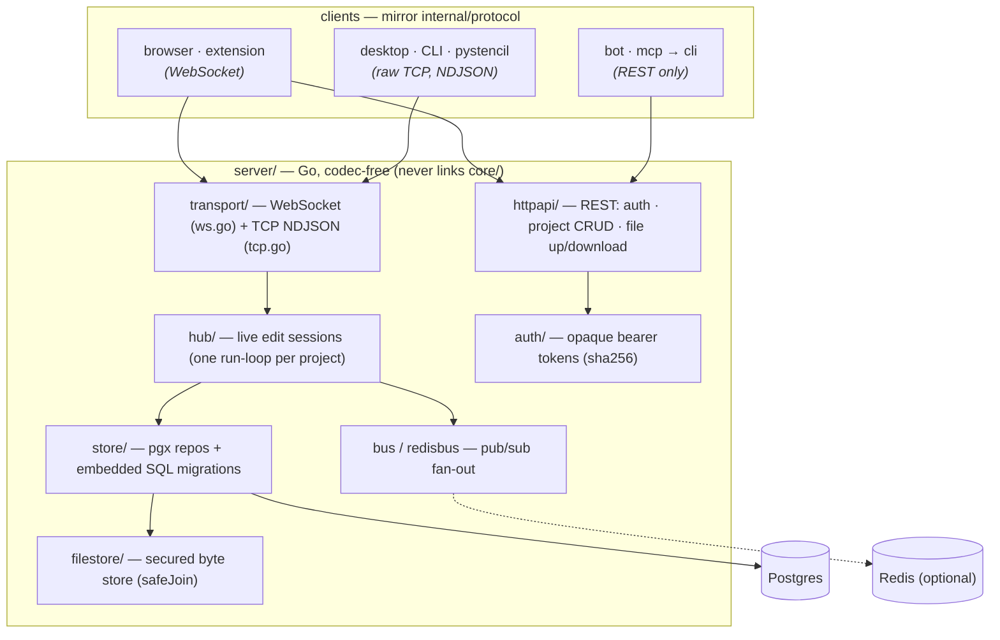

# Stencil collaboration server (`server/`)

A Go server that stores and shares Stencil projects and runs **live, multi-client
edit sessions**. Like `mcp/`, it is a **protocol adapter, not a core consumer**:
it never links or recompiles the C++ `core/`, never decodes images, and keeps the
parity contract out of scope. It persists project metadata in **Postgres** and
image bytes in a **custom secured file store**, and fans live edits out over
**WebSocket and raw TCP** (optionally across instances via **Redis**).

## Architecture



> Click a client node to open that surface's own architecture diagram, or see the
> whole-system view in the [repository README](../README.md#architecture).

## What it is for

- **Shared projects.** Any client holding a valid token sees the same project
  list and can open any project. Server-stored projects show up in each
  front-end's projects view distinguished with a golden outline.
- **Simultaneous editing.** Multiple browser/desktop/CLI/extension clients can
  edit one project at the same time; edits relay live to peers and durable
  snapshots are committed under a last-writer-wins version guard.
- **Two transports, one session.** Browsers/extension use the native WebSocket
  API; the desktop (Qt `QTcpSocket`) and CLI (Zig `std.net`) use raw TCP with
  newline-delimited JSON — so neither needs a third-party WebSocket library nor a
  hand-rolled RFC 6455 framer. All transports join the **same** edit session.

## Dependencies

Standard library for everything except, by design decision:

| Dependency | Why |
|---|---|
| `github.com/jackc/pgx/v5` | Postgres driver |
| `github.com/redis/go-redis/v9` | Redis pub/sub (cross-instance fan-out) |
| `github.com/coder/websocket` | minimal RFC 6455 server/client (avoids hand-rolling WS) |

HTTP routing, JSON, crypto (tokens, hashing), TLS, and the TCP transport are all
stdlib.

These three modules (and their transitive `// indirect` deps) are **vendored locally**:
run `go mod vendor` once to populate `server/vendor/`, and every `go build`/`go test`
uses that copy automatically instead of the machine-global module cache (`~/go/pkg/mod`).
The folder is git-ignored (node_modules-style) — re-run `go mod vendor` after changing
`go.mod`. `go.sum` stays committed. To prove a build never leaves the vendored copy:

```bash
GOFLAGS=-mod=vendor GOPROXY=off go build ./...   # offline, from server/vendor/
```

## Layout

```
server/
  cmd/stencil-server/main.go     entry: config -> store+migrate -> filestore -> bus -> api+hub -> HTTP/WS + TCP
  internal/
    protocol/   wire DTOs + WS message envelope — the shape every client mirrors
    config/     env/.env configuration
    auth/       opaque bearer tokens (sha256-hashed, constant-time), HTTP + WS gate
    filestore/  custom secured byte store; traversal-proof safeJoin (path.go)
    store/      pgx ProjectRepository + SessionRepository; embedded SQL migrations
    bus/        pub/sub interface + in-process implementation
    redisbus/   Redis implementation of bus.Bus
    transport/  Conn abstraction; WebSocket (ws.go) + TCP NDJSON (tcp.go) adapters
    httpapi/    net/http REST: token issuance, project CRUD, file upload/download
    hub/        live edit sessions: one run-loop per project, edit relay + save
```

## Run

```bash
cp .env.example .env          # set DATABASE_URL at minimum
go run ./cmd/stencil-server
```

Requires a reachable Postgres (`DATABASE_URL`). Redis is optional (`REDIS_URL`);
without it the server uses an in-process bus and is single-instance. The schema
is created at boot via embedded idempotent migrations.

Configuration (see `.env.example`): `LISTEN_ADDR`, `TCP_ADDR`, `DATABASE_URL`,
`REDIS_URL`, `FILESTORE_ROOT`, `ADMIN_TOKEN`, `TOKEN_TTL_HOURS`, `MAX_BODY_BYTES`,
`TLS_CERT`/`TLS_KEY` (one cert/key secures HTTPS+WSS and the TCP edit channel).

## REST API

All routes except `POST /auth/token` require `Authorization: Bearer <token>`.

| Method | Path | Purpose |
|---|---|---|
| POST | `/auth/token` | issue a token+session (gated by `ADMIN_TOKEN` when set) |
| GET | `/projects` | list project metadata, newest-updated first |
| POST | `/projects` | create a project |
| GET | `/projects/{id}` | full project incl. layout + original content |
| PUT | `/projects/{id}` | update name/layout under a version guard (409 on conflict) |
| DELETE | `/projects/{id}` | delete project + its files |
| GET | `/projects/{id}/files/{kind}` | download `original`/`result` bytes |
| POST | `/projects/{id}/files/{kind}?ext=&w=&h=` | upload bytes (server is codec-free: dimensions are passed in) |
| GET | `/healthz` | liveness |

## Live-edit protocol

One JSON `protocol.WSMessage` per WebSocket text frame, or per NDJSON line over
TCP. Connect to `ws://host/ws` (WS) or the TCP port; the **first frame must be a
`hello`** carrying the token, optional `clientId`/`name`, and a `projectId`. An
empty `projectId` selects the global `/events` feed instead of a project session.

Client → server: `hello`, `subscribe`, `edit` (ephemeral op relay), `cursor`,
`presence`, `save` (commit layout, version-guarded), `ping`.
Server → client: `welcome` (snapshot: project, layout, version, peers),
`peer-join`/`peer-leave`, `edit` (relayed), `synced` (commit ack/version),
`project-event` (global feed), `error`, `pong`.

Edits are relayed live without persistence; `save` writes the full layout to
Postgres under the version guard and broadcasts the new authoritative version.
This separates low-latency live relay from durable last-writer-wins snapshots.

## Security

- Tokens are 256-bit random values; only their SHA-256 hash is stored, compared
  in constant time, and checked for expiry. `POST /auth/token` can be gated by an
  admin token.
- WebSocket/TCP connections must authenticate with a `hello` token before joining
  any session; unauthenticated connections are closed.
- **Authorization is coarse by design: a valid token grants access to _every_
  project.** This is the intended shared-collaboration model — there is no
  per-project ownership check, so any client holding any valid token can
  read/write/delete any project (REST) and join/edit/save any session (WS/TCP).
  Treat a token as full access to the whole server, and issue tokens only to
  clients you trust with all projects.
- **Production hardening.** The dev defaults are deliberately permissive: when
  `ADMIN_TOKEN` is empty, `POST /auth/token` issues tokens to anyone, and
  `CORS_ORIGINS` defaults to `*`. For anything beyond localhost/dev, **set
  `ADMIN_TOKEN`** to gate token issuance and **set `CORS_ORIGINS`** to an explicit
  allowlist of your front-end origins.
- The file store never touches a client-supplied filename: paths are derived from
  a validated project-id allowlist plus a fixed `original`/`result` kind, run
  through `safeJoin` (clean + root-prefix re-check + symlink-escape guard), and
  written atomically. Traversal attempts are rejected and tested.
- REST bodies are size-capped and decoded with unknown-field rejection.
- Transport encryption is opt-in via `TLS_CERT`/`TLS_KEY`: one cert/key secures
  HTTPS + WSS *and* the raw-TCP edit channel (TLS 1.2 minimum). Tokens travel as
  bearer headers, so enable TLS (or front the server with a TLS-terminating proxy)
  on any untrusted network; plaintext is intended only for localhost/dev.

## Tests

```bash
go test ./...            # unit tests (filestore, auth, bus, httpapi, hub) run offline
go test -race ./internal/hub/...
```

Integration tests in `store/` and `redisbus/` **self-skip** when `DATABASE_URL` /
`REDIS_URL` are unset or unreachable (mirroring `mcp/`'s gated e2e tests). To run
them locally:

```bash
export DATABASE_URL='postgres://...?sslmode=disable'
export REDIS_URL='redis://localhost:6379/15'
go test ./...
```
