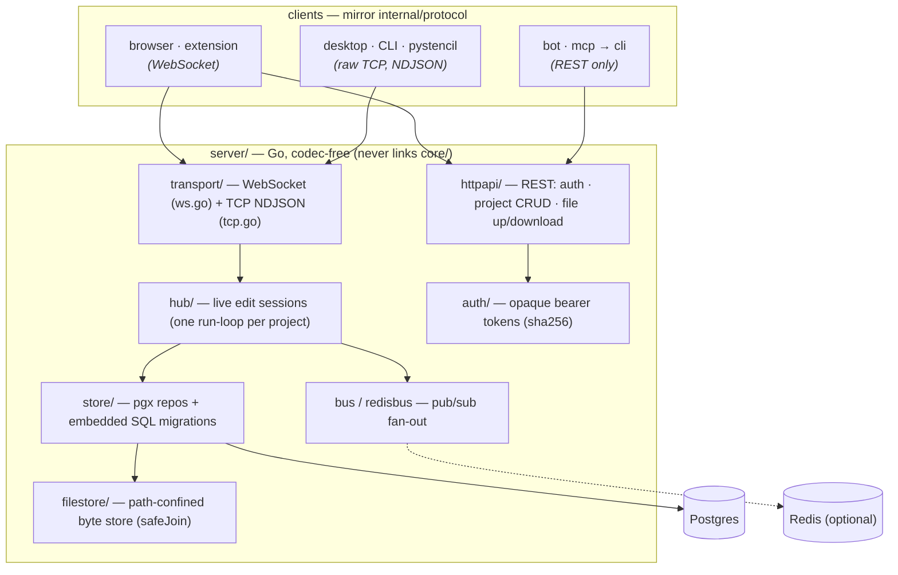

# Stencil collaboration server (`server/`)

A Go server that stores and shares Stencil projects and runs **live, multi-client
edit sessions**. Like `mcp/`, it is a **protocol adapter, not a core consumer**:
it never links or recompiles the C++ `core/`, never decodes images, and keeps the
parity contract out of scope. It persists project metadata in **Postgres** and
image bytes in a **path-confined file store** (traversal-proof, *not* encrypted —
there is no key handling anywhere), and fans live edits out over **WebSocket and
raw TCP** (optionally across instances via **Redis**).

## Architecture


```mermaid
graph TD
    subgraph CLIENTS["clients — mirror internal/protocol"]
      WS["browser · extension<br/><i>(WebSocket)</i>"]
      TCP["desktop · CLI · pystencil<br/><i>(raw TCP, NDJSON)</i>"]
      REST["bot · mcp → cli<br/><i>(REST only)</i>"]
    end
    subgraph SRV["server/ — Go, codec-free (never links core/)"]
      API["httpapi/ — REST: auth · project CRUD · file up/download"]
      TRANS["transport/ — WebSocket (ws.go) + TCP NDJSON (tcp.go)"]
      HUB["hub/ — live edit sessions (one run-loop per project)"]
      AUTH["auth/ — opaque bearer tokens (sha256)"]
      STORE["store/ — pgx repos + embedded SQL migrations"]
      FILES["filestore/ — path-confined byte store (safeJoin)"]
      BUS["bus / redisbus — pub/sub fan-out"]
    end
    PG[("Postgres")]
    RD[("Redis (optional)")]

    WS --> TRANS
    TCP --> TRANS
    WS --> API
    REST --> API
    API --> AUTH
    TRANS --> HUB
    HUB --> STORE
    HUB --> BUS
    STORE --> PG
    STORE --> FILES
    BUS -.-> RD
```

> **Client diagrams:** [browser](../browser/README.md#architecture) · [desktop](../desktop/README.md#architecture) · [bot](../bot/README.md#architecture) — or the whole-system view in the [repository README](../README.md#architecture).

## What it is for

- **Shared projects.** Any client holding a valid token sees the same project
  list and can open any project. Server-stored projects show up in each
  front-end's projects view distinguished with a golden outline.
- **Simultaneous editing.** Multiple browser/desktop/CLI/extension clients can
  edit one project at the same time; edits relay live to peers and durable
  snapshots are committed under a last-writer-wins version guard.
- **Two transports, one session.** Browsers/extension use the native WebSocket
  API; the desktop (Qt `QTcpSocket`) and CLI (Zig `std.net`) use raw TCP with
  newline-delimited JSON — so neither needs a third-party WebSocket library nor a
  hand-rolled RFC 6455 framer. All transports join the **same** edit session.

## Dependencies

Standard library for everything except, by design decision:

| Dependency | Why |
|---|---|
| `github.com/jackc/pgx/v5` | Postgres driver |
| `github.com/redis/go-redis/v9` | Redis pub/sub (cross-instance fan-out) |
| `github.com/coder/websocket` | minimal RFC 6455 server/client (avoids hand-rolling WS) |

HTTP routing, JSON, crypto (tokens, hashing), TLS, and the TCP transport are all
stdlib.

These three modules (and their transitive `// indirect` deps) are **vendored locally**:
run `go mod vendor` once to populate `server/vendor/`, and every `go build`/`go test`
uses that copy automatically instead of the machine-global module cache (`~/go/pkg/mod`).
The folder is git-ignored (node_modules-style) — re-run `go mod vendor` after changing
`go.mod`. `go.sum` is git-ignored too, so `go mod vendor` regenerates it locally. To
prove a build never leaves the vendored copy:

```bash
GOFLAGS=-mod=vendor GOPROXY=off go build ./...   # offline, from server/vendor/
```

## Layout

```
server/
  cmd/stencil-server/main.go     entry: config -> store+migrate -> filestore -> bus -> api+hub -> HTTP/WS + TCP
  internal/
    protocol/   wire DTOs + WS message envelope — the shape every client mirrors
    config/     env/.env configuration
    auth/       opaque bearer tokens (sha256-hashed, resolved by lookup), HTTP + WS gate
    filestore/  path-confined byte store; traversal-proof safeJoin (path.go)
    store/      pgx ProjectRepository + SessionRepository; embedded SQL migrations
    bus/        pub/sub interface + in-process implementation
    redisbus/   Redis implementation of bus.Bus
    transport/  Conn abstraction; WebSocket (ws.go) + TCP NDJSON (tcp.go) adapters
    httpapi/    net/http REST: token issuance, project CRUD, file upload/download
    hub/        live edit sessions: one run-loop per project, edit relay + save
```

## Run

```bash
cp .env.example .env          # set DATABASE_URL at minimum
go run ./cmd/stencil-server
```

Requires a reachable Postgres (`DATABASE_URL`). Redis is optional (`REDIS_URL`);
without it the server uses an in-process bus and is single-instance. The schema
is created at boot via embedded idempotent migrations.

Configuration (see `.env.example`): `LISTEN_ADDR`, `TCP_ADDR`, `DATABASE_URL`,
`REDIS_URL`, `FILESTORE_ROOT`, `ADMIN_TOKEN`, `AUTH_OPEN`, `TOKEN_TTL_HOURS`, `MAX_BODY_BYTES`,
`PROJECT_TTL_HOURS`, `EXPIRY_SWEEP_MINUTES`, `OP_TIMEOUT_SECONDS`, `TRUSTED_PROXY_CIDRS`,
`TLS_CERT`/`TLS_KEY` (one cert/key secures HTTPS+WSS and the TCP edit channel),
and the LLM proxy keys (`ANTHROPIC_API_KEY`, `LLM_*` — see [LLM proxy](#llm-proxy)).

`FILESTORE_ROOT` defaults to the relative `./data/filestore`, which resolves
against the working directory — in a container with no mounted volume the bytes
are lost on restart. The server logs a WARN at boot when the configured root is
relative; set an absolute path in production.

### Project expiration

Each project carries an `expiresAt` (epoch ms; `0`/absent = keep forever). It is
**off by default** — a project gets an expiry only when a client sets one
explicitly (via the editor's `expire` command, sent on create/update), or when the
operator sets `PROJECT_TTL_HOURS` > 0 to stamp `now + TTL` on every new project that
arrives without one. A background sweep runs at startup and every
`EXPIRY_SWEEP_MINUTES` (default 60; `0` disables it): it deletes each project past
its expiry from Postgres, removes its file-store bytes, and broadcasts a
`project-event` (`deleted`) so connected clients drop it live. Postgres is the sole
source of truth; Redis, when present, only relays that notification.

## REST API

All routes except `POST /auth/token` require `Authorization: Bearer <token>`.

| Method | Path | Purpose |
|---|---|---|
| POST | `/auth/token` | issue a token+session (always gated by the admin token — set or per-boot generated) |
| GET | `/projects` | list project metadata (incl. `createdAt`/`expiresAt`), newest-updated first |
| POST | `/projects` | create a project (optional `expiresAt`; else server default / none) |
| GET | `/projects/{id}` | full project incl. layout + original content |
| PUT | `/projects/{id}` | update name/color/`expiresAt`/layout under a version guard (409 on conflict) |
| DELETE | `/projects/{id}` | delete project + its files |
| GET | `/projects/{id}/files/{kind}` | download bytes; kind = `original` \| `result` \| `video` \| `variant1`..`variant8` \| `chat` |
| POST | `/projects/{id}/files/{kind}?ext=&w=&h=` | upload bytes (server is codec-free: dimensions are passed in) |
| DELETE | `/projects/{id}/files/{kind}` | delete one filestore-only kind (`video`/`variantN`/`chat`); idempotent 204 |
| GET | `/llm/info` | LLM proxy status: `{enabled, model}` |
| POST | `/llm/chat` | proxy one chat turn to Anthropic (503 `llmDisabled` without a key; 502 `llmUpstream` with the reason when the upstream fails) |
| GET | `/healthz` | liveness |

The `video`/`variantN`/`chat` file kinds are v1 filestore-only: the bytes upload
and download through the same routes, but no path/dimensions are written to the
project record; they are removed with the project (or individually via the
per-file DELETE). `chat` holds the opt-in persisted-chat JSON document
([`llm-contract/llm-chat.md`](../llm-contract/llm-chat.md) §12) and is served as `application/json`.

## LLM proxy

The server can proxy chat turns to Anthropic on behalf of clients so the API
key never leaves the server (`internal/llm` + `internal/httpapi/llm.go`; the
wire shapes are `LlmChatRequest`/`LlmChatResponse` in `internal/protocol`, per
[`llm-contract/llm-providers.md`](../llm-contract/llm-providers.md) §6.3). It is opt-in via env (the
client-side half — picking `stencil-server` in each front-end — is in the
[root README](../README.md#ai-assistant--setting-up-a-model)):

| Key | Default | Meaning |
|---|---|---|
| `LLM_API_KEY` | *(empty)* | upstream credential, **any** provider. Empty (where one is required) = proxy disabled |
| `ANTHROPIC_API_KEY` | *(empty)* | the older name, honoured **only** when `LLM_PROVIDER=anthropic`; ignored (with a log line) otherwise, so a provider switch can't send it elsewhere. `LLM_API_KEY` wins if both are set |
| `LLM_MODEL` | `claude-opus-5` | default model when a request names none |
| `LLM_BASE_URL` | *(per provider)* | upstream base; defaults Anthropic `https://api.anthropic.com`, Ollama `http://localhost:11434`, OpenAI-compatible `http://localhost:1234/v1` |
| `LLM_MAX_TOKENS` | `32768` | cap; request `maxTokens` is clamped to it (a §2.1 multi-image plan is large) |
| `LLM_TIMEOUT_SECONDS` | `120` | outbound request timeout |
| `LLM_RATE_PER_MINUTE` | `30` | per-session `/llm/chat` turns per minute; 0 = unlimited |
| `LLM_MAX_IN_FLIGHT` | `8` | concurrent upstream calls server-wide; 0 = unlimited |

Both routes sit behind the usual bearer-token auth. Requests are validated
before they leave the server (roles `user`/`assistant`, ≤ 32 messages, ≤ 10
images, media type png/jpeg/webp/gif, base64-decodable image data, ≤ 256 KiB of
text across `system` + all messages, a `[A-Za-z0-9._:-]{1,64}` model name, and
the `MAX_BODY_BYTES` cap). When no key is configured, `GET /llm/info` answers
`{"enabled":false,"model":""}` and `POST /llm/chat` answers
`503 {"code":"llmDisabled"}`. The server never logs the key or image payloads.

**Upstream failures say why** ([`llm-contract/llm-providers.md`](../llm-contract/llm-providers.md) §6.3). When the upstream rejects
or never answers a call, `/llm/chat` returns
`502 {"code":"llmUpstream","message":…}` whose message names the condition the
user can act on — out of credits/billing, key invalid or revoked, model unknown
or inaccessible, the *upstream's* rate limit (distinct from this server's
`429 rateLimited`), upstream timeout, unreachable host — classified in
`internal/llm/upstream.go` from the provider's status plus its own error
`type`/`code`, for all three providers. A recognised condition is said **once**:
the message is that short reason alone — no HTTP status, none of the upstream's
own prose restating it. Anything unclassified falls back to the
upstream's own short text with its status. That text is untrusted: it is stripped
of control characters, has URLs and token-shaped runs redacted, is capped at 200
characters, and is dropped entirely if any fragment of the API key shows up in
it — the `code` always stays the server's. Full detail keeps going to the server
log; a genuinely internal fault still answers the generic
`502 {"code":"internal","message":"LLM request failed"}`.

**Token issuance is always gated** (see [Security](#security)): `POST
/auth/token` requires the admin token, whether operator-set or per-boot
generated. Every session token therefore traces back to someone who held it,
so the proxy enables whenever the provider is configured — no separate
`ADMIN_TOKEN` precondition.

**Spend controls.** A session token lives for `TOKEN_TTL_HOURS` (default a
week) and every accepted turn spends the key above, so authenticated is not the
same as unlimited. Two caps, both on by default, both `0` to opt out:
`LLM_RATE_PER_MINUTE` (per session; a client may burst up to a minute's worth,
then settles to that pace) and `LLM_MAX_IN_FLIGHT` (concurrent upstream calls
server-wide — this also bounds memory, since each call in flight can hold an
8 MiB response plus its images). Over either, `POST /llm/chat` answers
`429 {"code":"rateLimited"}` with `Retry-After`; requests over the in-flight cap
are refused immediately rather than queued, since queueing would hold the client
for the whole upstream timeout and answer late anyway. `GET /llm/info` is not
metered. The counters are **in-process**: a multi-instance deployment limits per
instance, so put a shared limit at the proxy if you run several.

## Live-edit protocol

One JSON `protocol.WSMessage` per WebSocket text frame, or per NDJSON line over
TCP. Connect to `ws://host/ws` (WS) or the TCP port; the **first frame must be a
`hello`** carrying the token, optional `clientId`/`name`, and a `projectId`. An
empty `projectId` selects the global `/events` feed instead of a project session.

Client → server: `hello`, `subscribe`, `edit` (ephemeral op relay), `cursor`,
`presence`, `save` (commit layout, version-guarded), `ping`.
Server → client: `welcome` (snapshot: project, layout, version, peers),
`peer-join`/`peer-leave`, `edit` (relayed), `synced` (commit ack/version),
`project-event` (global feed), `error`, `pong`.

Edits are relayed live without persistence; `save` writes the full layout to
Postgres under the version guard and broadcasts the new authoritative version.
This separates low-latency live relay from durable last-writer-wins snapshots.
Because live edits are never persisted, a shutdown loses everything since the
last `save` — so before closing sessions the server sends every connection an
`error` frame with code `shuttingDown`, and clients can prompt to save/reconnect.

## Security

- Tokens are 256-bit random values; only their SHA-256 hash is stored, compared
  in constant time, and checked for expiry. `POST /auth/token` is gated
  by the admin token: `ADMIN_TOKEN` when set, otherwise a random per-boot token
  the server generates and prints once at startup. Issuance is never open by
  default.
- **Open issuance (`AUTH_OPEN=1`)** is an explicit opt-in for trusted networks:
  `POST /auth/token` then mints a token with no bearer at all (the admin token
  keeps working), and the server prints a loud boot warning. Because a token
  grants the entire shared workspace (see below), anyone who can reach the
  server gets full access — projects, chat transcripts, and the LLM proxy.
  `AUTH_RATE_PER_MINUTE` still applies per client IP; everything other than
  issuance stays token-gated exactly as before.
- WebSocket/TCP connections must authenticate with a `hello` token before joining
  any session; unauthenticated connections are closed. FAILED hellos are metered
  per client IP (`HELLO_RATE_PER_MINUTE`, default 30; `0` disables) — the socket
  accepts any origin by design, so without that meter a page could try tokens at
  line rate. A valid token spends nothing, and an exhausted bucket is refused
  before the token is even looked up.
- **Authorization is coarse by design: a valid token grants access to _every_
  project.** This is the intended shared-collaboration model — there is no
  per-project ownership check, so any client holding any valid token can
  read/write/delete any project (REST) and join/edit/save any session (WS/TCP).
  Treat a token as full access to the whole server, and issue tokens only to
  clients you trust with all projects. **This now covers conversations too**: the
  `chat` file kind stores a project's assistant transcript
  ([`llm-contract/llm-chat.md`](../llm-contract/llm-chat.md) §12), so any token holder can
  read or delete anyone's. Chat persistence is opt-in and ships off in every
  client; leave it off if that is not what you want. The workspace model is
  **deliberately shared**: per-project ACLs are out of scope by design.
- **Production hardening.** The defaults fail closed: issuance always requires
  the (set or generated) admin token, and `CORS_ORIGINS` defaults to loopback
  origins only — `*` reflects any origin but must be asked for explicitly. For
  anything beyond localhost/dev, **set `ADMIN_TOKEN`** to a stable secret
  (a generated one changes every boot) and **set `CORS_ORIGINS`** to an explicit
  allowlist of your front-end origins.
- The file store never touches a client-supplied filename: paths are derived from
  a validated project-id allowlist plus a fixed `original`/`result` kind, run
  through `safeJoin` (clean + root-prefix re-check + symlink-escape guard), and
  written atomically. Traversal attempts are rejected and tested. It is
  **path-confined, not encrypted**: bytes land on disk as uploaded, so the
  guarantee is "no path escapes the root", not "at rest protection".
- REST bodies are size-capped and decoded with unknown-field rejection.
- Transport encryption is opt-in via `TLS_CERT`/`TLS_KEY`: one cert/key secures
  HTTPS + WSS *and* the raw-TCP edit channel (TLS 1.2 minimum). Tokens travel as
  bearer headers, so enable TLS (or front the server with a TLS-terminating proxy)
  on any untrusted network; plaintext is intended only for localhost/dev.
- **Behind a proxy, set `TRUSTED_PROXY_CIDRS`** (comma-separated networks or bare
  addresses). Every per-IP limiter keys on the peer address, which behind a
  TLS-terminating proxy is the proxy itself — one bucket for the whole internet.
  With it, the client is taken from `X-Forwarded-For` (rightmost hop the trusted
  chain vouched for). Empty (the default) ignores that header entirely, so a
  spoofed one from an untrusted peer changes nothing.
- Every REST handler runs its store calls under `OP_TIMEOUT_SECONDS` (default 10),
  so one stuck query cannot hold a pool connection for the server's whole
  5-minute write timeout.

## Tests

```bash
go test ./...            # unit tests (filestore, auth, bus, httpapi, hub) run offline
go test -race ./internal/hub/...
```

Integration tests in `store/` and `redisbus/` **self-skip** when `TEST_DATABASE_URL` /
`REDIS_URL` are unset or unreachable (mirroring `mcp/`'s gated e2e tests). The store
tests read `TEST_DATABASE_URL`, never `DATABASE_URL`: their setup **truncates** the
named database, and `DATABASE_URL` points at the live server's. To run them locally,
point them at a throwaway database:

```bash
export TEST_DATABASE_URL='postgres://...stencil_test?sslmode=disable'
export REDIS_URL='redis://localhost:6379/15'
go test ./...
```
