# Telegram bot — use cases

Editing from a chat. Run the bot from [`bot/README.md`](../../bot/README.md); the images
here are captured from Telegram Web by [`usecases/capture/`](../capture/README.md), never
hand-edited.

## Say hello

`/start` answers with the main menu: the assistant chat, help, status, image sources and a
blank page.

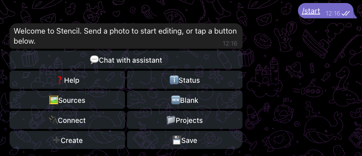

## Send a photo

Any photo, image file or image link becomes the working image. The reply carries the edit
keyboard: edit, filter, draw, undo/redo, chat, download, reset, save, rename, describe.

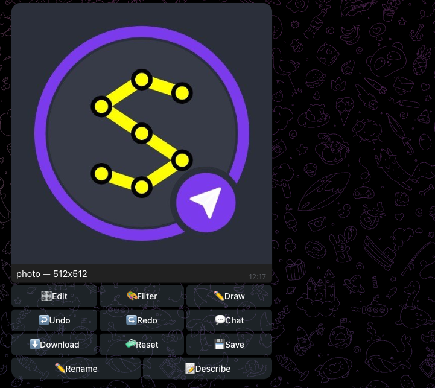

## The reply buttons

Every reply carries a keyboard. **Edit** opens rotate and crop, **Draw** the drawing
tools, **Download** the image, project or layout JSON; **« Back** returns to the main
keyboard.

| Edit | Draw | Download |
|---|---|---|
| 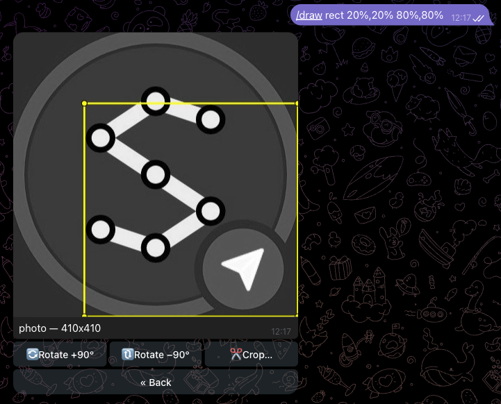 |  | 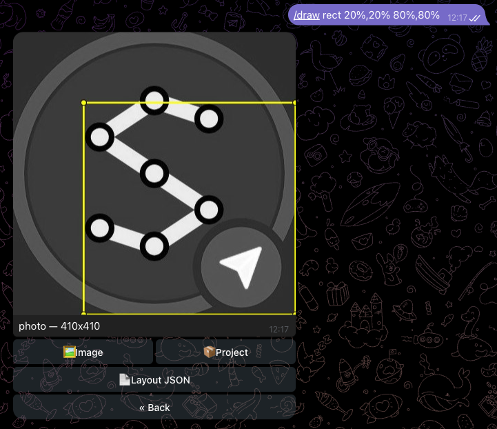 |

## Crop, filter, draw

Commands take the same arguments as the CLI flags; the buttons open the same submenus.

| `/crop x1=10% x2=90% y1=10% y2=90%` | Filter menu ▸ B&W |
|---|---|
| 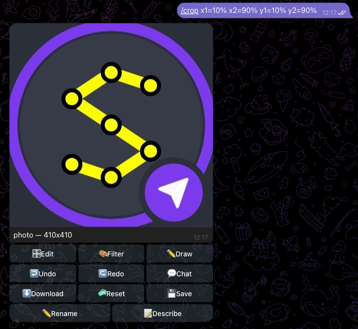 | 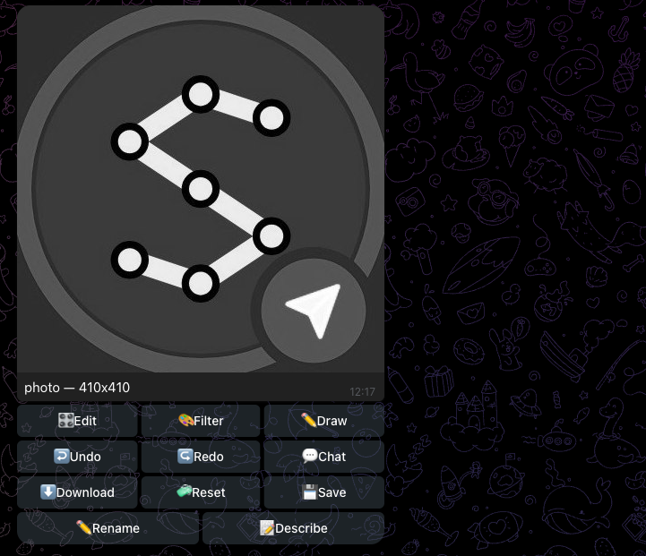 |

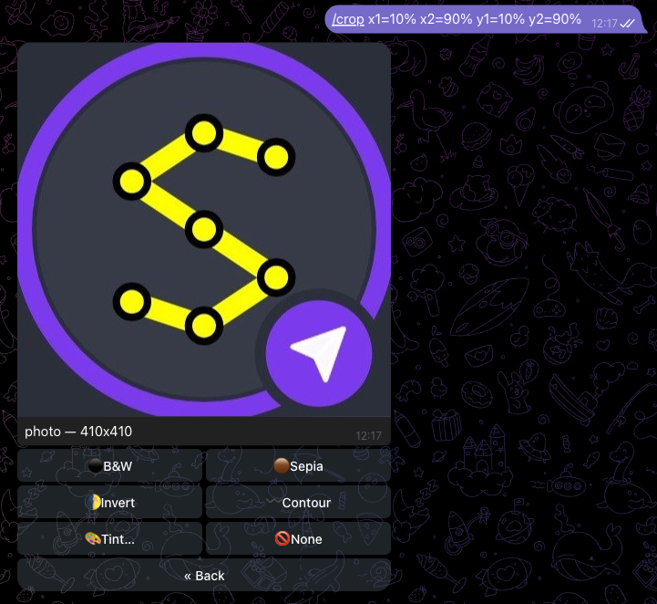

`/draw rect 20%,20% 80%,80%` draws a rectangle; `line` and `poly` take more points.

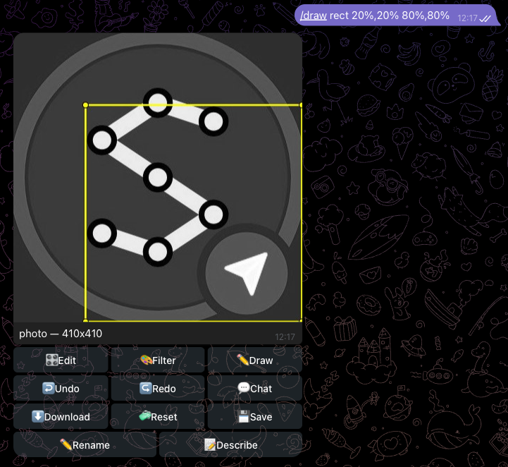

## Ask the assistant

`/prompt <text>` hands the working image and your words to the model the bot is configured
with; the plan runs and the result comes back as a photo. `/chat` keeps the conversation
open for plain messages.

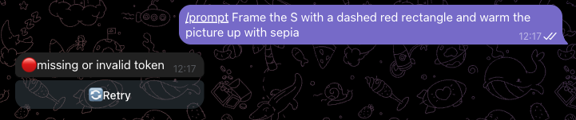

**Chat** (or `/chat`) turns chat mode on: from then on a plain message is a prompt and the
assistant answers, editing the image, until **Chat off**.

| Chat mode on | A plain message edits the image |
|---|---|
| 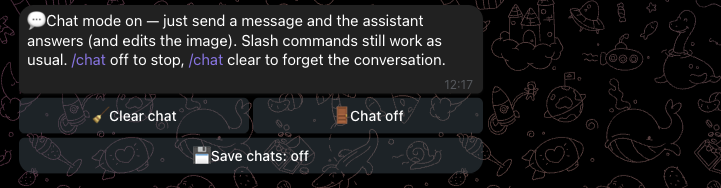 | 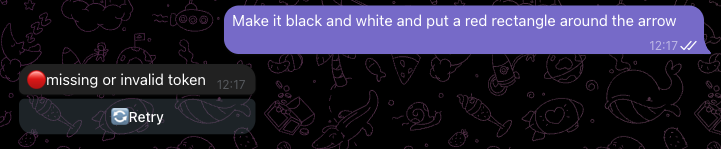 |

## Run a script

`/script @crop 10% ; @filter sepia ; @line (0,0) (100%,100%)` runs `.stc` statements on the
image; a `.stc` document does the same when it arrives.

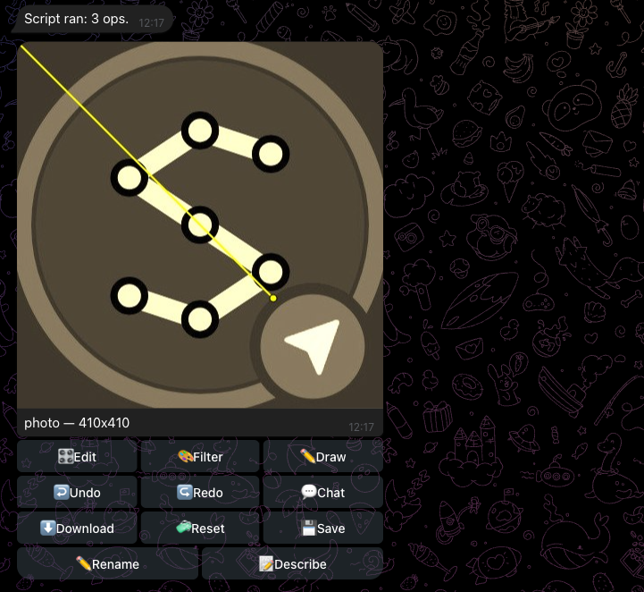

## Status and a blank page

`/status` shows the working image and pending edits; `/blank b5 black` starts a page.

| `/status` | `/blank b5 black` |
|---|---|
| 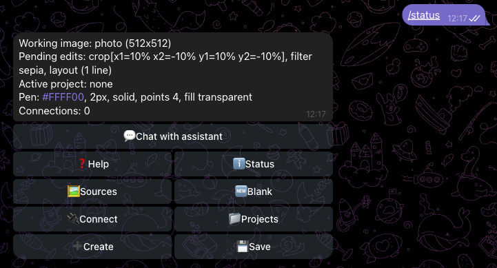 | 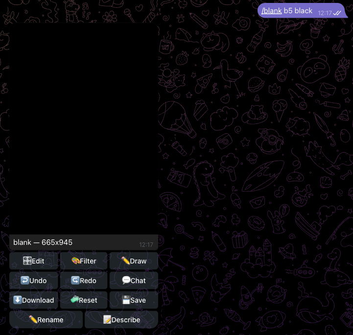 |

## Every command

`/help` lists the commands by group.

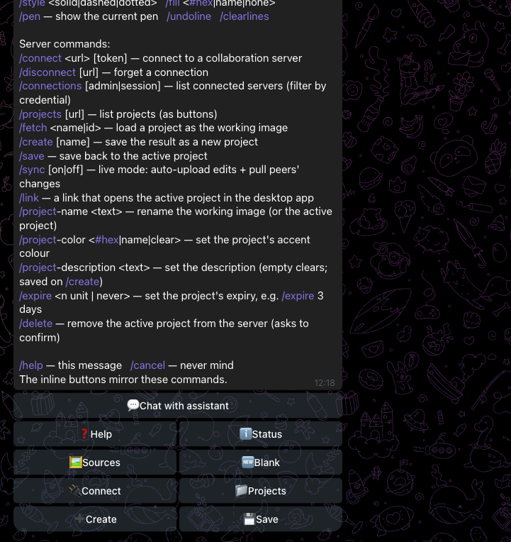
