# Chrome extension — use cases

The image picker on a real page. Install it from
[`browser-extension/README.md`](../../browser-extension/README.md); the images here are
generated by [`usecases/capture/`](../capture/README.md) against a small demo site built
from the repository's own pictures, never hand-edited.

## A page with pictures

Any page: `` elements, CSS backgrounds, video posters, icons and meta images all count.

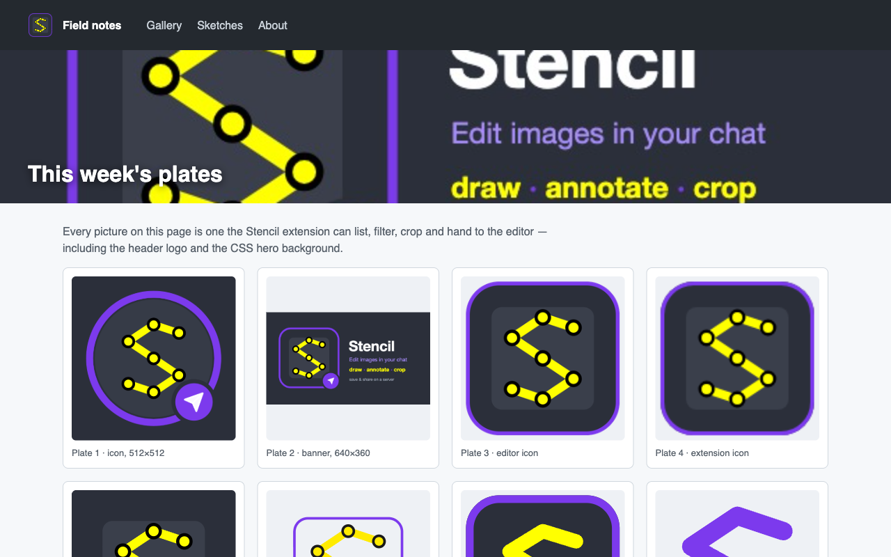

## List every image on the page

Click the toolbar icon. The popup scans the active tab and lists what it found with name,
kind, format and size; the accordion above filters by element type, format and pixel size,
and the search box narrows by name or URL. The moon/sun button flips the popup's theme.

| Light | Dark |
|---|---|
| 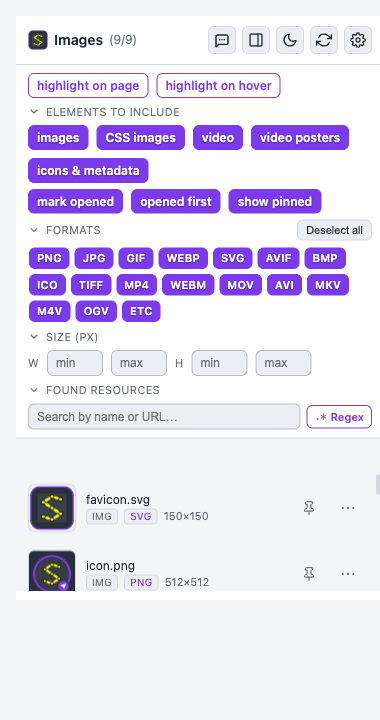 | 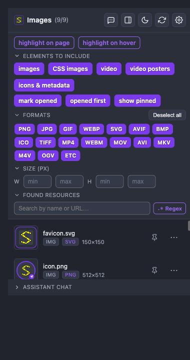 |

## See which element is which

**highlight on page** outlines every grabbable element right on the page; **highlight on
hover** lights the one under the pointer as you move over the rows.

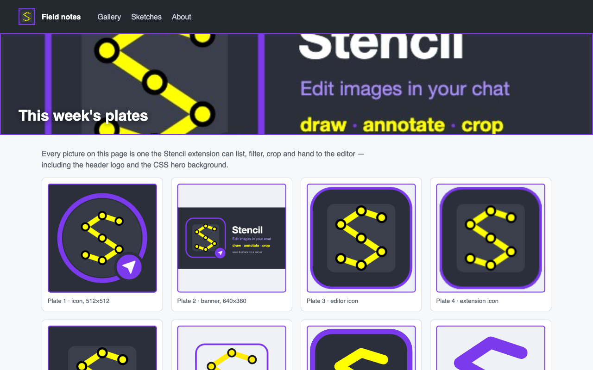

## Open an image in the editor

The **⋯** menu of a row opens the image **here** (an editor over the page), **in the editor**
tab, in an incognito editor, or hands it to the desktop app. Click a row to open, double-click
to open in a new tab.

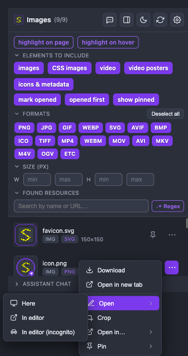

Opening it *here* lays the full editor over the page you are on:

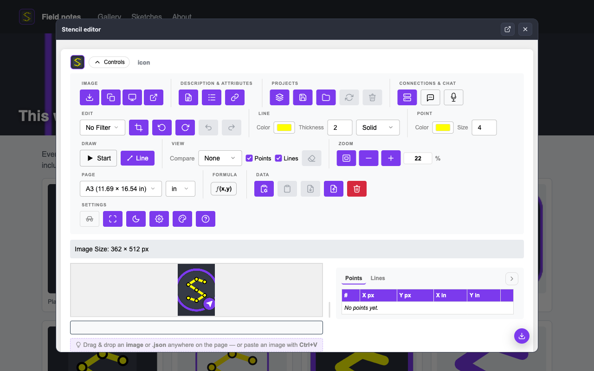

*In editor* opens a new tab of the editor with the image; the incognito variant opens one
that saves nothing.

| In editor | In editor (incognito) |
|---|---|
| 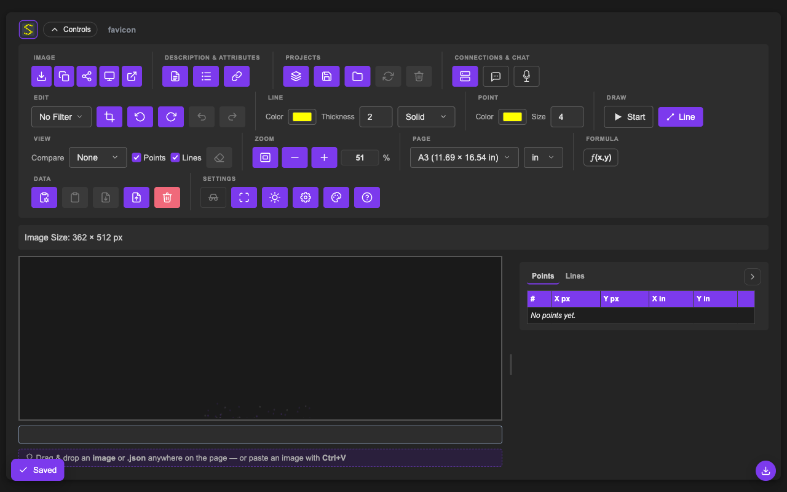 | 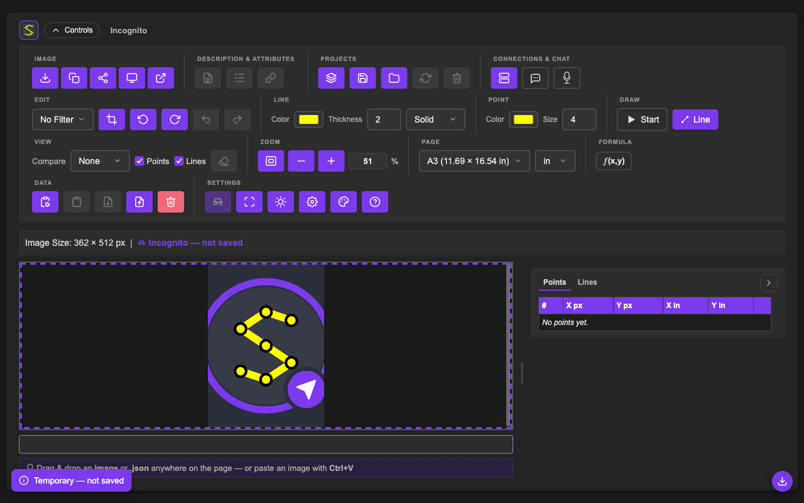 |

**Pin** keeps an image on the list across pages, locally or on a connected server; the
options page lists every pin.

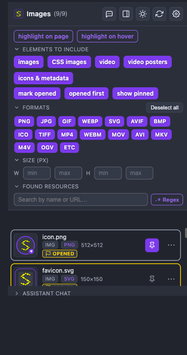

## Quick crop before editing

**Crop** frames the image in a page-shaped box first; keep the original with the crop
applied, or cut the cropped part out, then open it in the editor.

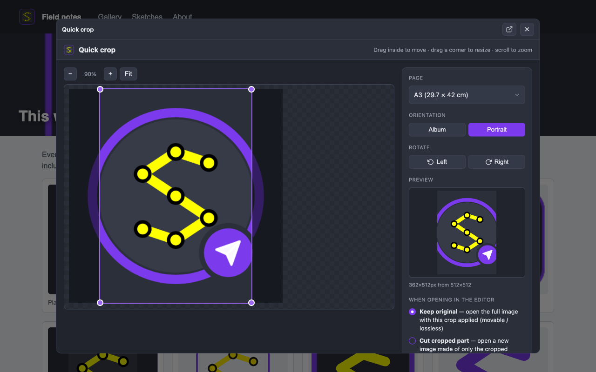

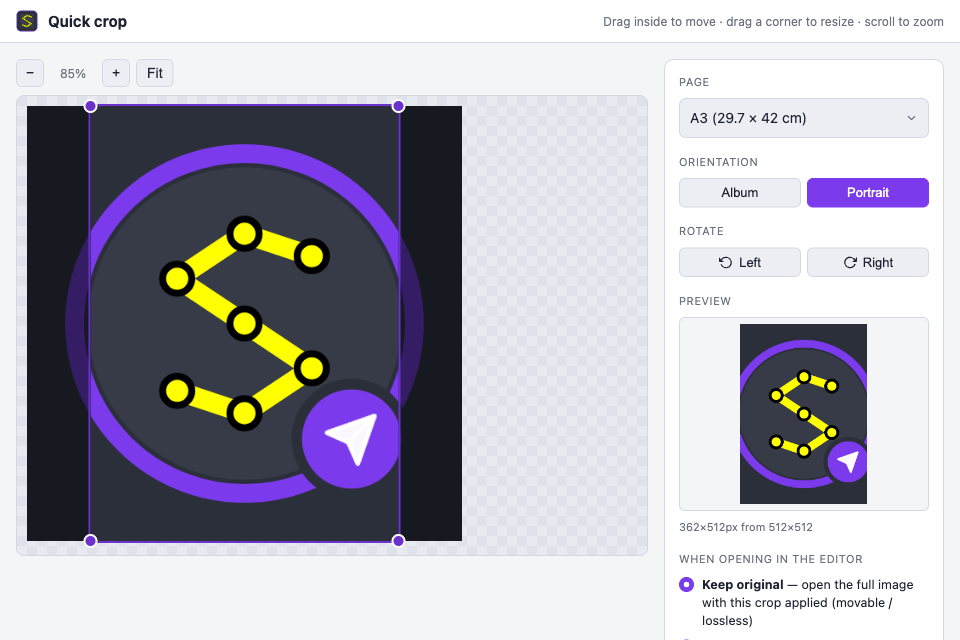

## Keep it docked

The **⇥** button moves the same list into Chrome's side panel, where it rescans as you
switch tabs.

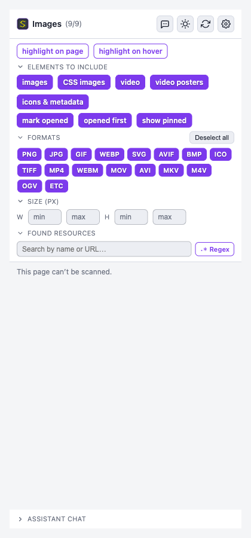

## Ask the assistant

The **Assistant chat** section at the bottom talks to the model you configured: it can
describe what is on the page, focus a picture, or open one in the editor. Here a real model,
through a collaboration server's proxy, reads the page's images off the scan.

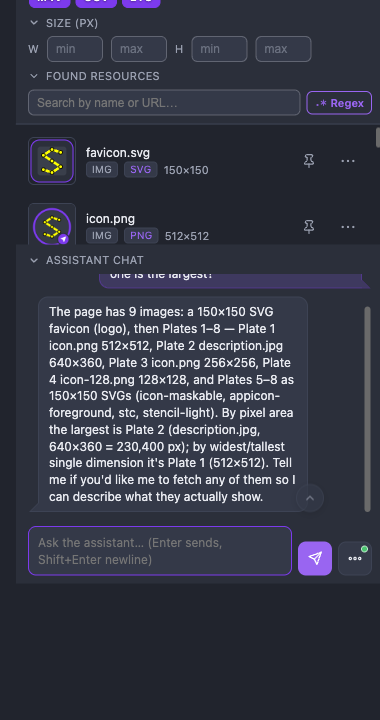

## Options

Editor URL, page size, appearance and motion, server connections, the assistant's provider,
and the pinned images all live on the options page.

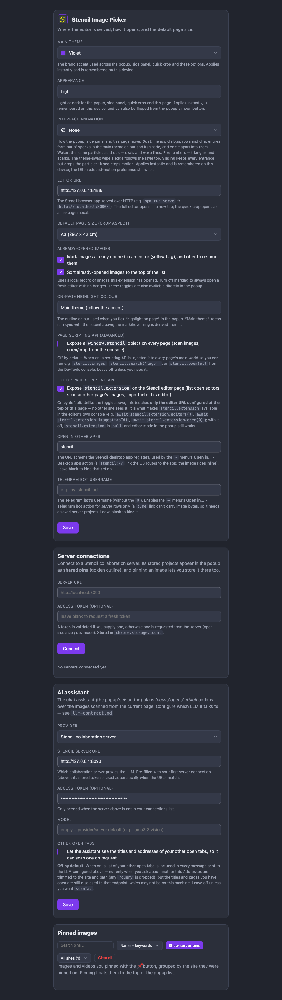
