# CLI — use cases

The Zig command-line tool, one-shot and interactive. Build it from
[`cli/README.md`](../../cli/README.md); the images here are generated by
[`usecases/capture/`](../capture/README.md) — the console photographed in a real terminal,
the listings rendered from the CLI's own pinned output — never hand-edited.

## One-shot edits

`stencil --help` prints the whole flag set: a source (a file, a URL, a video frame or a
blank page), the edits (crop, rotate, filter, layout, script), and the output path.

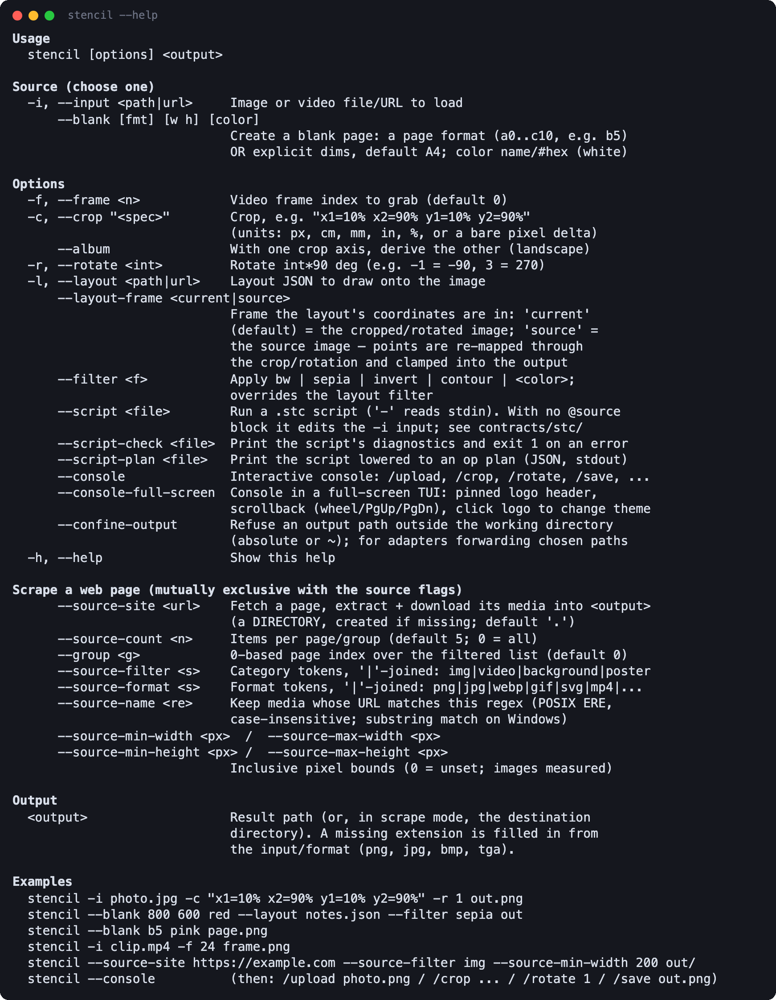

## The full-screen console

`stencil --console-full-screen` opens a TUI with a pinned logo header, a scrollback and a
prompt; the plain `--console` is the same conversation without the screen. Shown here in
VS Code's integrated terminal.

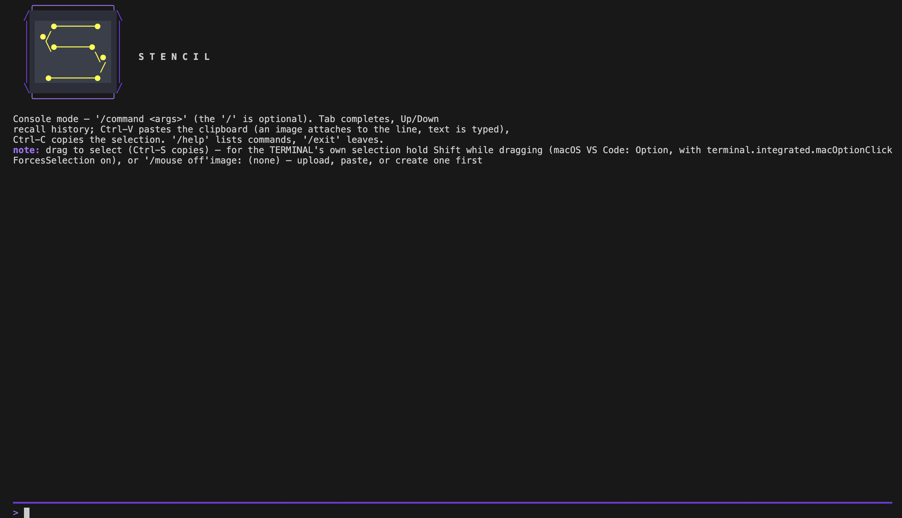

## Load an image from a link

`/upload <path|url>` loads an image or a video frame; `/status` describes what is loaded.

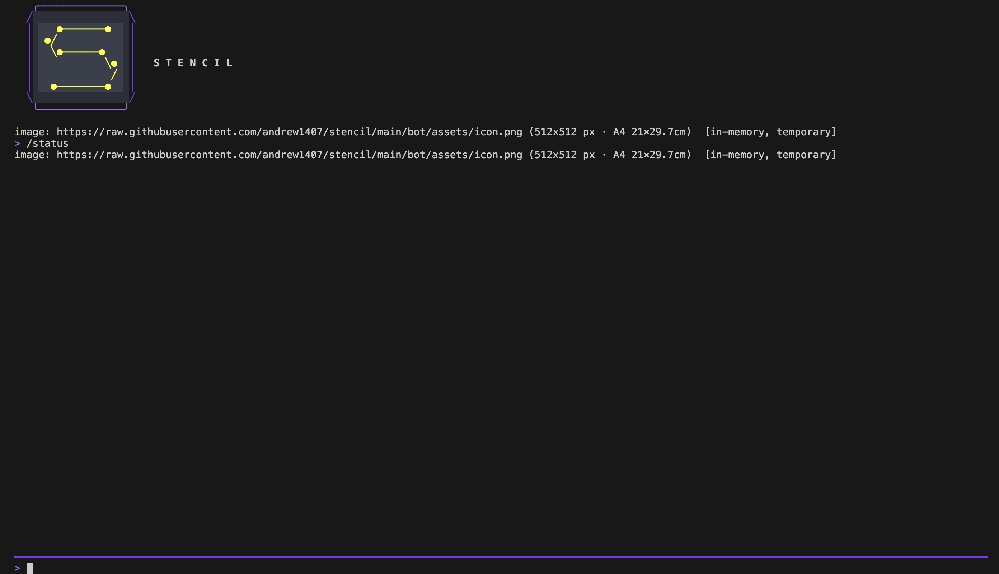

## Edit step by step

`/crop`, `/rotate`, `/filter` and friends take the same arguments as the flags; every step
reports the new size and its place in the edit history, `/undo` steps back, and `/save`
writes the result.

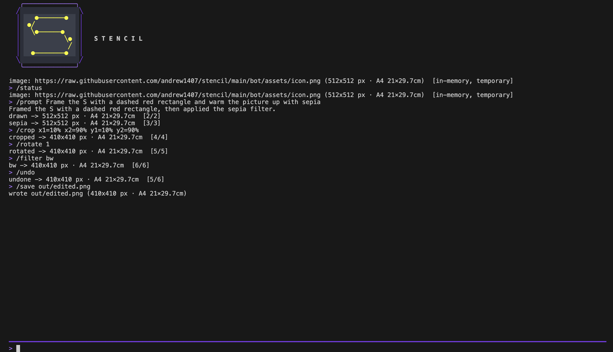

## Start from a blank page and run a script

`/blank a5 black` makes a page; `/script` runs `.stc` statements on it, `;`-separated,
and `/undo` walks them back one at a time.

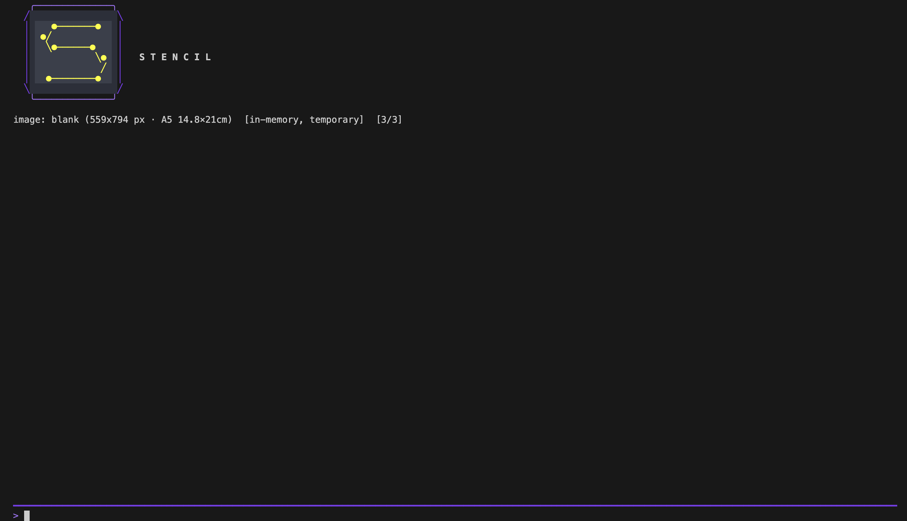

## Ask the assistant

With `STENCIL_LLM_*` pointing at a model (here a collaboration server's proxy), `/prompt`
describes an edit in words; the plan runs on the working image step by step.

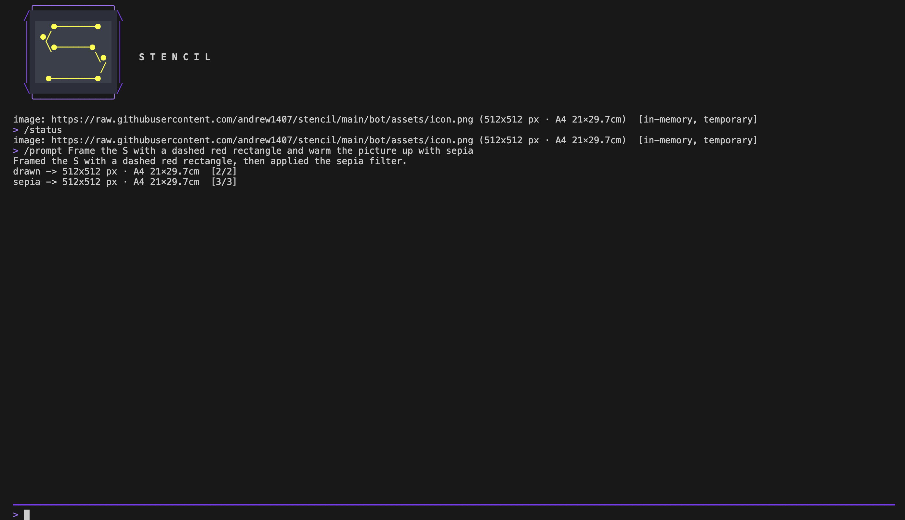

## Every command

`/help` lists the commands, grouped: image, edit, save, connections, assistant, system.

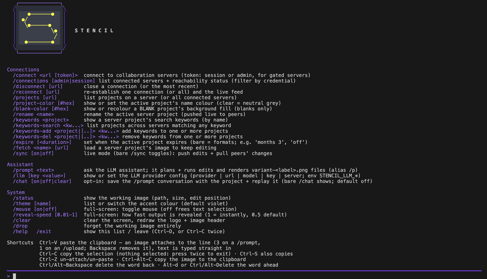

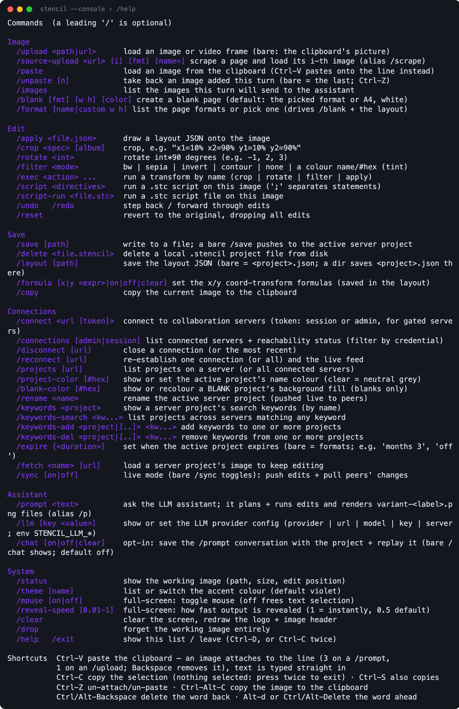

Page formats and accent themes have listings of their own:

| /format | /theme |
|---|---|
| 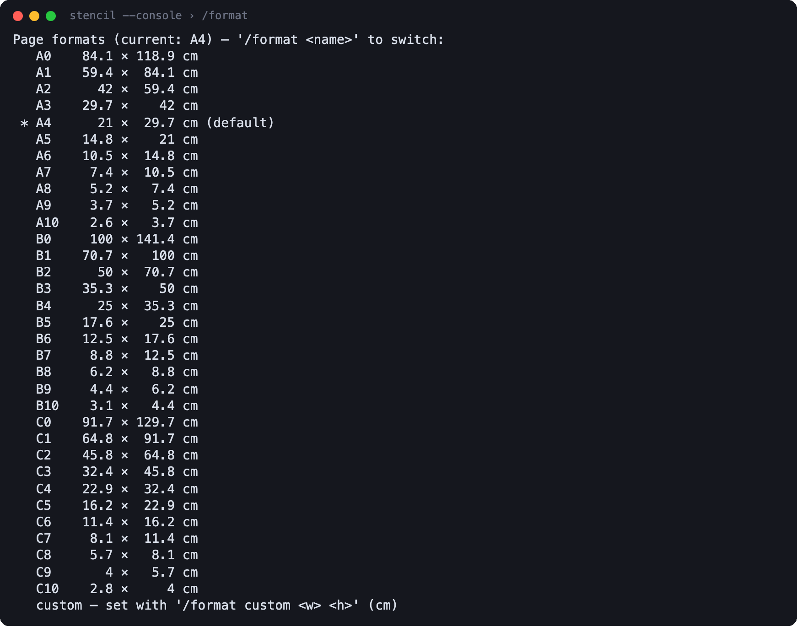 | 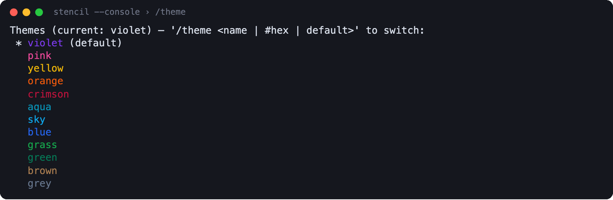 |

## Projects

`/projects` lists what is saved, locally and on connected servers.

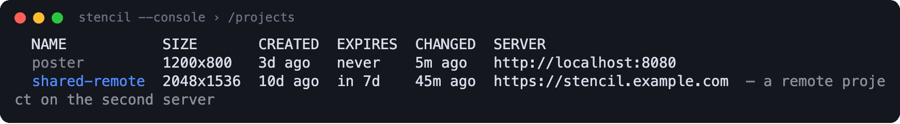

## Change the accent

Click the logo to cycle the accent colour; the recolour sweeps across the screen.

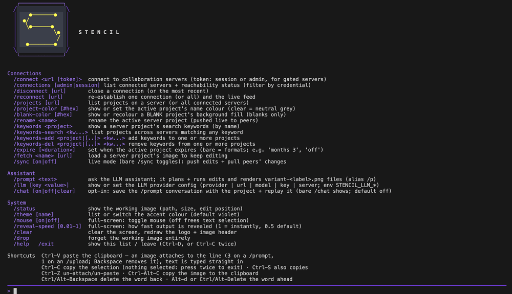

Output reveals line by line; `/reveal-speed` sets the pace.

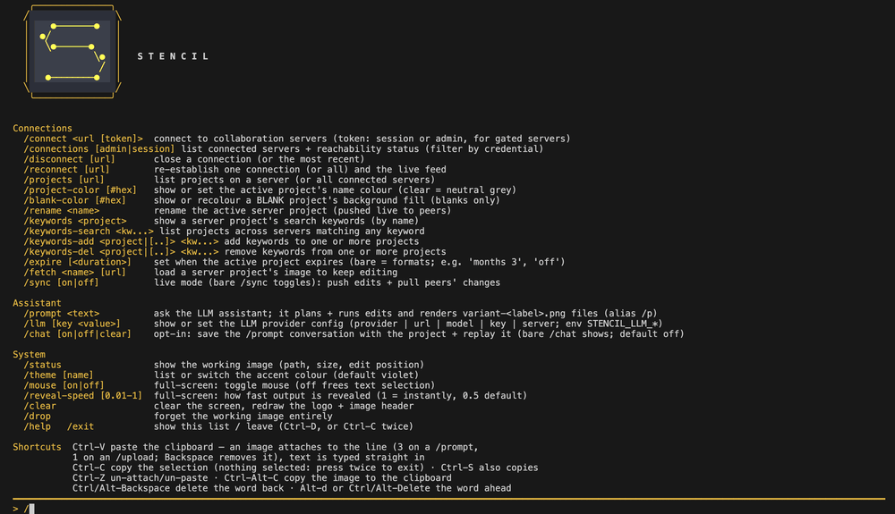
