# VS Code extension — use cases

Editing `.stc` scripts and `.stcjs` files in VS Code, and running them — through the CLI, or
in the browser app. Install it from
[`vscode-extension/README.md`](../../../vscode-extension/README.md); the images here are
generated by [`usecases/capture-runner/`](../../capture-runner/README.md), never hand-edited.

## Open a script

Every file type is marked in the explorer: a script, its JavaScript flavour, and a saved
project.

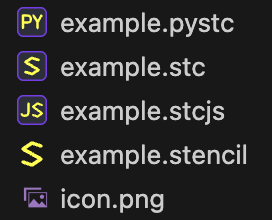

A `.stc` file's every word is coloured by the statement it sits in: directives, lengths and
units, colour names with a swatch, filter modes, stroke styles.

| Light | Dark |
|---|---|
| 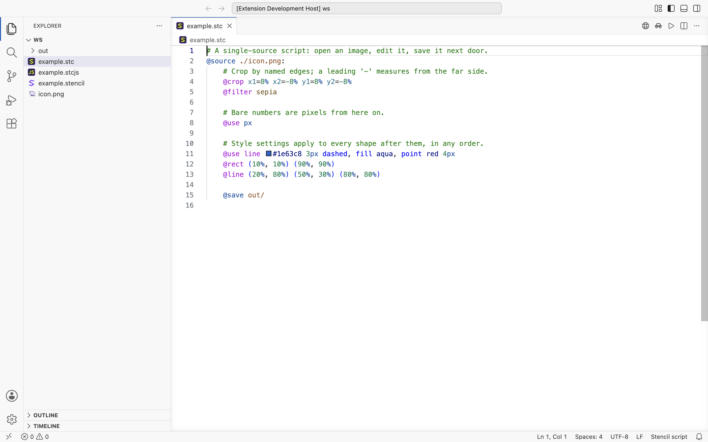 | 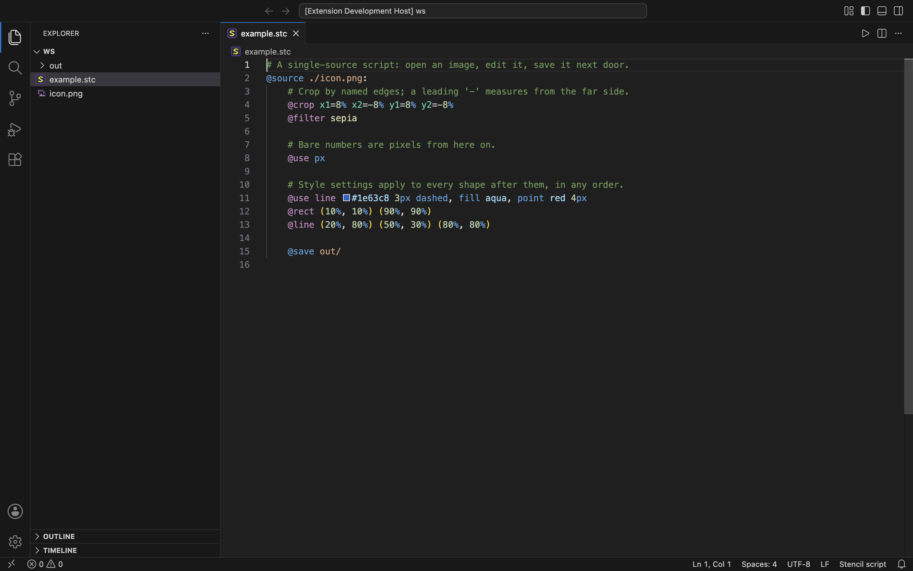 |

## Complete as you type

Type `@` for the directives; inside a statement the suggestions are what is legal there:
filter modes, stroke styles, crop edges, colour names, the templates the file defines, and
units as whole replacements of the length being typed.

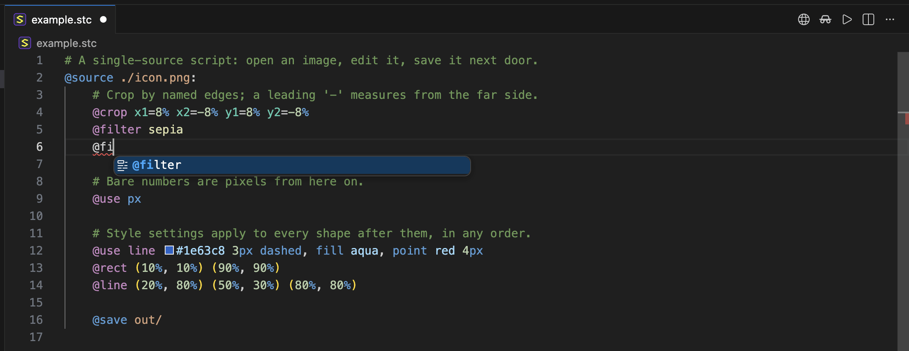

The list narrows as you type, Enter accepts, and the next statement offers its own words —
here a filter mode and a colour, each with its swatch.

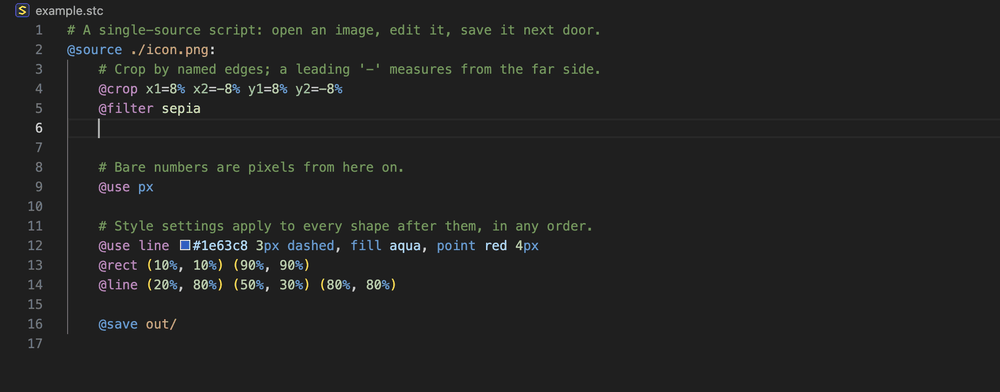

## Look a word up

Hover a directive or keyword for its meaning, argument grammar and an example.

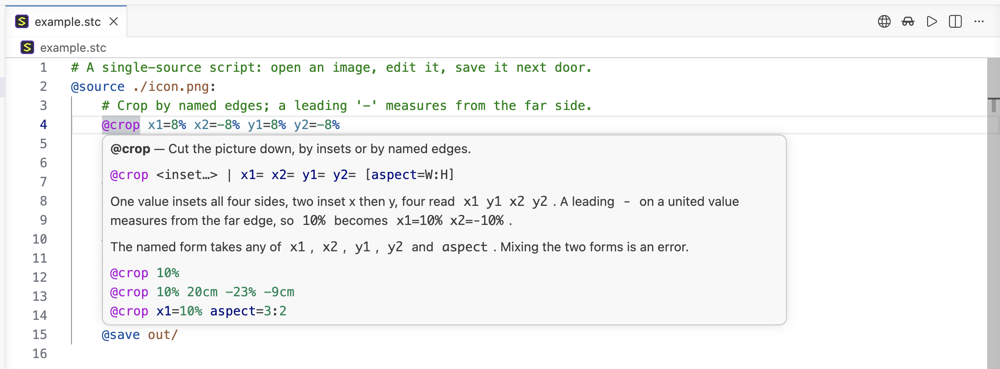

## See errors as you write

A mistake is underlined while typing and listed in the Problems panel with its code; a
saved file is checked by the same compiled engine that runs it. A script with any error
runs nothing.

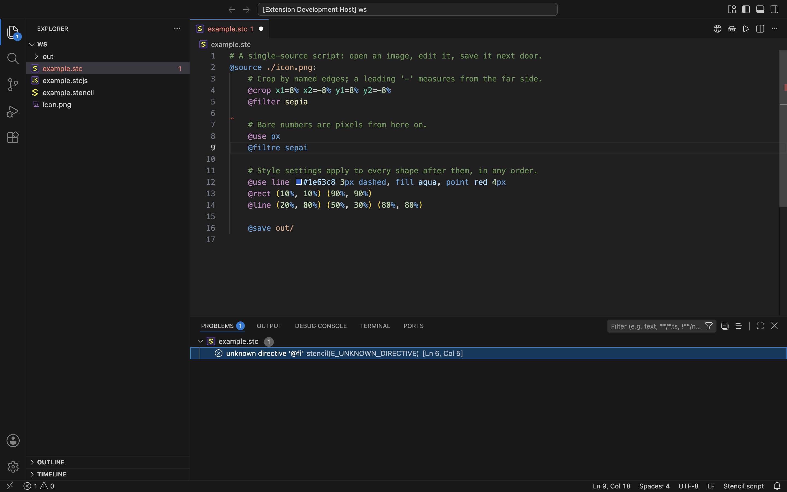

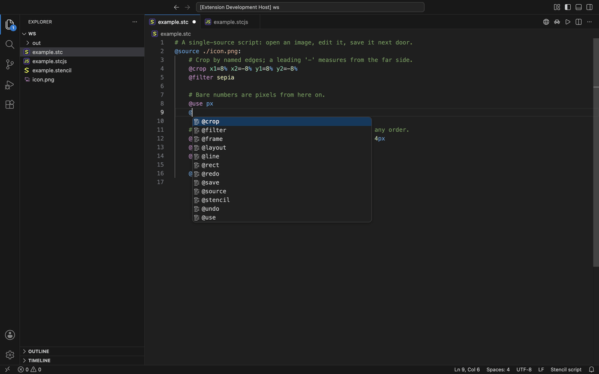

## Run it

**Stencil: Run script** (the ▶ button, `Cmd+Alt+R` / `Ctrl+Alt+R`) saves the file and runs
it through the CLI in a terminal named *Stencil*, from the script's own folder so relative
sources resolve.

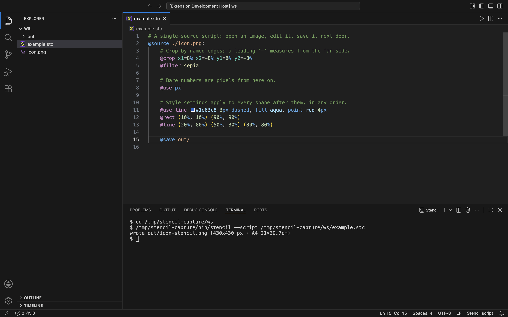

## Send it to the browser

**Stencil: Open in Stencil Web** hands the open script — or a `.stencil` project — to the
browser app, which runs it on the picture and keeps the source in its script window. The
whole hand-off rides in the URL fragment, so nothing about it reaches a server. Its incognito
twin sends the same thing into a session the app keeps nothing from.

A script that names no `@source` acts on whatever is open, so the command asks for a picture to
send along with it. In the browser the script has no filesystem to read either: a `@source`
there must be an `http(s)` URL, and the app says so itself, on the line it happened.

## Drive the browser console

**Stencil: Run in Stencil Web Console** (`Cmd+Alt+W` / `Ctrl+Alt+W`, and the ▷ button a
`.stcjs` carries) opens the app under VS Code's own JavaScript debugger and runs in the page itself, so the same file can be run again
and again against what is on screen. Its two siblings run just the selection — or one
expression you type — and open an image by URL or from disk. Answers land in the **Stencil**
output channel.

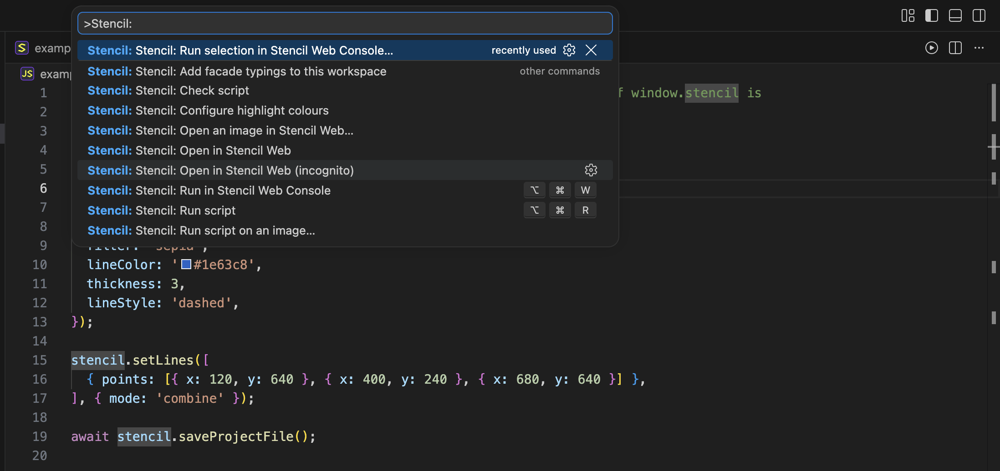

## Write a `.stcjs`

A `.stcjs` is JavaScript against the app's own `window.stencil` API. Every member is offered
after `stencil.`, with what it does beside it.

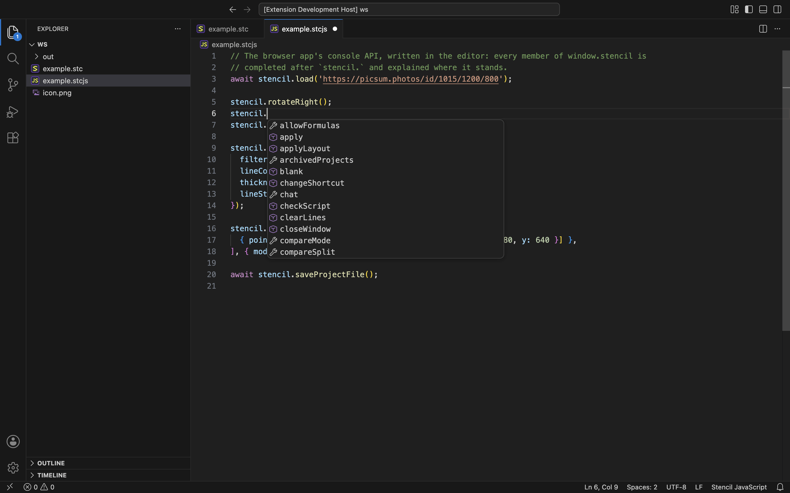

The list narrows as you type, Enter accepts, and the next call offers its own members.

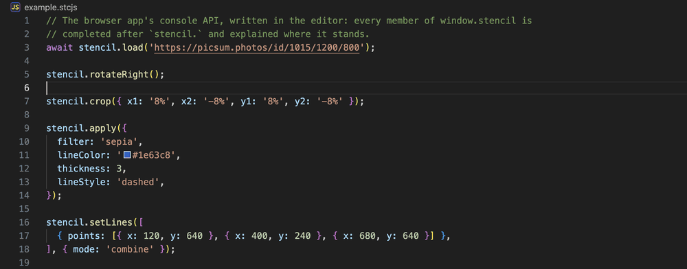

Hover any member for its signature and what it does — and `stencil` itself for what the
facade is, which the editor's own JavaScript service can only call `any`.

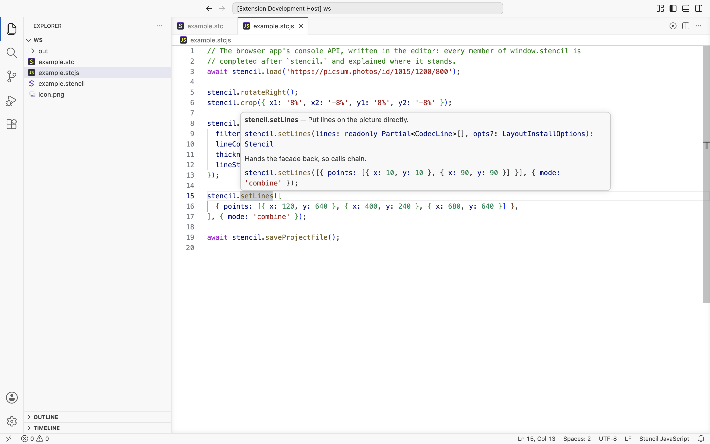

A plain `.js` joins in as soon as it says `// @use stencil` on a comment line of its own —
anywhere in the file, first line or last. The marker is coloured where it stands, so it reads as
the declaration it is, and hovering it explains itself; the same words with code in front of
them are not the marker, and say so instead. A `.stcjs` runs through the
console command — it is JavaScript, and the app itself never evaluates code.

In a `.js` the editor has its own opinion about a global nothing declares, and says `any`
under the explanation. **Stencil: Add facade typings to this workspace** settles it: the types
land beside your code, the editor types `stencil` itself, and one tooltip carries the type,
the prose, the example and a link back to these docs.
