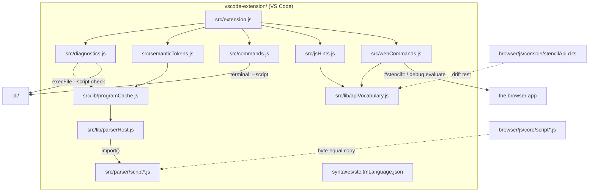
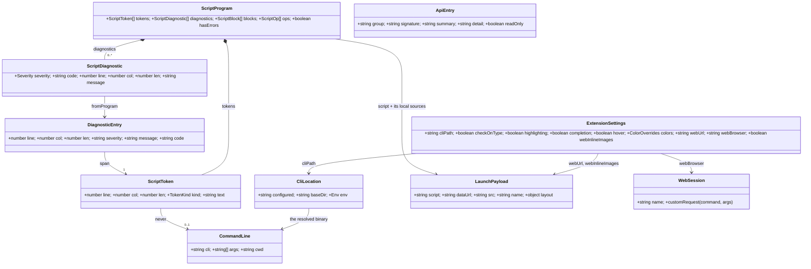

# VS Code extension architecture

The system-wide design — the parity contract, canonical data, the layer model, the pattern vocabulary — is in the root [`ARCHITECTURE.md`](../ARCHITECTURE.md).

An editor adapter for two file types. It gives `.stc` scripts colour, squiggles, completions,
hovers and a Run button, and every one of those answers comes from Stencil itself: the parser copies in
`src/parser/` while you type, the `stencil` CLI on save and on Run. `.stcjs` is the JavaScript
flavour — a file that drives the browser app's `window.stencil` facade — and gets the same
treatment for the facade that `.stc` gets for the language, from a vocabulary held to
`browser/js/console/stencilApi.d.ts`. `.stencil` projects are contributed too, but as data
only — an icon and a grammar that defers to `source.json` — because a saved project is JSON
this tree has no reason to interpret. A script can also be run **in the browser app** rather
than through the CLI, by hand-off or in the page's own console. It owns no language
rules of its own — the language lives in [`contracts/stc/`](../contracts/stc/), is
implemented in `core/script/`, and reaches this tree as copied JavaScript and as a spawned
binary.

## Layers

`src/config/` (data only) + `src/parser/` → `src/lib/` → `src/*.js` → `src/extension.js`.
A layer may use everything to its left and nothing to its right. `src/parser/` is copied
code and imports nothing but itself and the one colour table beside it; `src/lib/` is the
`vscode`-free bottom of this tree's own code, so it is testable without the editor;
`src/*.js` are the three features, each registering itself; `src/extension.js` is wiring and
the only root file that may import a sibling root file. Enforced by
`tests/layerBoundary.test.js` over every relative `import` and `require` in `src/`.

## Where things go

| Path | Holds | Rule |
|---|---|---|
| `package.json` | the manifest VS Code reads: the two languages and their icons, grammars, commands, settings, menu, keybinding, gallery logo | no root `type` field — the extension is CommonJS; `@vscode/vsce` is the one dependency and it is a devDependency (`tests/manifest.test.js`) |
| `language-configuration.json` | `#` line comments, the `()` and `"` pairs, the `@name` word pattern, indent after a `…:` header | its regexes are JS, not Oniguruma — `tests/grammar.test.js` compiles them |
| `syntaxes/stc.tmLanguage.json` | the TextMate grammar under scope `source.stc` | every scope name ends `.stc`; the directive list is pinned to the parser's `DIRECTIVES` |
| `language-configuration.stcjs.json` + `syntaxes/stcjs.tmLanguage.json` | the `.stcjs` flavour: JavaScript's own comments, pairs and indent rules, and a grammar whose whole body is `include: source.js` | it defers, never re-spells JavaScript; the editor's own JS service owns the language, this tree adds only the facade's words |
| `syntaxes/stencilMarker.tmLanguage.json` | the one rule that lights `// @use stencil` up inside a JavaScript line comment | an INJECTION (`injectTo: source.js`, `source.stcjs`), so it adds a scope and re-spells nothing; both halves take ONE scope a theme already knows, so the marker reads as a single declaration |
| `language-configuration.project.json` + `syntaxes/stencilProject.tmLanguage.json` | the `.stencil` project file: brackets, and a grammar whose whole body is `include: source.json` | it defers, never re-spells JSON; contributing it must not add an `activationEvents` entry (`tests/manifest.test.js`) |
| `icons/` | `stencil.svg` (the app mark, the logo's source), `stc.svg` (the mark as a panelled badge, the script's explorer glyph), `stcjs.svg` (the same badge, its S paired with a J) and the light/dark bare-stroke pair for a project | `stencil.svg` is a copy of `browser/favicon.svg`, pinned by `browser/tests/svgArt.test.js`; the glyphs are this surface's own art. `stc.svg` carries its own panel, so one file serves both themes; the bare stroke does not, so it is a pair |
| `icon.png` | the extension-page logo, rasterized from `icons/stencil.svg` | PNG, ≥128px — VS Code refuses an SVG here |
| `src/extension.js` | `activate` / `deactivate` | wiring only; every disposable goes on the context |
| `src/diagnostics.js` | the two diagnostic sources, the debounce and the version guard | the CLI answers for a saved file, the parser copies for a buffer; both become `vscode.Diagnostic` |
| `src/semanticTokens.js` | the legend and the provider | standard VS Code token types only, so any theme colours it; WHICH type a token gets is `lib/tokenClassify.js` |
| — | each of the three providers reads its own `stencil.*` toggle per request | a toggle must not need a reload, so nothing is decided at `register` time; colouring, recolouring and the icon themes stay VS Code's own settings |
| `src/completion.js` | the suggestion items, one builder per group | it offers words, never a filename — a path is the user's to type |
| `src/hover.js` | the Markdown for the token under the caret | the token comes from the same parse the colours do, so a hover cannot land where no colour did |
| `src/decorations.js` | one `TextEditorDecorationType` per family the extension or `stencil.colors` colours, painted over the themed tokens | a theme decides what a token type looks like, so an EXACT colour can only be drawn on top; the eight families whose type means something else to a theme carry a built-in colour, every other family is the theme's until named, and an empty string hands one back |
| `src/colors.js` | the one command that is not a CLI invocation: it seeds and opens VS Code's token-colour setting | an extension may not set token colours, so this hands the user the setting rather than owning one; the seeded rules are pinned to the README block (`tests/colors.test.js`) |
| `src/commands.js` | run, run-on-image, check | one CLI invocation each, in the reused `Stencil` terminal, `cwd` = the script's directory |
| `src/webCommands.js` | the four browser commands: the hand-off, and the three that evaluate in the page | it composes no shell line and reads no target out of the document — the instance comes from `lib/webTarget.js` alone |
| `src/jsHints.js` | the facade's completions and hovers, for `.stcjs` and for an opted-in `.js` | additive to the editor's own JavaScript service, which cannot know a facade a page installs at runtime; both flavours are offered to VS Code and `lib/jsSource.js` decides per request — except where the workspace holds the typings and the service can answer for itself |
| `src/typings.js` over `src/lib/typingsFile.js` | the one command that writes the facade's types into a workspace | it writes `stencil.d.ts`, and a `jsconfig.json` only where the project has none — one it already has is the user's |
| `typings/stencil.d.ts` + `tools/genTypings.mjs` | the facade as ONE ambient script: the app's types flattened, every member carrying its summary, its example and a link to the docs | generated, never hand-edited (`tests/typings.test.js` regenerates and compares); a top-level `export` would make it a module and its declarations would stop being global |
| `src/lib/` | `ids.js` (the contributed identifiers), `cliLocator.js` (the ONE way the binary is found) over `pathSearch.js` (the executable probe and the memoized PATH walk), `webTarget.js` (the ONE way the browser instance is named), `terminal.js` (the ONE place a command line is composed) over `shellQuote.js` (the per-shell rules), `webLaunch.js` (the `#stencil=` hand-off) and `webConsole.js` (the debug configuration, the expression and the two waits), `scriptCheck.js` (the CLI's `--script-check` answer and its line grammar), `parserHost.js` (the memoized `import()`) and `programCache.js` over it (one parse per document version), `vocabulary.js` (the one reading of the language's vocabulary table) and `apiVocabulary.js` (the same for the facade's), `jsSource.js` (which JavaScript buffers are Stencil's), `tokenClassify.js` (a legend type per token, from the statement it sits in), `colorFamilies.js` (the user-facing name for each legend type, and the reduction of `stencil.colors`) and `completionContext.js` (which suggestion groups a caret takes) | `vscode` is passed in, never imported, so each is a pure unit |
| `src/parser/` | byte-equal copies of `browser/js/core/script*.js`, plus `index.js`, which re-composes what `script.js` does without the wasm binding | ESM, scoped by its own `package.json`; pinned both directions by `tests/parserParity.test.js` |
| `src/config/` | `colorNames.json`, the one table the copies import, and the two vocabularies, `stcVocabulary.json` and `stencilApiVocabulary.json` | `colorNames.json` is byte-pinned to `browser/js/config/colorNames.json`; both vocabularies are this surface's own prose — no other surface explains the language or the facade to a reader — over somebody else's list: the directive keys are held to the parser's `DIRECTIVES`, the member keys and signatures to `interface Stencil` in `browser/js/console/stencilApi.d.ts` |
| `tests/` | `node --test` suites and `helpers/vscodeStub.js` | ESM, scoped by its own `package.json`; no editor, no network |

## Entities

| Entity | What it is | Owned by / lifetime | Relates to |
|---|---|---|---|
| `ScriptProgram` (`src/parser/index.js`) | one parse of a `.stc` buffer: tokens, diagnostics, blocks, ops; canonical in `core/script/scriptProgram.cpp` | built once per document version, held by `programCache` for the last few versions | `ScriptToken`, `ScriptDiagnostic` |
| `ScriptToken` (`src/parser/scriptLexer.js`) | one lexeme with its 1-based line, column, length and `TokenKind` | inside a `ScriptProgram` | becomes a semantic-token row through `KIND_TYPE` |
| `ScriptDiagnostic` (`src/parser/scriptDiagnostics.js`) | one error or warning with its stable `E_`/`W_` code and span | inside a `ScriptProgram` | flattened into a `DiagnosticEntry` |
| `DiagnosticEntry` (`src/diagnostics.js`) | the shape both sources agree on — the parser's diagnostics and the CLI's `--script-check` lines | per refresh; mapped straight to `vscode.Diagnostic` | `ScriptDiagnostic`, the CLI's stdout |
| `CliLocation` (`src/lib/cliLocator.js`) | the inputs to finding the binary: the `stencil.cliPath` setting, the workspace folder, the environment | per call; only the PATH walk under it is memoized, briefly and per `PATH` | `ExtensionSettings`; produces the path a `CommandLine` runs |
| `CommandLine` (`src/lib/terminal.js`) | one composed, fully quoted shell line and the terminal it is sent to | per command invocation; the `Stencil` terminal outlives it | `ShellRules`, and the CLI process |
| `ShellRules` (`src/lib/shellQuote.js`) | one shell family's quoting: what needs no quotes, how a quote is escaped, how a directory is changed, what a quoted command word needs in front of it | a frozen table entry, chosen per invocation from `vscode.env.shell` | `CommandLine` |
| `LaunchPayload` (`src/lib/webLaunch.js`) | what rides the `#stencil=` fragment: the script, and a picture as inlined bytes or as a URL; a `.stencil` arrives already split into the two | per invocation of the hand-off; consumed once by the app and stripped from its URL | `ScriptProgram` (whose blocks say what the browser cannot open), the receiving `normalizeLaunchPayload` |
| `WebSession` (`src/lib/webConsole.js`) | the js-debug session driving the browser, addressed by one `evaluate` custom request | VS Code's, one per browser window; reused across runs while it lives | `ExtensionSettings.webBrowser`, the page's `window.stencil` |
| `ApiEntry` (`src/config/stencilApiVocabulary.json`) | one `window.stencil` member as a reader meets it: its group, its signature, what it does | a frozen table entry, read through `lib/apiVocabulary.js` | `interface Stencil` in `browser/js/console/stencilApi.d.ts`, which is its list |
| `ExtensionSettings` | the `stencil.*` settings, read through `workspace.getConfiguration`: `cliPath`, `checkOnType` and `checkOnSave`, a toggle per editing feature (`highlighting`, `completion`, `hover`) and `colors`, a family → hex map laid over `colorFamilies.js`'s built-in palette, and the three browser settings (`webUrl`, `webBrowser`, `webInlineImages`) | VS Code's, read on each use so a change needs no reload | `CliLocation`, the on-type check, the three providers, the decorations, both browser routes |

## Patterns

| Pattern | Where | Notes |
|---|---|---|
| Port (byte-equal copy) | `src/parser/script*.js` ← `browser/js/core/script*.js`; `src/config/colorNames.json` | The extension cannot import across subprojects, so the parser is copied and `tests/parserParity.test.js` pins it both directions: no file may appear, vanish or change alone. |
| Adapter | `src/diagnostics.js` `parseCheckOutput` + `toDiagnostic` | The CLI's one-line-per-diagnostic grammar and the parser's objects both become `vscode.Diagnostic`. |
| Strategy | `src/diagnostics.js` `collect` | Saved file plus a locatable CLI takes the compiled core; anything else takes the copies. The two must agree, which is what the shared corpus proves. |
| Table-driven | `src/semanticTokens.js` `KIND_TYPE`; `src/lib/ids.js` | A `TokenKind` becomes a legend index by lookup, and every contributed id has one home the manifest test reads. |
| Chain of Responsibility | `src/lib/cliLocator.js`: setting → `STENCIL_CLI` → `PATH` | Each step refuses or answers; no shell is consulted, so nothing is word-split or expanded. |
| Port (byte-equal copy) → drift test | `src/config/stencilApiVocabulary.json` ← `browser/js/console/stencilApi.d.ts` | The prose is this tree's, the LIST is not: `tests/apiVocabulary.test.js` parses the interface and asserts the members and their signatures both ways, so a new facade member is unexplained until it is written down. |
| Strategy | `src/webCommands.js`: hand-off vs. console | The fragment answers "show me this, in my own browser"; the debug evaluate answers "run this, again, and tell me what it said". A `.stcjs` has only the second, because the app never evaluates anything itself. |
| Lazy singleton | `src/lib/parserHost.js` | One memoized `import()` bridges CommonJS to the ESM copies; both features share the module graph. A rejection is never memoized, so one failure does not outlive itself. |
| Strategy (table) | `src/lib/shellQuote.js` `SHELLS` | PowerShell, cmd.exe and POSIX each get a row; `vscode.env.shell` picks it. Quoting is never re-derived at a call site. |
| Cache | `src/lib/programCache.js`; the PATH walk in `src/lib/pathSearch.js` | Keyed on what invalidates it — a document's `version`, and the whole `PATH` — so a keystroke lexes once for both features and a burst of opens walks `PATH` once. |
| Facade | `src/extension.js` | One `register(context)` call per feature; no feature knows another exists. |

## Design

- **Activation.** VS Code loads `src/extension.js` on `onLanguage:stencil-script`. `activate`
  calls `register(context)` on each feature in turn — diagnostics, semantic tokens, completion,
  hover, decorations, the colour command, the CLI commands; each pushes its own disposables onto
  the context and returns. Nothing is loaded eagerly — the parser copies arrive on the first
  parse, through `parserHost`.
- **Colour.** Three layers. The TextMate grammar paints as the file loads, line by line, and is
  what a `.stc` looks like before the extension activates. The semantic-token provider then
  re-paints from a real parse, which is how `#ccc` stays a colour while `# note` is a comment —
  a decision the lexer makes from the whole word and a regex can only approximate; VS Code asks
  for it only while `stencil.highlighting` and `editor.semanticHighlighting.enabled` are both on.
  A family is then painted over the top as a decoration, which is the only way an extension can
  set an exact colour, and is independent of the other two layers: eight families carry one out of
  the box, in `colorFamilies.js`'s light or dark palette, picked from `activeColorTheme.kind` and
  rebuilt when it changes; `stencil.colors` lays the user's own rows over them.
- **A check.** On open and on save — while `stencil.checkOnSave` is on — `collect` locates the
  CLI and runs `execFile(cli, ['--script-check', path])` with no shell, so the extension host is
  never blocked; each output line is read by `CHECK_LINE` into a `DiagnosticEntry`. A run that did
  not answer about the script — an exit status other than 0 or 1, a failure that printed
  nothing parsable, or a binary that stopped answering at all and was killed once the wait ran
  out — is **no answer at all**, not an empty one, so the copies take over rather
  than the squiggles silently clearing — as they do outright with `stencil.checkOnSave` off, which
  is the one way to stop the extension spawning anything. While typing (`stencil.checkOnType`, default on) the
  copies answer anyway, debounced per document, and a result whose `version` the next keystroke
  has already outdated is dropped instead of painted. Either way `toDiagnostic` turns 1-based
  spans into 0-based ranges, never zero-width, tagged `source: 'stencil'` and carrying the
  `E_`/`W_` code.
- **A run.** `stencil.runScript` saves the buffer, locates the CLI, and sends
  `stencil --script <file>` to the reused `Stencil` terminal with `cwd` set to the script's
  own directory, so a relative `@source` resolves the way it does on the command line.
  `stencil.runScriptOnImage` prefixes `-i <picked image>`; `stencil.checkScript` sends
  `--script-check`. Every argument goes through `quoteArg` first, under the `ShellRules` for
  the shell VS Code reports. With no CLI the command refuses with "Stencil CLI not found — set
  stencil.cliPath" and spawns nothing; a buffer with no file behind it — an untitled one, or a
  Save As the user cancelled — refuses too, because `fsPath` would be a label, not a path.
- **A run in the browser.** Two routes, because they answer different questions. `stencil.openInWeb`
  builds the `#stencil=` fragment the app already boots on — the one the Chrome extension writes and
  `browser/js/core/deepLink.js` validates — and hands it to `env.openExternal`. The script rides as a
  top-level `script` key that codec deliberately ignores, so no other surface's vectors moved; the app
  reads it off the raw payload, runs it once the picture lands, and shows the source in its script
  window. A script that names no `@source` acts on whatever is open, so the command asks for a picture
  to send with it — the hand-off's twin of the CLI's run-on-image. A cancelled pick still sends the
  script: what the app cannot do, it reports. A `.stencil` arrives already split into the image and
  the layout the loader adopts. Local
  bytes travel in the fragment, which no server sees, under Chrome's ~1.8 MB navigation ceiling rather
  than the validator's 32 MiB. `stencil.runInWebConsole` and its two siblings take the other route:
  `vscode.debug.startDebugging` opens Chrome or Edge on the same instance through VS Code's built-in
  JavaScript debugger, in a throwaway profile, and a DAP `evaluate` in `repl` context runs in that
  page. **The launcher session is not the page**: js-debug starts a child session for the document
  a moment later, and an `evaluate` sent to the parent never answers at all — not an error, no
  reply — so every candidate session is asked, together rather than in turn, and every request is
  bounded. The one that answers `typeof window.stencil` is the page. A `.stc` is quoted into one
  `execScript` call — data, never spliced into source — while a `.stcjs`, a selection or a typed
  expression runs as written. That route is the only one a `.stcjs`
  has: the app's CSP grants no `unsafe-eval` and its own rule forbids it, so the code runs in DevTools
  or not at all. The first call waits for `window.stencil` rather than racing a booting page, the
  session is reused so a second run opens no second browser, and every answer and failure lands in the
  `Stencil` output channel.
- **Two vocabularies, one shape.** `.stc` words come from `stcVocabulary.json`, facade members from
  `stencilApiVocabulary.json`; both are read by one module each and rendered by the same
  `markdownFor`, which takes the fence language so one reads as `stc` and the other as `js`. The
  facade's hints answer in a `.stcjs` always and in a plain `.js` only when its first line is
  `// @use stencil` — read with `lineAt(0)` on each request, so opting a file in needs no reload,
  and lit by an injection grammar so the marker reads as the declaration it is rather than as one
  more comment. The **global itself** is answered for as well as its members: the editor's own
  JavaScript service sees a name nothing declares and can only say `any`, so hovering `stencil`
  (bare, or the `stencil` in `window.stencil`) explains the facade instead, and every entry
  carries a worked example and what the call hands back.
- **Two answers, one box.** VS Code stacks every provider's hover in one popup and none may
  suppress another, so in a plain `.js` the editor's own `any` sat under this tree's explanation.
  The fix is not to silence it but to make it true: `tools/genTypings.mjs` flattens the app's
  `stencilApi.d.ts` into one ambient script carrying the same prose, and **Stencil: Add facade
  typings to this workspace** writes it beside the user's code. The service then types `stencil`
  itself — `var stencil: Stencil`, declared the way `lib.dom.d.ts` declares `window`, so it
  takes an ambient global's colour rather than a read-only one, with the example and a link
  rendered the way that file renders *MDN Reference* — and `jsHints` stands aside wherever that file is present, so nothing
  is said twice. A `.stcjs` is never TypeScript's, so there it always answers. The marker is the
  exception both ways: it is a comment, which no language service explains, so it is answered for
  even in a typed workspace — while a word written in any OTHER comment is prose, and answered
  for nowhere. The marker may STAND anywhere in the file, on a comment line of its own, which
  costs a whole-text scan per ask — what "anywhere" is worth. The words with code in front of them
  are not it, and are hovered with the reason, because a coloured line that does nothing is worse
  than no line at all.
- **The parser copies.** `src/parser/` is `browser/js/core/script*.js`, byte for byte, with
  two files left behind: `script.js`, whose imports reach the wasm loader and the app's unit
  helpers, and `scriptHandles.js`, which marshals wasm handles. `src/parser/index.js` stands in
  for the first, re-composing lex → parse → lower exactly as `script.js` does when wasm is
  absent; `tests/parserParity.test.js` pins those declarations line for line. The copies are
  ESM and the extension is CommonJS, so the only way in is `parserHost`'s dynamic `import()`.

## Rules

1. **The CLI path and the browser instance are explicit user configuration.** `stencil.cliPath`,
   then `STENCIL_CLI`, then `PATH`; and `stencil.webUrl`, else the published default, which must be
   `http(s)`. Neither is ever read out of the document being edited or out of anything the script
   fetches. `src/lib/cliLocator.js` and `src/lib/webTarget.js` are the one way each is resolved.
2. **Document text never reaches a shell unquoted.** `src/lib/terminal.js` is the only place
   a command line is composed, and it composes for the shell the user actually runs, never for
   an assumed POSIX one; every spawn elsewhere takes an argv array and `shell: false`. A path
   holding a quote, a space, a percent or a semicolon survives as one argument.
3. **The parser is copied, never edited here.** A change belongs in `core/script/` and
   `browser/js/core/`; this tree re-copies. `tests/parserParity.test.js` fails on any drift,
   in either direction, and `tests/sizeBudget.json` `exceptions` marks the copies as copies.
   The facade vocabulary is the same idea one step out: the prose is this tree's, the member
   list and the signatures are `stencilApi.d.ts`'s, and `tests/apiVocabulary.test.js` holds them.
4. **The grammar follows the language, not the other way round.** The directive list is
   asserted equal to the parser's `DIRECTIVES`; a new directive lands in the contract and the
   core first. `.stcjs` and `.stencil` go further and defer outright, to `source.js` and
   `source.json`: this tree re-spells neither language.
5. **The prose has one home.** A member's summary, example and link are written once, in
   `src/config/stencilApiVocabulary.json`, and reach a reader two ways: this tree's own hover and
   the generated `typings/stencil.d.ts` the editor reads. The generator is the only writer of the
   second, and its test regenerates to prove it.
6. **The app is never asked to evaluate.** A `.stcjs` runs through the browser's own DevTools,
   over the debugger VS Code already ships. Nothing here widens the app's CSP or adds an
   execution path inside it.
7. **One dependency, dev-only.** `@vscode/vsce`, exactly pinned, used only by
   `npm run package`. Nothing ships at runtime; the packaged `.vsix` carries `src/` and
   `syntaxes/` and no `node_modules`.
8. **Every disposable belongs to the context.** `deactivate` does nothing, because there is
   nothing left for it to do.

## Tests

`tests/` runs under `node --test`, offline and without VS Code: `helpers/vscodeStub.js`
answers `require('vscode')` through a `Module._load` hook with a recording stub, so the
extension's own wiring, the diagnostic collection, the semantic-token rows and the terminal
lines are all asserted from the outside. The quoting is proved per shell family — and the POSIX
line additionally round-tripped through a real `/bin/sh` — while a stub CLI standing in for
every exit status proves which answers fall back to the copies. The two browser routes are
asserted the same way, from the outside and without a browser: the fragment is decoded back
into the payload it carries, and a recording debug session shows exactly which expressions a
run sends, in which order, with a `.stc` quoted as data and a `.stcjs` verbatim. What the
routes refuse is pinned as carefully as what they do — no file open, a `.stcjs` at the
hand-off, an instance that is not `http(s)`, a script too long for a URL, a browser that will
not start, a page that never boots. Cross-surface drift is pinned, not re-tested:
`parserParity.test.js` holds `src/parser/` byte-equal to `browser/js/core/` both ways and
pins the three declarations `index.js` re-composes, `apiVocabulary.test.js` parses
`interface Stencil` out of `browser/js/console/stencilApi.d.ts` and asserts the documented
members and their signatures against it in both directions, while `fixtureWalker.test.js` replays the
shared corpus in `browser/js/config/script/fixtures/cases.txt` — the same file the core and
the browser walk — through the copies. Data is asserted as data: `grammar.test.js` compiles
every TextMate and language-configuration regex, resolves every `include`, and checks the
scope names and the directive list; `tokenClassify.test.js` and `hover.test.js` run real buffers through the
parser copies rather than hand-built spans, so a colour or an explanation is asserted where a
reader would see it, and `vocabulary.test.js` holds the documented words to the parser's own
lists. `manifest.test.js` holds `package.json` to `src/lib/ids.js`,
to the files it points at — both languages' configurations, grammars and icons, and the
logo — and every module to its sibling `.d.ts`. `layerBoundary.test.js` scans import direction and
`sizeBudget.{json,test.js}` is the line and comment ratchet. There is deliberately **no
`@vscode/test-electron` end-to-end suite**: it would download a VS Code build per run, which
this repo's no-new-dependency rule rules out, and the behaviour it would cover is the editor's
own. The editor-side check is manual — install the `.vsix`, open a fixture `.stc`.
