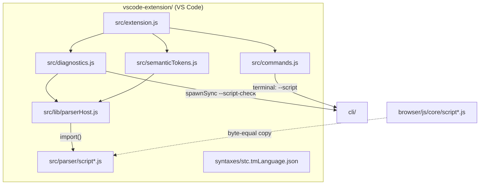
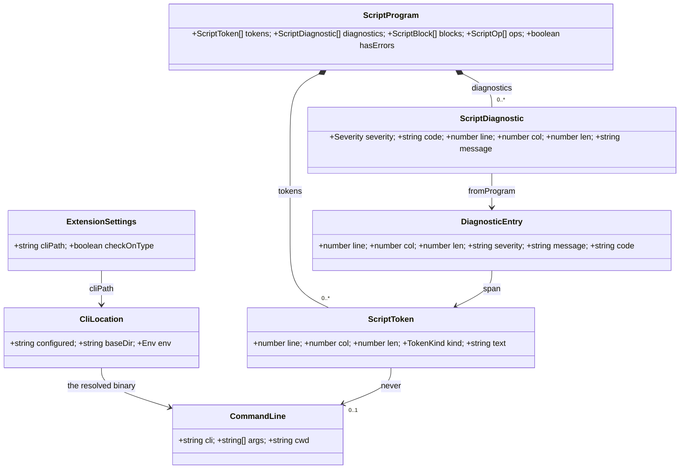

# VS Code extension architecture

The system-wide design — the parity contract, canonical data, the layer model, the pattern vocabulary — is in the root [`ARCHITECTURE.md`](../ARCHITECTURE.md).

An editor adapter for one file type. It gives `.stc` scripts colour, squiggles and a Run
button, and every one of those answers comes from Stencil itself: the parser copies in
`src/parser/` while you type, the `stencil` CLI on save and on Run. It owns no language
rules of its own — the language lives in [`contracts/stc/`](../contracts/stc/), is
implemented in `core/script/`, and reaches this tree as copied JavaScript and as a spawned
binary.

## Layers

`src/config/` (data only) + `src/parser/` → `src/lib/` → `src/*.js` → `src/extension.js`.
A layer may use everything to its left and nothing to its right. `src/parser/` is copied
code and imports nothing but itself and the one colour table beside it; `src/lib/` is the
`vscode`-free bottom of this tree's own code, so it is testable without the editor;
`src/*.js` are the three features, each registering itself; `src/extension.js` is wiring and
the only root file that may import a sibling root file. Enforced by
`tests/layerBoundary.test.js` over every relative `import` and `require` in `src/`.

## Where things go

| Path | Holds | Rule |
|---|---|---|
| `package.json` | the manifest VS Code reads: language, grammar, commands, settings, menu, keybinding | no root `type` field — the extension is CommonJS; `@vscode/vsce` is the one dependency and it is a devDependency (`tests/manifest.test.js`) |
| `language-configuration.json` | `#` line comments, the `()` and `"` pairs, the `@name` word pattern, indent after a `…:` header | its regexes are JS, not Oniguruma — `tests/grammar.test.js` compiles them |
| `syntaxes/stc.tmLanguage.json` | the TextMate grammar under scope `source.stc` | every scope name ends `.stc`; the directive list is pinned to the parser's `DIRECTIVES` |
| `src/extension.js` | `activate` / `deactivate` | wiring only; every disposable goes on the context |
| `src/diagnostics.js` | the two diagnostic sources and the `file:line:col: severity: message [CODE]` grammar | the CLI answers for a saved file, the parser copies for a buffer; both become `vscode.Diagnostic` |
| `src/semanticTokens.js` | the legend, the `TokenKind` → legend map, the provider | standard VS Code token types only, so any theme colours it |
| `src/commands.js` | run, run-on-image, check | one CLI invocation each, in the reused `Stencil` terminal, `cwd` = the script's directory |
| `src/lib/` | `ids.js` (the contributed identifiers), `cliLocator.js` (the ONE way the binary is found), `terminal.js` (the ONE place a command line is composed), `parserHost.js` (the memoized `import()`) | `vscode` is passed in, never imported, so each is a pure unit |
| `src/parser/` | byte-equal copies of `browser/js/core/script*.js`, plus `index.js`, which re-composes what `script.js` does without the wasm binding | ESM, scoped by its own `package.json`; pinned both directions by `tests/parserParity.test.js` |
| `src/config/` | `colorNames.json`, the one table the copies import | byte-pinned to `browser/js/config/colorNames.json` |
| `tests/` | `node --test` suites and `helpers/vscodeStub.js` | ESM, scoped by its own `package.json`; no editor, no network |

## Entities

| Entity | What it is | Owned by / lifetime | Relates to |
|---|---|---|---|
| `ScriptProgram` (`src/parser/index.js`) | one parse of a `.stc` buffer: tokens, diagnostics, blocks, ops; canonical in `core/script/scriptProgram.cpp` | built per keystroke or per save, never stored | `ScriptToken`, `ScriptDiagnostic` |
| `ScriptToken` (`src/parser/scriptLexer.js`) | one lexeme with its 1-based line, column, length and `TokenKind` | inside a `ScriptProgram` | becomes a semantic-token row through `KIND_TYPE` |
| `ScriptDiagnostic` (`src/parser/scriptDiagnostics.js`) | one error or warning with its stable `E_`/`W_` code and span | inside a `ScriptProgram` | flattened into a `DiagnosticEntry` |
| `DiagnosticEntry` (`src/diagnostics.js`) | the shape both sources agree on — the parser's diagnostics and the CLI's `--script-check` lines | per refresh; mapped straight to `vscode.Diagnostic` | `ScriptDiagnostic`, the CLI's stdout |
| `CliLocation` (`src/lib/cliLocator.js`) | the inputs to finding the binary: the `stencil.cliPath` setting, the workspace folder, the environment | per call, nothing cached | `ExtensionSettings`; produces the path a `CommandLine` runs |
| `CommandLine` (`src/lib/terminal.js`) | one composed, fully quoted shell line and the terminal it is sent to | per command invocation; the `Stencil` terminal outlives it | the CLI process |
| `ExtensionSettings` | `stencil.cliPath` and `stencil.checkOnType`, read through `workspace.getConfiguration` | VS Code's, read on each use so a change needs no reload | `CliLocation`, the on-type check |

## Patterns

| Pattern | Where | Notes |
|---|---|---|
| Port (byte-equal copy) | `src/parser/script*.js` ← `browser/js/core/script*.js`; `src/config/colorNames.json` | The extension cannot import across subprojects, so the parser is copied and `tests/parserParity.test.js` pins it both directions: no file may appear, vanish or change alone. |
| Adapter | `src/diagnostics.js` `parseCheckOutput` + `toDiagnostic` | The CLI's one-line-per-diagnostic grammar and the parser's objects both become `vscode.Diagnostic`. |
| Strategy | `src/diagnostics.js` `collect` | Saved file plus a locatable CLI takes the compiled core; anything else takes the copies. The two must agree, which is what the shared corpus proves. |
| Table-driven | `src/semanticTokens.js` `KIND_TYPE`; `src/lib/ids.js` | A `TokenKind` becomes a legend index by lookup, and every contributed id has one home the manifest test reads. |
| Chain of Responsibility | `src/lib/cliLocator.js`: setting → `STENCIL_CLI` → `PATH` | Each step refuses or answers; no shell is consulted, so nothing is word-split or expanded. |
| Lazy singleton | `src/lib/parserHost.js` | One memoized `import()` bridges CommonJS to the ESM copies; both features share the module graph. |
| Facade | `src/extension.js` | Three `register(context)` calls; no feature knows another exists. |

## Design

- **Activation.** VS Code loads `src/extension.js` on `onLanguage:stencil-script`. `activate`
  calls `diagnostics.register`, `semanticTokens.register` and `commands.register`; each pushes
  its own disposables onto the context and returns. Nothing is loaded eagerly — the parser
  copies arrive on the first parse, through `parserHost`.
- **Colour.** Two layers. The TextMate grammar paints as the file loads, line by line, and is
  what a `.stc` looks like before the extension activates. The semantic-token provider then
  re-paints from a real parse, which is how `#ccc` stays a colour while `# note` is a comment —
  a decision the lexer makes from the whole word and a regex can only approximate.
- **A check.** On open and on save, `collect` locates the CLI and runs
  `spawnSync(cli, ['--script-check', path])` with no shell; each stdout line is read by
  `CHECK_LINE` into a `DiagnosticEntry`. While typing (`stencil.checkOnType`, default on), and
  whenever there is no CLI or the buffer is not a file on disk, the parser copies answer
  instead. Either way `toDiagnostic` turns 1-based spans into 0-based ranges, never
  zero-width, tagged `source: 'stencil'` and carrying the `E_`/`W_` code.
- **A run.** `stencil.runScript` saves the buffer, locates the CLI, and sends
  `stencil --script <file>` to the reused `Stencil` terminal with `cwd` set to the script's
  own directory, so a relative `@source` resolves the way it does on the command line.
  `stencil.runScriptOnImage` prefixes `-i <picked image>`; `stencil.checkScript` sends
  `--script-check`. Every argument goes through `quoteArg` first. With no CLI the command
  refuses with "Stencil CLI not found — set stencil.cliPath" and spawns nothing.
- **The parser copies.** `src/parser/` is `browser/js/core/script*.js`, byte for byte, with
  two files left behind: `script.js`, whose imports reach the wasm loader and the app's unit
  helpers, and `scriptHandles.js`, which marshals wasm handles. `src/parser/index.js` stands in
  for the first, re-composing lex → parse → lower exactly as `script.js` does when wasm is
  absent; `tests/parserParity.test.js` pins those declarations line for line. The copies are
  ESM and the extension is CommonJS, so the only way in is `parserHost`'s dynamic `import()`.

## Rules

1. **The CLI path is explicit user configuration.** `stencil.cliPath`, then `STENCIL_CLI`,
   then `PATH` — and never a path read out of the document being edited or out of anything
   the script fetches.
2. **Document text never reaches a shell unquoted.** `src/lib/terminal.js` is the only place
   a command line is composed; `spawnSync` elsewhere takes an argv array and `shell: false`.
   A path holding a quote, a space or a semicolon survives as one argument.
3. **The parser is copied, never edited here.** A change belongs in `core/script/` and
   `browser/js/core/`; this tree re-copies. `tests/parserParity.test.js` fails on any drift,
   in either direction, and `tests/sizeBudget.json` `exceptions` marks the copies as copies.
4. **The grammar follows the language, not the other way round.** The directive list is
   asserted equal to the parser's `DIRECTIVES`; a new directive lands in the contract and the
   core first.
5. **One dependency, dev-only.** `@vscode/vsce`, exactly pinned, used only by
   `npm run package`. Nothing ships at runtime; the packaged `.vsix` carries `src/` and
   `syntaxes/` and no `node_modules`.
6. **Every disposable belongs to the context.** `deactivate` does nothing, because there is
   nothing left for it to do.

## Tests

`tests/` runs under `node --test`, offline and without VS Code: `helpers/vscodeStub.js`
answers `require('vscode')` through a `Module._load` hook with a recording stub, so the
extension's own wiring, the diagnostic collection, the semantic-token rows and the terminal
lines are all asserted from the outside. Cross-surface drift is pinned, not re-tested:
`parserParity.test.js` holds `src/parser/` byte-equal to `browser/js/core/` both ways and
pins the three declarations `index.js` re-composes, while `fixtureWalker.test.js` replays the
shared corpus in `browser/js/config/script/fixtures/cases.txt` — the same file the core and
the browser walk — through the copies. Data is asserted as data: `grammar.test.js` compiles
every TextMate and language-configuration regex, resolves every `include`, and checks the
scope names and the directive list; `manifest.test.js` holds `package.json` to `src/lib/ids.js`,
to the files it points at, and every module to its sibling `.d.ts`. `layerBoundary.test.js` scans import direction and
`sizeBudget.{json,test.js}` is the line and comment ratchet. There is deliberately **no
`@vscode/test-electron` end-to-end suite**: it would download a VS Code build per run, which
this repo's no-new-dependency rule rules out, and the behaviour it would cover is the editor's
own. The editor-side check is manual — install the `.vsix`, open a fixture `.stc`.
