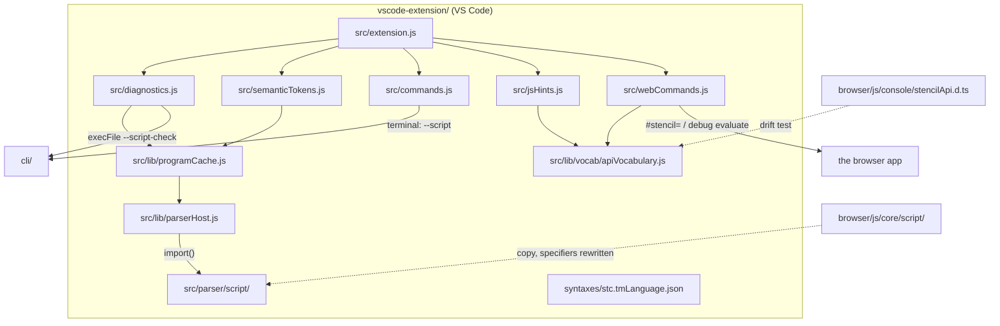
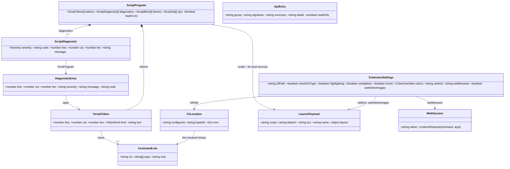

# VS Code extension architecture

The system-wide design — the parity contract, canonical data, the layer model, the pattern vocabulary — is in the root [`ARCHITECTURE.md`](../ARCHITECTURE.md).

An editor adapter for Stencil's script files. It gives `.stc` scripts colour, squiggles, completions,
hovers and a Run button, and every answer comes from Stencil itself: the parser copies in
`src/parser/` while you type, the `stencil` CLI on save and on Run. `.stcjs` is the JavaScript
flavour — a file that drives the browser app's `window.stencil` facade — and gets the same
treatment for the facade, from a vocabulary held to `browser/js/console/stencilApi.d.ts`.
`.pystc` is the Python flavour, the pystencil script `--script-emit` writes. `.stencil` projects
are data only — an icon and a grammar that defers to `source.json`. A script can also run **in
the browser app**, by hand-off or in the page's own console. The tree owns no language rules —
the language lives in [`contracts/stc/`](../contracts/stc/), is implemented in `core/script/`,
and reaches this tree as copied JavaScript and as a spawned binary.

```mermaid
graph TD
    subgraph VSC["vscode-extension/ (VS Code)"]
      ENTRY["src/extension.js"]
      DIAG["src/diagnostics.js"]
      SEM["src/semanticTokens.js"]
      CMD["src/commands.js"]
      WEB["src/webCommands.js"]
      HINTS["src/jsHints.js"]
      APIV["src/lib/vocab/apiVocabulary.js"]
      CACHE["src/lib/programCache.js"]
      HOST["src/lib/parserHost.js"]
      COPIES["src/parser/script/"]
      GRAM["syntaxes/stc.tmLanguage.json"]
    end
    SRC["browser/js/core/script/"]
    DTS["browser/js/console/stencilApi.d.ts"]
    CLI["cli/"]
    APP["the browser app"]

    ENTRY --> DIAG & SEM & CMD & HINTS & WEB
    DIAG & SEM --> CACHE
    CACHE --> HOST
    HINTS & WEB --> APIV
    HOST -->|"import()"| COPIES
    SRC -.->|"copy, specifiers rewritten"| COPIES
    DTS -.->|"drift test"| APIV
    DIAG -->|"execFile --script-check"| CLI
    CMD -->|"terminal: --script"| CLI
    WEB -->|"#stencil= / debug evaluate"| APP
```

## Layers

`src/config/` (data only) + `src/parser/` → `src/lib/` → `src/*.js` → `src/extension.js`.
A layer may use everything to its left and nothing to its right. `src/parser/` is copied
code and imports nothing but itself and the one colour table beside it; `src/lib/` is the
`vscode`-free bottom of this tree's own code, so it is testable without the editor;
`src/*.js` are the features, each registering itself; `src/extension.js` is wiring and
the only root file that may import a sibling root file. Enforced by
`tests/layerBoundary.test.js` over every relative `import` and `require` in `src/`.

## Where things go

| Path | Holds | Rule |
|---|---|---|
| `package.json` | the manifest VS Code reads: languages, icons, grammars, commands, settings, menus | `"type": "module"`; `@vscode/vsce` is the one dependency, dev-only (`tests/manifest.test.js`) |
| `language-configuration.json` | comments, pairs, the `@name` word pattern, indent rules | its regexes are JS — `tests/grammar.test.js` compiles them |
| `syntaxes/stc.tmLanguage.json` | the TextMate grammar under scope `source.stc` | every scope name ends `.stc`; the directive list is pinned to the parser's `DIRECTIVES` |
| `language-configuration.{stcjs,pystc}.json` + `syntaxes/{stcjs,pystc}.tmLanguage.json` | the `.stcjs` and `.pystc` flavours, whose grammar is `include: source.js` / `source.python` | it defers, never re-spells the host language |
| `syntaxes/stencilMarker.tmLanguage.json` | the rule that lights `// @use stencil` inside a JavaScript comment | an injection: it adds a scope and re-spells nothing |
| `language-configuration.project.json` + `syntaxes/stencilProject.tmLanguage.json` | the `.stencil` project file, whose grammar is `include: source.json` | it defers, never re-spells JSON |
| `icons/` | the app mark and each file type's explorer glyph | `stencil.svg` is a copy of `common/icons/favicon.svg`, pinned by `browser/tests/config/svgArt.test.js` |
| `icon.png` | the extension-page logo, rasterized from `icons/stencil.svg` | PNG — VS Code refuses an SVG here |
| `src/extension.js` | `activate` / `deactivate` | wiring only; every disposable goes on the context |
| `src/diagnostics.js` | the two diagnostic sources, the debounce and the version guard | the CLI answers for a saved file, the parser copies for a buffer; both become `vscode.Diagnostic` |
| `src/semanticTokens.js` | the legend and the provider | standard token types only; which type a token gets is `lib/vocab/tokenClassify.js` |
| — | each provider reads its own `stencil.*` toggle per request | a toggle never needs a reload |
| `src/completion.js` | the suggestion items, one builder per group | it offers words, never a filename |
| `src/hover.js` | the Markdown for the token under the caret | the token comes from the same parse the colours do |
| `src/decorations.js` | one decoration type per colour family, painted over the themed tokens | an exact colour can only be drawn on top of a theme |
| `src/colors.js` | the command that seeds and opens VS Code's token-colour setting | an extension may not set token colours; the seeded rules are pinned to the README block (`tests/colors.test.js`) |
| `src/commands.js` | run, run-on-image, check | one CLI invocation each, in the reused `Stencil` terminal, `cwd` = the script's directory |
| `src/webCommands.js` | the browser commands: the hand-off and those that evaluate in the page | composes no shell line; the instance comes from `lib/web/target.js` alone |
| `src/jsHints.js` | the facade's completions and hovers, for `.stcjs` and an opted-in `.js` | additive to the editor's JavaScript service; stands aside where the workspace holds the typings |
| `src/typings.js` over `src/lib/emit/typingsFile.js` | the command that writes the facade's types into a workspace | writes `stencil.d.ts`, and a `jsconfig.json` only where the project has none |
| `typings/stencil.d.ts` + `tools/genTypings.mjs` | the facade as one ambient script, every member with its summary, example and link | generated, never hand-edited (`tests/typings.test.js`); no top-level `export` |
| `src/lib/` (+ `spawn/`, `web/`, `vocab/`, `emit/`) | the tree's logic below the editor: ids, the parser host and program cache, span mapping, the `--script-check` grammar; `spawn/` — `cliLocator.js`, `pythonLocator.js` and `terminal.js`; `web/` — the hand-off, the debug console and `target.js`; `vocab/` — vocabularies and token classes; `emit/` — the `@use stencil` marker, emit targets, the typings file | `vscode` is passed in, never imported |
| `src/parser/` | `script/`, copies of `browser/js/core/script/` byte-equal except the import specifiers `tools/twins.json`'s `rewrite` declares, plus `index.js`, which re-composes `script.js` without the wasm binding | pinned both directions by `tests/parserParity.test.js` |
| `src/config/` | `colorNames.json`, the table the copies import, and the vocabularies `stcVocabulary.json` and `stencilApiVocabulary.json` | `colorNames.json` is byte-pinned to `common/config/colorNames.json`; vocabulary keys are held to `DIRECTIVES` and `interface Stencil` |
| `tests/` | `node --test` suites and `helpers/vscodeStub.js` | no editor, no network |

## Entities

```mermaid
classDiagram
    class ScriptProgram { +ScriptToken[] tokens; +ScriptDiagnostic[] diagnostics; +ScriptBlock[] blocks; +ScriptOp[] ops; +boolean hasErrors }
    class ScriptToken { +number line; +number col; +number len; +TokenKind kind; +string text }
    class ScriptDiagnostic { +Severity severity; +string code; +number line; +number col; +number len; +string message }
    class DiagnosticEntry { +number line; +number col; +number len; +string severity; +string message; +string code }
    class CliLocation { +string configured; +string baseDir; +Env env }
    class CommandLine { +string cli; +string[] args; +string cwd }
    class LaunchPayload { +string script; +string dataUrl; +string src; +string name; +object layout }
    class WebSession { +string name; +customRequest(command, args) }
    class ApiEntry { +string group; +string signature; +string summary; +string detail; +boolean readOnly }
    class ExtensionSettings { +string cliPath; +boolean checkOnType; +boolean highlighting; +boolean completion; +boolean hover; +ColorOverrides colors; +string webUrl; +string webBrowser; +boolean webInlineImages }

    ScriptProgram *-- "0..*" ScriptToken : tokens
    ScriptProgram *-- "0..*" ScriptDiagnostic : diagnostics
    ScriptDiagnostic --> DiagnosticEntry : fromProgram
    DiagnosticEntry --> "1" ScriptToken : span
    ExtensionSettings --> CliLocation : cliPath
    CliLocation --> CommandLine : the resolved binary
    ScriptToken --> "0..1" CommandLine : never
    ExtensionSettings --> LaunchPayload : webUrl, webInlineImages
    ExtensionSettings --> WebSession : webBrowser
    ScriptProgram --> LaunchPayload : script + its local sources
```

| Entity | What it is | Owned by / lifetime | Relates to |
|---|---|---|---|
| `ScriptProgram` (`src/parser/index.js`) | one parse of a `.stc` buffer: tokens, diagnostics, blocks, ops | built once per document version, held by `programCache` | `ScriptToken`, `ScriptDiagnostic` |
| `ScriptToken` (`src/parser/script/lexer.js`) | one lexeme with its 1-based line, UTF-8 byte column and length, and its `TokenKind` | inside a `ScriptProgram` | becomes a semantic-token row through `KIND_TYPE` |
| `ScriptDiagnostic` (`src/parser/script/diagnostics.js`) | one error or warning with its stable `E_`/`W_` code and span | inside a `ScriptProgram` | flattened into a `DiagnosticEntry` |
| `DiagnosticEntry` (`src/diagnostics.js`) | the shape both sources agree on — the parser's diagnostics and the CLI's `--script-check` lines | per refresh; mapped to `vscode.Diagnostic` | `ScriptDiagnostic`, the CLI's stdout |
| `CliLocation` (`src/lib/spawn/cliLocator.js`) | the inputs to finding the binary: the setting, the workspace folder, the environment | per call; the PATH walk is memoized per `PATH` | `ExtensionSettings`; produces the path a `CommandLine` runs |
| `CommandLine` (`src/lib/spawn/terminal.js`) | one composed, fully quoted shell line and the terminal it is sent to | per command invocation; the `Stencil` terminal outlives it | `ShellRules`, the CLI process |
| `ShellRules` (`src/lib/spawn/shellQuote.js`) | one shell family's quoting and directory-change rules | a frozen table entry, chosen from `vscode.env.shell` | `CommandLine` |
| `LaunchPayload` (`src/lib/web/launch.js`) | what rides the `#stencil=` fragment: the script, a picture as bytes or a URL, the incognito flag | per hand-off; consumed once by the app | `ScriptProgram`, the app's `normalizeLaunchPayload` |
| `WebSession` (`src/lib/web/console.js`) | the js-debug session driving the browser, addressed by `evaluate` requests | VS Code's, one per browser window; reused while it lives | `ExtensionSettings.webBrowser`, the page's `window.stencil` |
| `ApiEntry` (`src/config/stencilApiVocabulary.json`) | one `window.stencil` member: its group, signature, what it does | a frozen table entry, read through `lib/vocab/apiVocabulary.js` | `interface Stencil` in `browser/js/console/stencilApi.d.ts` is its list |
| `ExtensionSettings` | the `stencil.*` settings: CLI and Python paths, check triggers, feature toggles, `colors`, the browser settings | VS Code's, read on each use | `CliLocation`, the providers, the decorations, both browser routes |

## Patterns

| Pattern | Where | Notes |
|---|---|---|
| Port (byte-equal copy) | `src/parser/script/` ← `browser/js/core/script/`; `src/config/colorNames.json` | The extension cannot import across subprojects; `tests/parserParity.test.js` pins the copy both directions. |
| Adapter | `src/diagnostics.js` `parseCheckOutput` + `toDiagnostic` | The CLI's diagnostic lines and the parser's objects both become `vscode.Diagnostic`. |
| Strategy | `src/diagnostics.js` `collect` | Saved file plus a locatable CLI takes the compiled core; anything else takes the copies. |
| Table-driven | `src/semanticTokens.js` `KIND_TYPE`; `src/lib/ids.js`; the `HANDLERS` and `LAUNCH_FOR` maps in `src/webCommands.js` | A token kind becomes a legend index, every contributed id has one home, a language id picks its payload. |
| Chain of Responsibility | `src/lib/spawn/cliLocator.js` (setting → `STENCIL_CLI` → `PATH`), `pythonLocator.js` (→ `STENCIL_PYTHON`) | Each step refuses or answers; no shell is consulted. |
| Drift test | `src/config/stencilApiVocabulary.json` ← `browser/js/console/stencilApi.d.ts` | The prose is this tree's, the list is not: `tests/lib/vocab/apiVocabulary.test.js` holds members and signatures both ways. |
| Strategy | `src/webCommands.js`: hand-off vs. console | The fragment shows a script in the user's browser; the debug evaluate runs it and reports. A `.stcjs` has only the second. |
| Lazy singleton | `src/lib/parserHost.js` | One memoized `import()` loads the copies on the first parse; a rejection is never memoized. |
| Strategy (table) | `src/lib/spawn/shellQuote.js` `SHELLS` | One row per shell family; `vscode.env.shell` picks it. |
| Cache | `src/lib/spawn/versionCache.js`, under `programCache.js` and `jsSource.js`; `src/lib/pathSearch.js` | Keyed on what invalidates it — a document's `version`, the whole `PATH`. |
| Higher-order factory | `src/lib/vocab/vocabularyEntry.js` `makeExplain` | The rendering of a vocabulary entry is written once for both tables. |
| Facade | `src/extension.js` | One `register(context)` call per feature; no feature knows another exists. |

## Design

- **Activation.** VS Code loads `src/extension.js` when a contributed language opens, or a
  marked `.js`. `activate` calls `register(context)` on each feature; the parser copies arrive
  on the first parse, through `parserHost`'s dynamic `import()`.
- **Colour.** Three layers: the TextMate grammar paints as the file loads; the semantic-token
  provider re-paints from a real parse; colour families are painted over as decorations from a
  light or dark palette, with `stencil.colors` laid on top.
- **A check.** On open and save, `collect` locates the CLI and runs
  `execFile(cli, ['--script-check', path])` with no shell; each line becomes a
  `DiagnosticEntry`. A run that gave no parsable answer is no answer, so the copies take over
  rather than the squiggles clearing. While typing the copies answer, debounced, and an outdated
  result is dropped. `toDiagnostic` turns byte spans into UTF-16 ranges (`lib/spans.js`), tagged
  with the `E_`/`W_` code.
- **A run.** `stencil.runScript` saves the buffer, locates the CLI, and sends
  `stencil --script <file>` to the reused `Stencil` terminal with `cwd` the script's directory,
  so a relative `@source` resolves as on the command line. Every argument goes through
  `quoteArg` under the reported shell's `ShellRules`. With no CLI, or no file behind the
  buffer, the command refuses.
- **A run in the browser.** Two routes. The hand-off builds the `#stencil=` fragment
  `browser/js/core/launch/deepLink.js` validates and hands it to `env.openExternal`; the script
  rides as a top-level `script` key, local bytes travel in the fragment, which no server sees.
  The console route opens the browser through VS Code's built-in JavaScript debugger in a
  throwaway profile and sends DAP `evaluate` requests; the session that answers
  `typeof window.stencil` is the page. A `.stc` is quoted into one `execScript` call as data,
  while a `.stcjs` runs as written — the app's CSP grants no `unsafe-eval`, so that is its only
  route. Answers and failures land in the `Stencil` output channel.
- **A run on the desktop.** The desktop commands build a `stencil://open?…` link in
  `lib/desktop/launch.js`, pinned to the shared link grammar, and hand it to `env.openExternal`.
  The scheme is fixed, so no workspace can route a script elsewhere.
- **Two vocabularies, one shape.** `.stc` words come from `stcVocabulary.json`, facade members
  from `stencilApiVocabulary.json`; both render through the same `markdownFor`. The facade's
  hints answer in a `.stcjs` always and in a `.js` only while it holds `// @use stencil` on a
  comment line of its own, read on each request.
- **Two answers, one box.** VS Code stacks every provider's hover, so in a `.js` the editor's own
  `any` would sit under this tree's explanation. `tools/genTypings.mjs` flattens the app's
  `stencilApi.d.ts` into one ambient script with the same prose, and the typings command writes
  it into the workspace; `jsHints` then stands aside wherever that file is present. The marker
  comment is answered for even in a typed workspace.
- **The parser copies.** `src/parser/script/` is `browser/js/core/script/` byte for byte, minus
  `script.js` (which reaches the wasm loader) and `scriptHandles.js`; `src/parser/index.js`
  re-composes lex → parse → lower as `script.js` does without wasm, pinned by
  `tests/parserParity.test.js`.

## Rules

1. **The CLI, the Python and the browser instance are explicit user configuration.** `stencil.cliPath`
   (then `STENCIL_CLI`, then `PATH`), `stencil.pythonPath` (then `STENCIL_PYTHON`, then `PATH`) and
   `stencil.webUrl`, else the published default, which must be `http(s)` — all machine-scoped
   so a workspace cannot set them. None is ever read out of the document being edited or anything the script
   fetches; `cliLocator.js`, `pythonLocator.js` and `web/target.js` are the one way each is resolved.
2. **Document text never reaches a shell unquoted.** `src/lib/spawn/terminal.js` is the only place
   a command line is composed, for the shell the user actually runs; every spawn elsewhere takes
   an argv array and `shell: false`.
3. **The parser is copied, never edited here.** A change belongs in `core/script/` and
   `browser/js/core/`; this tree re-copies. `tests/parserParity.test.js` fails on any drift,
   in either direction. The facade vocabulary's member list and signatures are
   `stencilApi.d.ts`'s.
4. **The grammar follows the language, not the other way round.** The directive list is
   asserted equal to the parser's `DIRECTIVES`. `.stcjs` and `.stencil` defer outright, to
   `source.js` and `source.json`.
5. **The prose has one home.** A member's summary, example and link are written once, in
   `src/config/stencilApiVocabulary.json`; the generator is the only writer of
   `typings/stencil.d.ts`.
6. **The app is never asked to evaluate.** A `.stcjs` runs through the browser's own DevTools.
   Nothing here widens the app's CSP or adds an execution path inside it.
7. **One dependency, dev-only.** `@vscode/vsce`, exactly pinned, used only by
   `npm run package`; the packaged `.vsix` carries no `node_modules`.
8. **Every disposable belongs to the context.** `deactivate` does nothing.
9. **An engine span is bytes; an editor position is UTF-16.** The copies and `--script-check`
   count in UTF-8 bytes; every range converts through `lib/spans.js` against the text of its
   line.

## Tests

`tests/` runs under `node --test`, offline and without VS Code: `helpers/vscodeStub.js` answers
`import 'vscode'` through a resolve hook with a recording stub, so the wiring, the diagnostics,
the semantic-token rows and the terminal lines are asserted from the outside;
`unicodeSpans.test.js` drives every span consumer over multi-byte text. Quoting is proved per
shell family, and a stub CLI proves which exit statuses fall back to the copies. The browser
routes are asserted without a browser: the fragment is decoded back into its payload, and a
recording debug session shows which expressions a run sends. Cross-surface drift is pinned:
`parserParity.test.js` holds `src/parser/` byte-equal to `browser/js/core/` both ways,
`apiVocabulary.test.js` holds the members to `interface Stencil`, and `fixtureWalker.test.js`
replays `common/fixtures/script/cases.txt` through the copies. `grammar.test.js` compiles every
grammar regex and checks scopes and the directive list; `tokenClassify.test.js` and
`hover.test.js` run real buffers through the copies; `manifest.test.js` holds `package.json` to
`src/lib/ids.js` and every module to its `.d.ts`; `layerBoundary.test.js` scans import direction.
There is no `@vscode/test-electron` suite — it would download a VS Code build, which the
no-dependency rule rules out; the editor-side check is manual.
